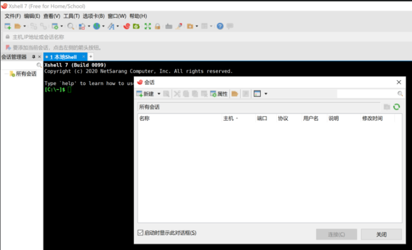
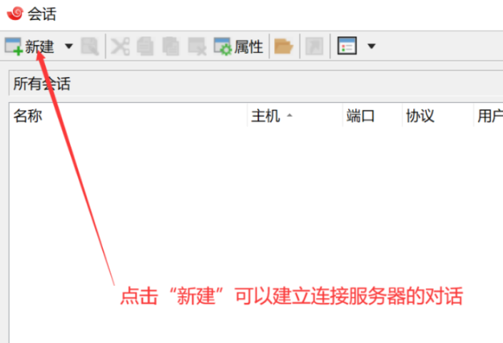
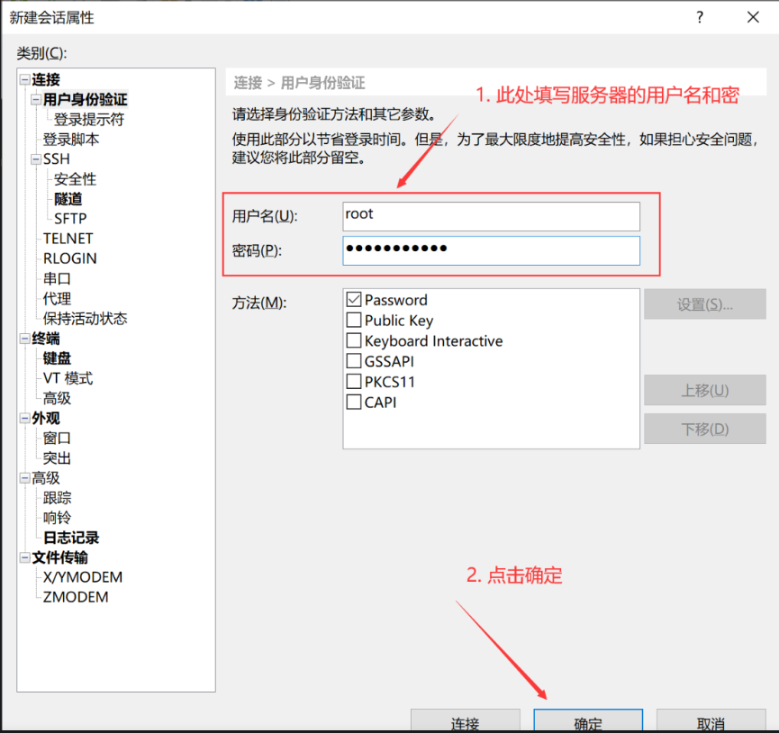
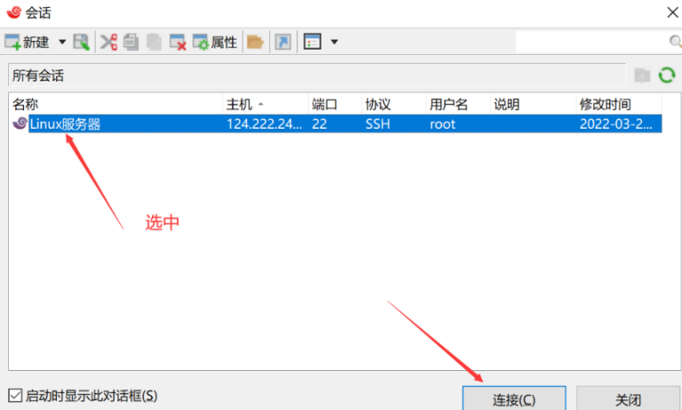
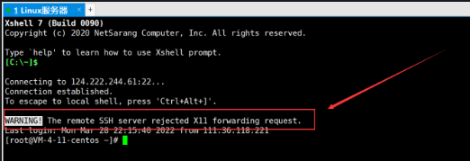

# 1. 常用软件清单
## 1.1 SSH远程连接工具

### 1.1.1 Xshell

1. 介绍

    最好用的SSH远程连接工具。
    
    免费版(**不可商用**)：https://www.xshell.com/zh/free-for-home-school/

    如官网打不开，可以从网盘下载  
    - 链接：https://pan.baidu.com/s/1NJGWZHkByakOkQpKfkc7Yg?
    - 提取码：r0ds

2. 会话连接配置
    
    （1） 开启Xshell
    
        
    
    （2） 新建会话
    
    
    
    (3) 填写主机IP并编写会话名称
    
    
    
    (4) 填写用户名和密码
    
    
    
    (5) 选中会话进行连接
    
    
    
    (6) 连接服务器
    
    
    
3. 属性设置

    
    
    
    
    - 可以选择按下鼠标的按钮快速粘贴
    - 选定即可自动复制到剪贴板 
    
# 参考

[1] XShell免费版的安装配置教程以及使用教程（超级详细、保姆级），
    https://blog.csdn.net/m0_67400972/article/details/125346023