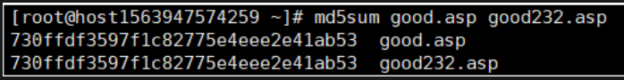

# Linux下比较两个文件是否一致-md5sum

md5值一致则说明是一模一样



diff返回空也说明两个文件是一致的

```shell
diff good.asp good232.asp
```

MD5算法常常被用来验证网络文件传输的完整性，防止文件被人篡改。MD5 全称是报文摘要算法
（Message-Digest Algorithm 5），此算法对任意长度的信息逐位进行计算，产生一个二进制长度为128位
（十六进制长度就是32位）的“指纹”（或称“报文摘要”），不同的文件产生相同的报文摘要的可能性是非常非常之小的。

md5sum命令采用MD5报文摘要算法（128位）计算和检查文件的校验和。一般来说，安装了Linux后，
就会有md5sum这个工具，直接在命令行终端直接运行。

md5sum命令用于生成和校验文件的md5值。它会逐位对文件的内容进行校验。是文件的内容，与文件名无关，
也就是文件内容相同，其md5指相同。
 
md5校验，有很小的概率不同的文件生成的md5可能相同。比md5更安全的校验算法还有SHA*系列的。
 
在网络传输时，我们校验源文件获得其md5sum，传输完毕后，校验其目标文件，并对比如果源文件
和目标文件md5 一致的话，则表示文件传输无异常。否则说明文件在传输过程中未正确传输。

特殊说明：
      
1）md5sum 是校验文件内容，与文件名是否相同无关
2）md5sum值逐位校验，所以文件越大，校验时间越长。
 
 总结： 通过md5sum来校验生成文件校验码，来发现文件传输（网络传输、复制、本地不同设备间的传输）
 异常造成的文件内容不一致的情况。
 

# 参考

[1] Linux下比较两个文件是否一致-md5sum，https://blog.csdn.net/HuDi_2017/article/details/121154847