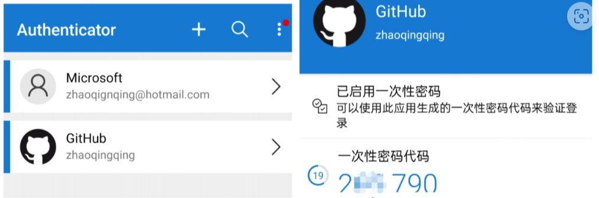

# 1. 2FA认证

对github有代码贡献的帐号要求进行2FA验证， 否则过期不能提交代码。

但是github手机短信验证不支持中国号码，这里介绍2种我正在使用的方式：

1. totp应用
2. 浏览器扩展

启用2FA之后，每次在不同设备上登录github都要输入验证码，浏览器插件可以生成验证码，
但前提是需要先把帐号添加扩展中，换设备登录建议在手机上安装totp应用

## TOTP应用
推荐微软的authenticator，类似网易大神APP，每次打开都会生成一个动态验证码，用此验证码进行登录，
在国内的应用商店中可以下载到或者从google play中下载。

1. 打开GitHub，从右上角选择【设置】，或者点击https://github.com/settings/security
2. 从“个人设置”中选择【password and authentication】，然后从【Two-factor authentication】
   区域中选择 “Authenticator app”。
3. 选择Edit，就会打开一个 页面显示 QR 代码， 请勿关闭此页面。
4. 打开Authenticator应用，从右上角的【+】号添加帐户， (Google、Facebook 等) 选择其他帐户，然后扫一扫github页面上的这个QR码
5. 扫描完成之后帐号就添加到Authenticator中了，下次打开切到github即可展示动态验证码。

如果是第一次启用2FA，可以查看微软的文档：Add non-Microsoft accounts 
to the Microsoft Authenticator app - Microsoft Support

在第一次启用2FA后会给你一串码，下载下来保存这串码，关于这种恢复码的解释如下：

Recovery codes can be used to access your account in the event you lose access 
to your device and cannot receive two-factor authentication codes.

## 浏览器扩展
开源免费的Authenticator: 2FA Client，支持多种浏览器。

切到github的设置- 安全页面，展示一个二维码，然后点击扩展上的扫描按钮，用鼠标选中github的二维码，即可添加github帐号。

开源地址：Authenticator-Extension/Authenticator: Authenticator generates 2-Step Verification codes in your browser. (github.com)

Edge扩展：Authenticator: 2FA Client - Microsoft Edge Addons

Chrome扩展：身份验证器 - Chrome 应用商店 (google.com)

# 参考

[1] github 2fa中国认证及TOTP App，https://zhuanlan.zhihu.com/p/657035724
