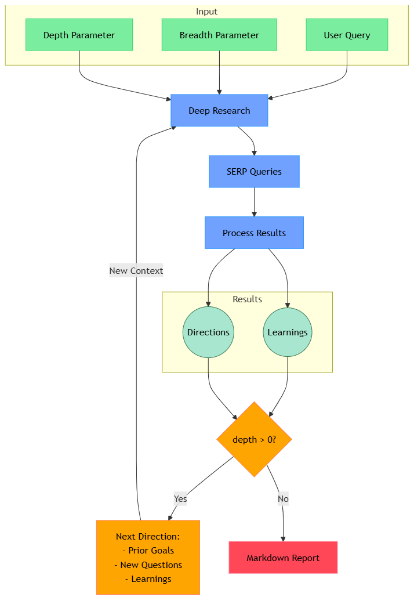

参考项目：https://github.com/dzhng/deep-research

这段代码使用的是 Mermaid 语言，它是一种基于文本的可视化绘图语言，常用于 Markdown 文档中绘制流程图、序列图、甘特图等。Mermaid 语法简单直观，广泛用于文档、Wiki（如 GitHub、Notion）和技术博客中。

你可以在支持 Mermaid 语法的 Markdown 编辑器（如 Typora、Obsidian）或者在线工具（如 Mermaid Live Editor）中渲染这段代码，生成可视化的流程图。

```shell
flowchart TB
    subgraph Input
        Q[User Query]
        B[Breadth Parameter]
        D[Depth Parameter]
    end

    DR[Deep Research] -->
    SQ[SERP Queries] -->
    PR[Process Results]

    subgraph Results[Results]
        direction TB
        NL((Learnings))
        ND((Directions))
    end

    PR --> NL
    PR --> ND

    DP{depth > 0?}

    RD["Next Direction:
    - Prior Goals
    - New Questions
    - Learnings"]

    MR[Markdown Report]

    %% Main Flow
    Q & B & D --> DR

    %% Results to Decision
    NL & ND --> DP

    %% Circular Flow
    DP -->|Yes| RD
    RD -->|New Context| DR

    %% Final Output
    DP -->|No| MR

    %% Styling
    classDef input fill:#7bed9f,stroke:#2ed573,color:black
    classDef process fill:#70a1ff,stroke:#1e90ff,color:black
    classDef recursive fill:#ffa502,stroke:#ff7f50,color:black
    classDef output fill:#ff4757,stroke:#ff6b81,color:black
    classDef results fill:#a8e6cf,stroke:#3b7a57,color:black

    class Q,B,D input
    class DR,SQ,PR process
    class DP,RD recursive
    class MR output
    class NL,ND results

```


