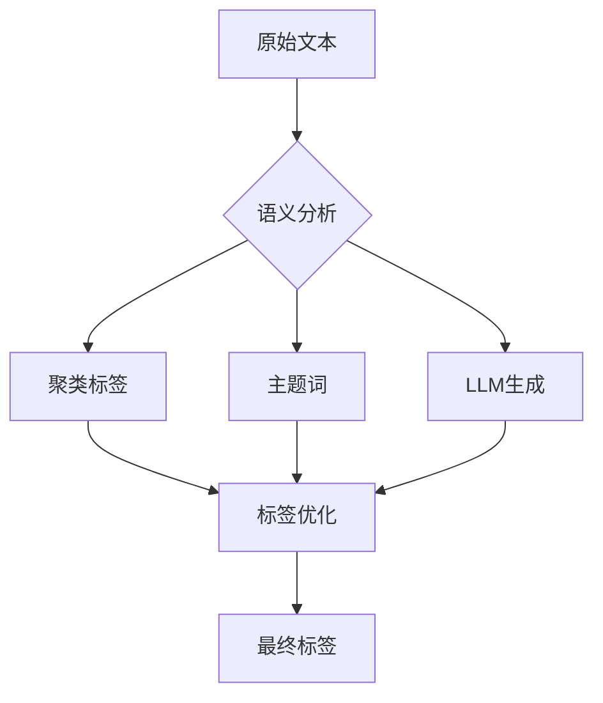

下面是 **Mermaid** 语法中的流程图（flowchart）表达方式，用于在 Markdown 或支持 Mermaid 的平台（如 Obsidian、Typora、Notion、GitHub、Markdown Preview Enhanced 等）中绘制图表。

### 解读这段 Mermaid 代码：



* `graph TD`：表示绘制一个从上到下（Top-Down）的流程图。
* `A[原始文本]`：定义一个节点 A，显示为“原始文本”。
* `B{语义分析}`：定义一个判断型节点（菱形），表示语义分析。
* `-->`：表示节点之间的连接箭头。
* 最终结果是将聚类标签、主题词、LLM生成内容一并输入“标签优化”步骤，产出“最终标签”。

### 图示效果如下：

```
原始文本
     ↓
  语义分析
   ↙ ↓ ↘
聚类 主题 LLM生成
标签 词
   ↘ ↓ ↙
    标签优化
         ↓
     最终标签
```

是否需要我为你渲染成实际图像？
