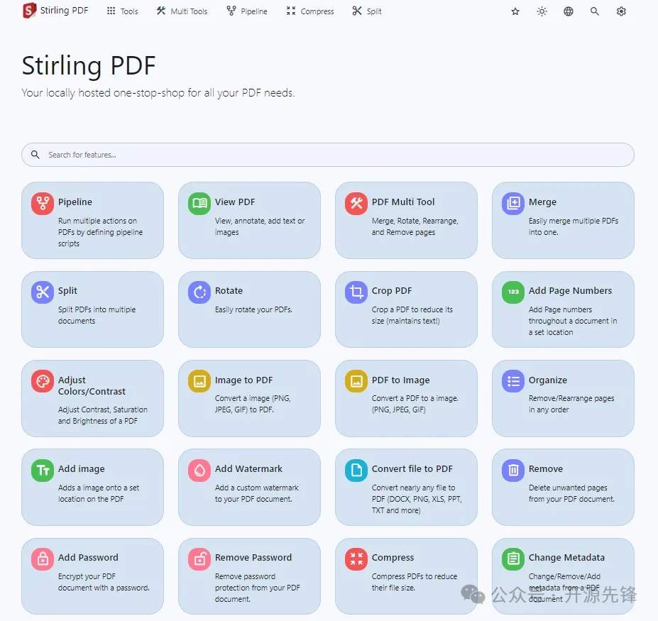

# 1. 简介

项目地址：https://github.com/Stirling-Tools/Stirling-PDF

Stirling-PDF是一个基于Web的开源PDF处理工具，里面有各种各样的工具，可以帮助我们对PDF文件进行各种各样的操作，比如合并、拆分、加密、解密、旋转、压缩等等，功能超全，而且开源免费，简直是神器！



这个项目的目标是提供一个强大且易用的PDF处理工具，无论你是需要批量处理文件的办公室白领，还是需要整理文档的学生，Stirling-PDF都能帮我们轻松搞定。

# 2. 性能特色

- 多功能集成：Stirling-PDF可以合并、拆分、加密、解密、旋转、压缩PDF文件，功能一应俱全。
- 高效处理：使用高效的算法，处理速度快，还支持批量操作，省时省力。
- 跨平台支持：无论你是Windows、Mac还是Linux用户，都能轻松使用。
- 用户友好：操作界面简洁明了，使用起来非常顺手。
- 多语言支持：目前支持38种国家和地区的语言

# 3. 快速使用

安装Stirling-PDF很简单，推荐使用Docker安装部署：

```bash
docker run -d \
  -p 8080:8080 \
  -v ./trainingData:/usr/share/tessdata \
  -v ./extraConfigs:/configs \
  -v ./logs:/logs \
  -e DOCKER_ENABLE_SECURITY=false \
  -e INSTALL_BOOK_AND_ADVANCED_HTML_OPS=false \
  -e LANGS=en_GB \
  --name stirling-pdf \
  frooodle/s-pdf:latest
```

然后，访问http://你的服务器IP:8080，就可以看到Stirling-PDF的主界面了。接下来，就可以开始愉快地处理PDF文件啦！

# 参考

[1] 35.8K star！开源免费的本地PDF处理神器，真的太强了！，https://mp.weixin.qq.com/s/zQ-93nf1DFY68m_-Y2xE3A