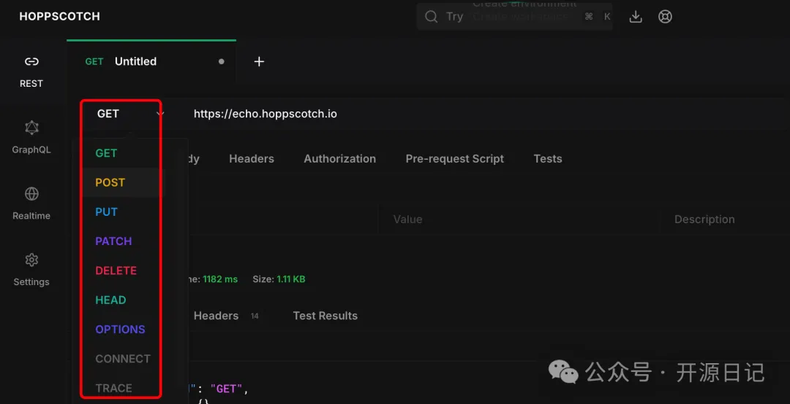

# 1. 资源

Github (80k stars): 开源地址https://github.com/hoppscotch/hoppscotch

# 2. 介绍

在日常的软件开发中，如何快速测试 API、发送 HTTP 请求或者管理 Websocket 通信一直都是开发者面临的重要需求。很多人会想到Postman。

但POSTMAN占用内存太高、专业版价格昂贵(虽然也有免费版)、不支持本地部署？没关系，今天介绍的开源项目 Hoppscotch统统帮你解决这些痛点！  没有对比就没有伤害。

Hoppscotch 是一个轻量化的开源 API 开发工具，定位为 Postman 的开源替代方案。通过其直观的界面与丰富功能，您可以快速测试 HTTP 请求、运行 GraphQL 查询、管理 WebSocket、甚至设置团队协作工作流。最重要的是，它完全免费，还能本地部署，真的是开发者的心头好！

开发语言： 主要由 TypeScript (58.8%) 和 Vue.js (31.7%) 构建，性能优化极佳。

实时发送 HTTP 请求

支持所有常见 HTTP 方法：GET、POST、PUT、DELETE、OPTIONS 等。

提供可视化结果，包括响应状态码、Header 和 Body。

方便的历史记录功能，支持多设备同步。

WebSocket、Socket.IO、GraphQL 支持

测试 WebSocket 或 Socket.IO 服务，轻松建立全双工通信。