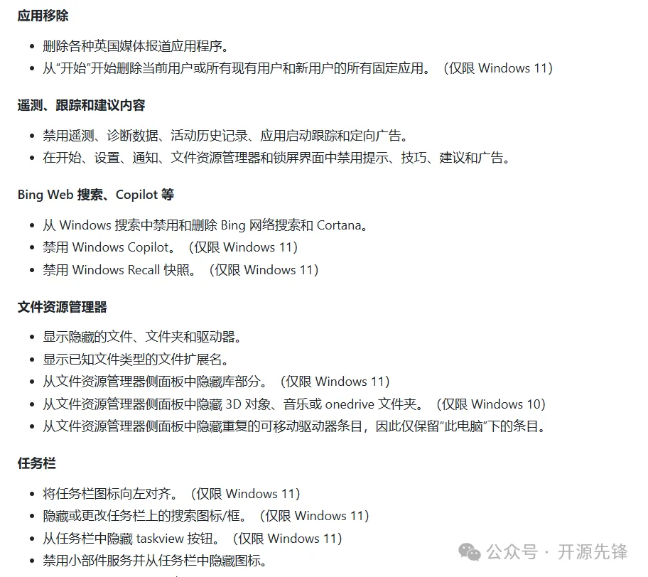
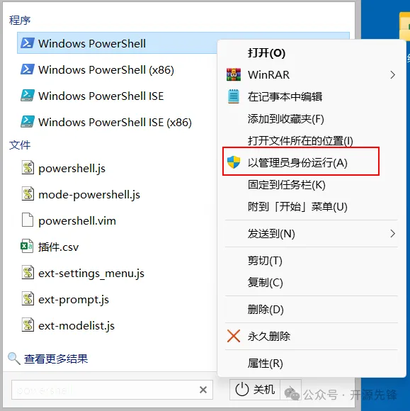
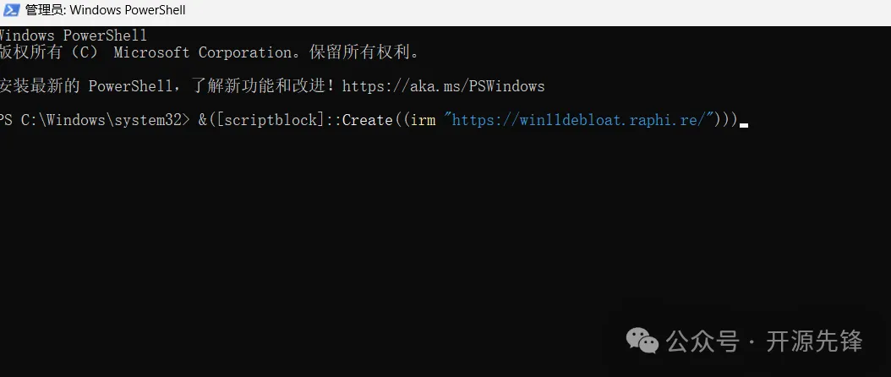
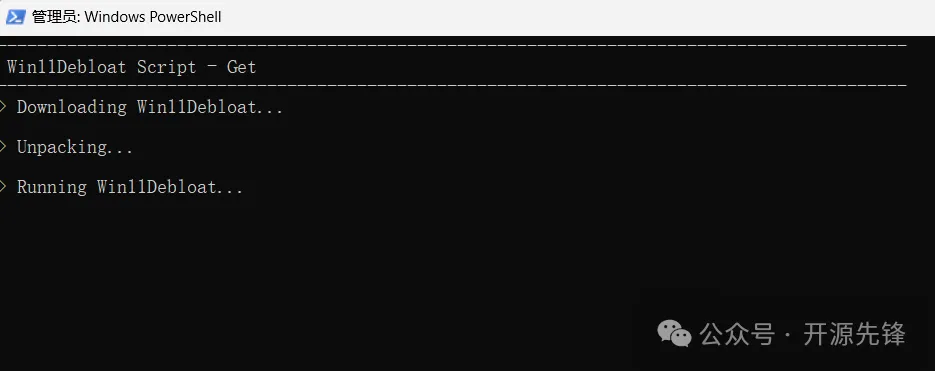
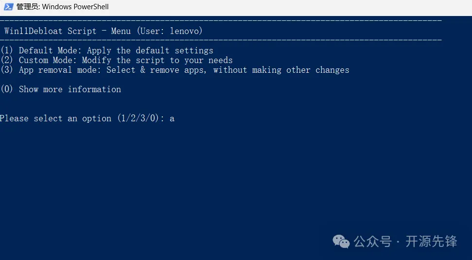
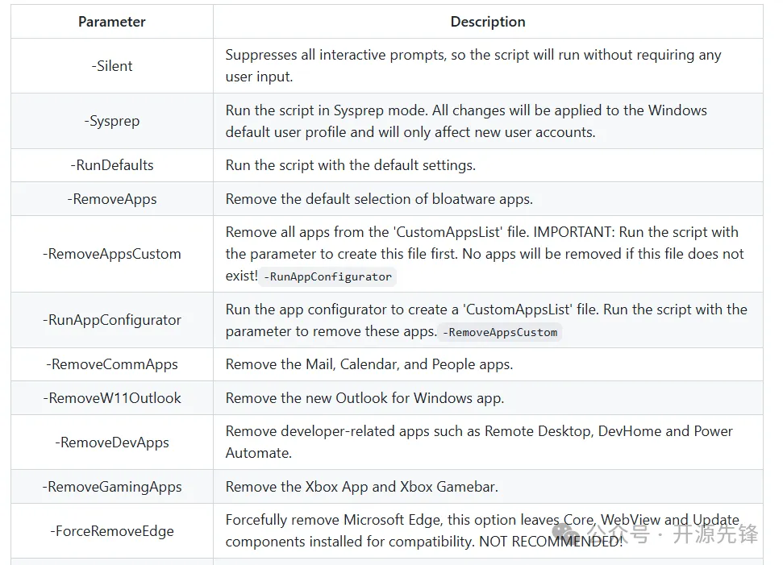

# 1. 简介

项目地址：https://github.com/Raphire/Win11Debloat

Win11Debloat是由一位名叫Raphire的大佬开发的PowerShell脚本，专门用来专门针对Win 10和Win 11系统中的那些讨人厌的预装软件和没用的系统组件。

这个脚本能帮我们一键去除那些预装的、或许一辈子都用不到的应用程序，还能禁用那些偷偷摸摸收集数据的遥测服务、自定义设置资源管理器、任务栏等等。



# 2. 性能特色

- 一键瘦身：无需复杂操作，只需运行一个脚本，就能一键清理Win11中不需要的内容。
- 可定制化：脚本内容可根据自己的需求进行修改，想删啥删啥，完全看心情。
- 安全可靠：所有清理操作都有详细的记录，并且在执行前会有确认提示，防止误删重要文件。
- 开源透明：代码完全开源，你可以随时查看和修改，保证了使用的安全性和透明度。

# 3. 快速使用
使用Win11Debloat也非常简单，快速的方法是直接打开PowerShell（记得要以管理员身份哦）。



然后复制粘贴下面的代码，回车，等着脚本自己下载并运行：

```powershell
&([scriptblock]::Create((irm "https://win11debloat.raphi.re/")))
```





然后选择默认模式或者自定义模式，跟着提示走就好啦。



如果你喜欢自己动手，丰衣足食，那就下载脚本，然后在PowerShell里设置执行策略，运行脚本：

```powershell
Set-ExecutionPolicy Unrestricted -Scope Process
.\Win11Debloat.ps1
```

这种方式支持使用参数，比如

```powershell
.\Win11Debloat.ps1 -RemoveApps -DisableBing -Silent
```

还有更多使用参数



总的来说，Win11Debloat是一个非常实用的工具，特别适合那些对系统性能要求高的用户。它操作简单、效果显著，而且完全开源，安全可靠。对于那些希望自己的Win系统一直保持流畅运行的朋友们，这个工具绝对值得使用。

更多细节功能，感兴趣的可以到项目地址查看：

# 参考

[1] 9.1K star！这个一键清理win系统的项目，了不得！, https://mp.weixin.qq.com/s?__biz=MzkwNzU4NTMyMA==&mid=2247489397&idx=1&sn=62751c8cf36db5ae44f55f5a56072ff5&chksm=c0d7a532f7a02c248389485dca5cd9e9a86d68a9470506a5ab979f56cab89d8071bb8074737d&scene=21#wechat_redirect