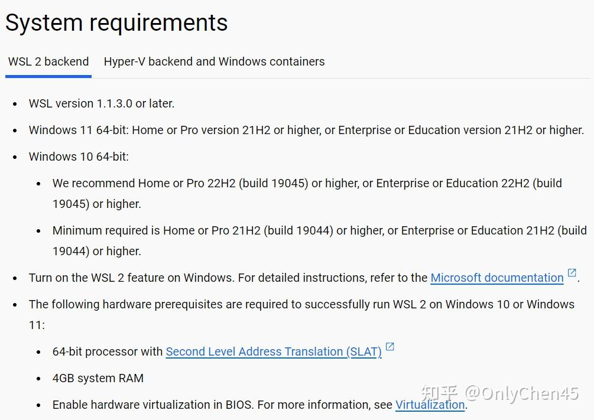
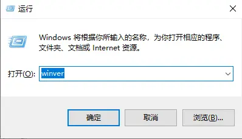
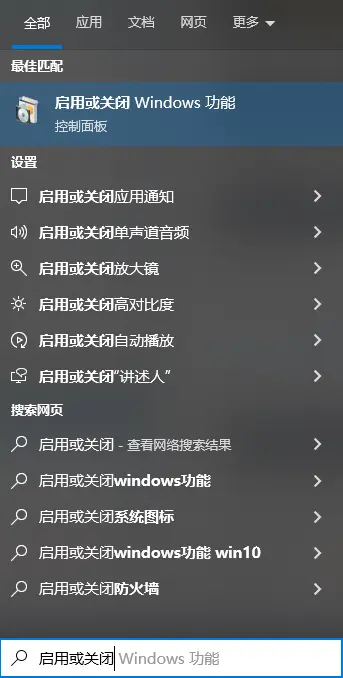
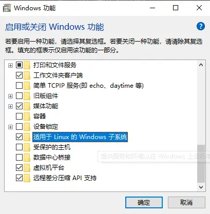

# 问题

从windows商店可以直接安装ubuntu wsl，但有时有连接问题，需采用离线安装方式。

- docker windows安装包：https://docs.docker.com/desktop/setup/install/windows-install/
- wsl离线下载：https://learn.microsoft.com/zh-cn/windows/wsl/install-manual#downloading-distributions
- windows终端：https://learn.microsoft.com/zh-cn/windows/terminal/install
- 官方文档：https://learn.microsoft.com/zh-cn/windows/wsl/tutorials/wsl-containers

# 1. 整体流程

- 安装wsl2
- 确认启用window功能
- 手动安装wsl linux
- 手动配置linuex分发版
- 安装docker desktop

## 1.1 版本确认



需要Windows 10 版本 2004 及更高版本（内部版本 19041 及更高版本）或 Windows 11。

Windows系统中使用“win+r”，输入“winver”回车，查看系统的版本。



## 1.2 启用或关闭windows功能

**方法1：命令行**

以管理员身份运行powershell (右键用管理员身份)

启用适用于Linux的Windwos子系统

```bash
dism.exe /online /enable-feature /featurename:Microsoft-Windows-Subsystem-Linux /all /norestart
```

启用虚拟机功能

```bash
dism.exe /online /enable-feature /featurename:VirtualMachinePlatform /all /norestart
```

**方法2：界面**

搜索“启用或关闭windows功能”



运行该应用，进度条拉到底，勾选所需的选项



## 1.3 重启电脑

我在另一台电脑上安装ubuntu2204，在 step7 安装ubuntu 时会遇到提示说bios的虚拟机功能未打开，无法安装。这一项也算是安装前置条件，所以这里以华硕B550M的bios简要说明如何处理。
开机 → F2进入bios界面 → F7进入高级设置 → 点击上方菜单栏中的“高级”选项 → 点击“CPU设置” → 找到SVM mode → 设置成enable → F10后正常开机

## 1.4 下载Linux内核更新包，并安装（适用于 x64 计算机的 WSL2 Linux 内核更新包）
https://wslstorestorage.blob.core.windows.net/wslblob/wsl_update_x64.msi
Linux内核更新包可以在旧版 WSL 的手动安装步骤 | Microsoft Learn中的步骤4下载

## 1.5 手动安装wsl linux

- wsl离线下载：https://learn.microsoft.com/zh-cn/windows/wsl/install-manual#downloading-distributions

点击这个链接，选择一个合适Linux版本并下载，安装所选的 Linux 分发| Microsoft Learn

我选择了Ubuntu22.04LTS

下载到一个后缀为.appx的文件后，将文件名中后缀.appx改为.zip并解压，解压后又得到一些.appx文件，将安装的Linux同样解压，例如我把Ubuntu_2204.1.7.0_x64.appx改为Ubuntu_2204.1.7.0_x64.zip并解压

把解压后的ubuntu文件放在你希望放置这个wslLinux的位置（安装的时候不会让你再次选位置

然后进入解压后的文件夹，双击ubuntu.exe

等待几分钟即可。中间会提示注册该linux系统的用户，输入用户的用户名和密码即可。

事实上，如果没有第一步安装wsl，此步会报错：

WslRegisterDistribution failed with error: 0x800701bc
安装完成后，再次双击ubuntu.exe，可以打开一个linux系统。

输入wsl -l -v 会 看刚安装的系统正确注册了

```text
 NAME                   STATE           VERSION
* Ubuntu                 Running         1
```

## 1.6 手动配置linux分发版

在Powershell中：

```text
wsl --set-version <分发版名称> <版本号>
```

即

```text
wsl --set-version Ubuntu 2
```

## 1.7 安装docker desktop

docker windows安装包：https://docs.docker.com/desktop/setup/install/windows-install/

其中，可能弹出提示，要求升级windows相关组件，以及要求运行`wsl update`

# 参考

[1] Wondows10绕开微软商店微软账户纯手动安装wsl2和docker, https://zhuanlan.zhihu.com/p/680372783
[2] WSL2安装ubuntu及修改安装位置, https://www.jianshu.com/p/6f3195bad5f1