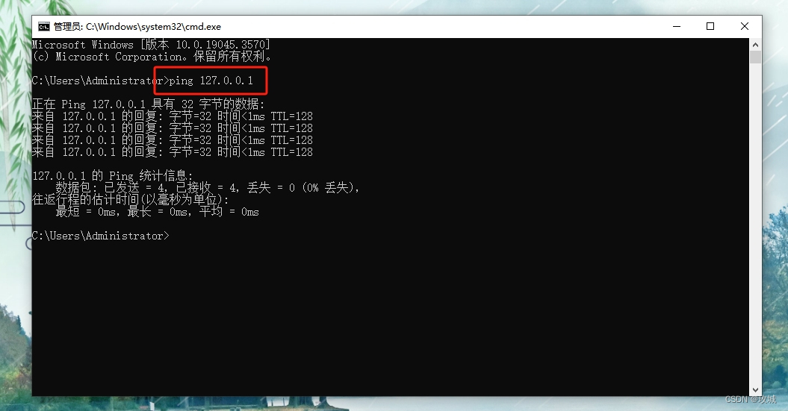
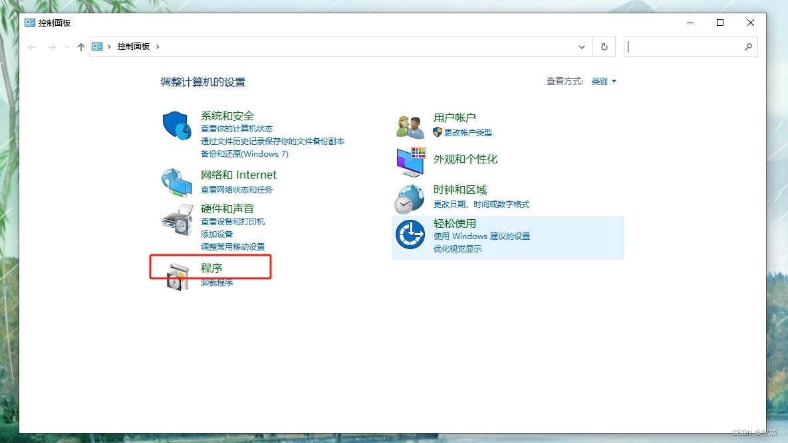
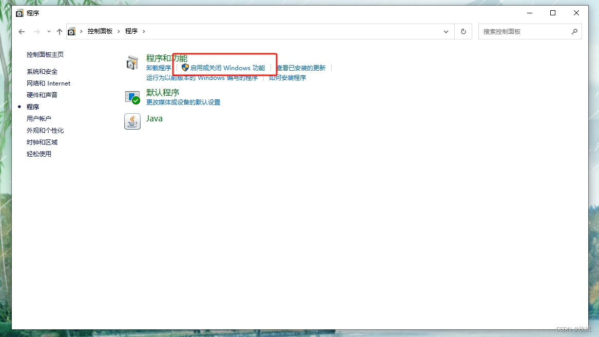
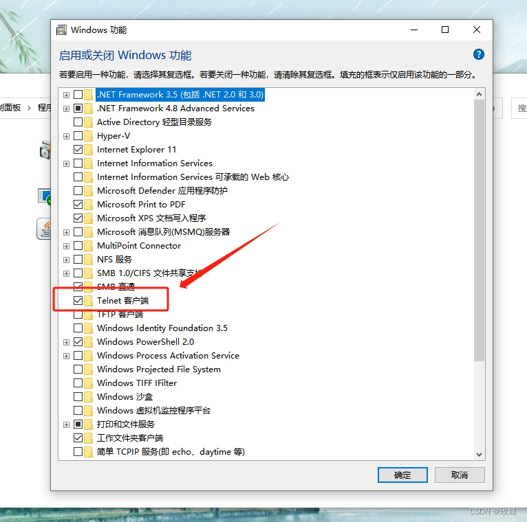
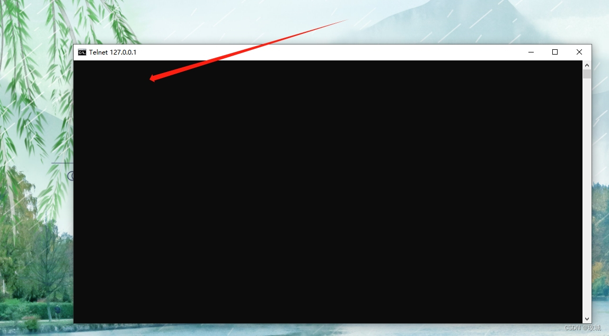
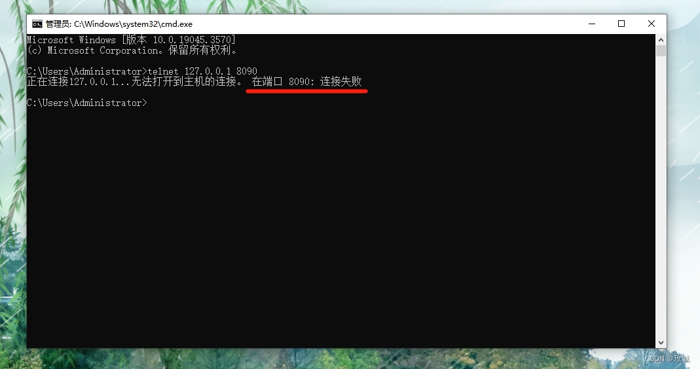

开发过程中经常会黑窗口中手动测试一下计划请求的目标ip和端口是否通畅，测试方式如下：

# 1. 单纯测试ip是否能够 ping 通，这个比较熟悉了，运行 cmd 打开黑窗口

输入如下指令，能够如下提示信息，表示端口是通畅的。

```text
ping ip(如：127.0.0.1)
```



# 2. 黑窗口测试ip + 端口
如果仍然使用 ping 的命令方法，就出现错误提示了。 这里就需要使用到另外一个指令：

```text
telnet ip port (如：127.0.0.1 8888)
```

能看到这里，并且此时直接使用此命令，大概率此命令是不通的，因为使用此命令需要提前开启Windows 的 Telnet 客户端功能，开启方式如下：







以上windows功能开启后再次尝试：


如果目标ip和端口是通的，当前窗口自动关闭，同时打开新的空白窗口：



如果目标ip和端口不通，将有如下提示：



以上便是黑窗口测试目标 ip 和 port 的方法。

# 参考

[1] [ Windows ] ping IP + Port 测试 ip 和 端口是否通畅，https://blog.csdn.net/weixin_70506521/article/details/133931567