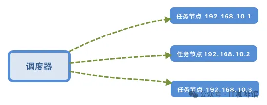
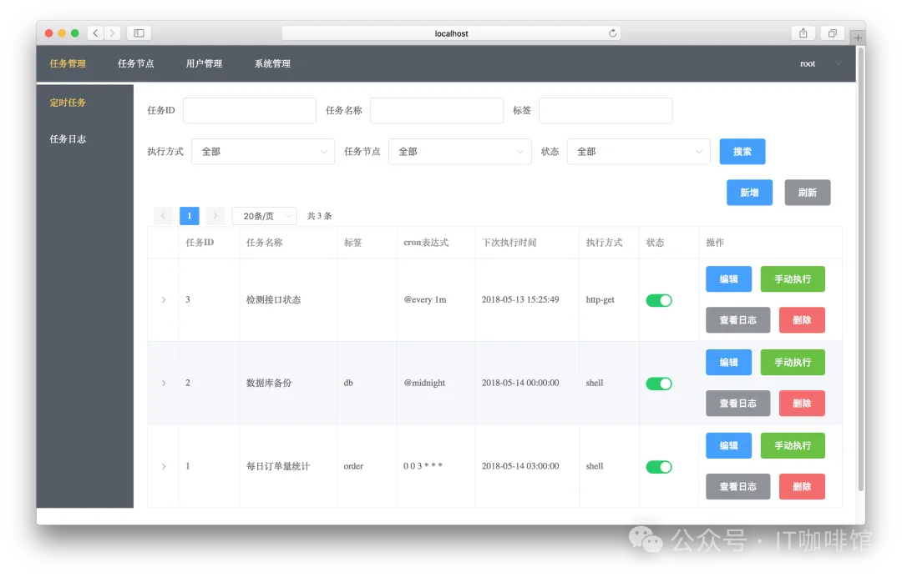

# 1. 资源

项目名称：gocron

GitHub 链接：https://github.com/ouqiang/gocron

Star 数：5K

# 2. 简介

在软件开发的过程中，经常需要使用cron表达式来执行一些定时任务，比如周期性的获取内容、更新数据、清理文件等等。

今天我们分享的开源项目，它是一个 Go 语言编写的定时任务管理系统，提供了web的使用界面，更直接的管理定时任务，它就是：gocron

gocron是使用Go语言开发的轻量级定时任务集中调度和管理系统, 用于替代Linux-crontab。

它功能强大，简单易用，适合各种规模的项目使用。无论你是开发者、运维工程师，还是小型企业的 IT 管理员，gocron 都能帮助你高效地管理定时任务。Gocron支持从简单到复杂的调度规则，无论是周期性的日常任务，还是特定日期的计划事件，都能精准安排。无论是按秒、分钟、小时、日、周、月定义任务周期，Gocron都能轻松应对。

项目的功能和特性包括以下：

- Web界面管理定时任务
- crontab时间表达式, 精确到秒
- 任务执行失败可重试
- 任务执行超时, 强制结束
- 任务依赖配置, A任务完成后再执行B任务
- 支持设置账户权限控制
- 支持多种任务类型
- shell任务：在任务节点上执行shell命令, 支持任务同时在多个节点上运行
- HTTP任务:访问指定的URL地址, 由调度器直接执行, 不依赖任务节点
- 可以查看任务执行结果日志
- 任务执行结果通知, 支持邮件、Slack、Webhook

# 参考

[1] 5k star！可视化的定时任务管理系统, https://mp.weixin.qq.com/s/5H32-UbUOwBygtaf-CPu2w