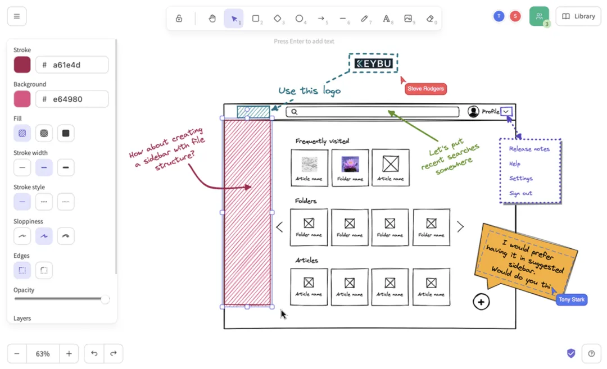

# 资源

GitHub 项目地址：https://github.com/excalidraw/excalidraw

# 简介

主要功能
团队协作：

实时多人在线编辑，零延迟体验

端到端加密，确保信息安全

一键生成分享链接，随时邀请团队成员

自动保存功能，不怕意外断线

设计特色：

手绘风格界面，让创意更有趣

丰富的图形库和模板资源

支持深色模式，长时间使用不疲劳

简洁直观的操作界面

便捷功能：

支持快速导出各种格式

复制粘贴无缝衔接

离线使用，不受网络限制

多语言支持，国际团队也能用

# 安装指南
使用 Excalidraw 非常简单：

直接访问 excalidraw.com，无需安装即可使用

需要在自己的项目中集成时，可以通过 npm 安装：

npm install @excalidraw/excalidraw

# 参考

[1] 84.8k Star！超火爆的在线画图神器，爱了！https://mp.weixin.qq.com/s/_bQ6Fe4HtNN5xBRXraeDxg