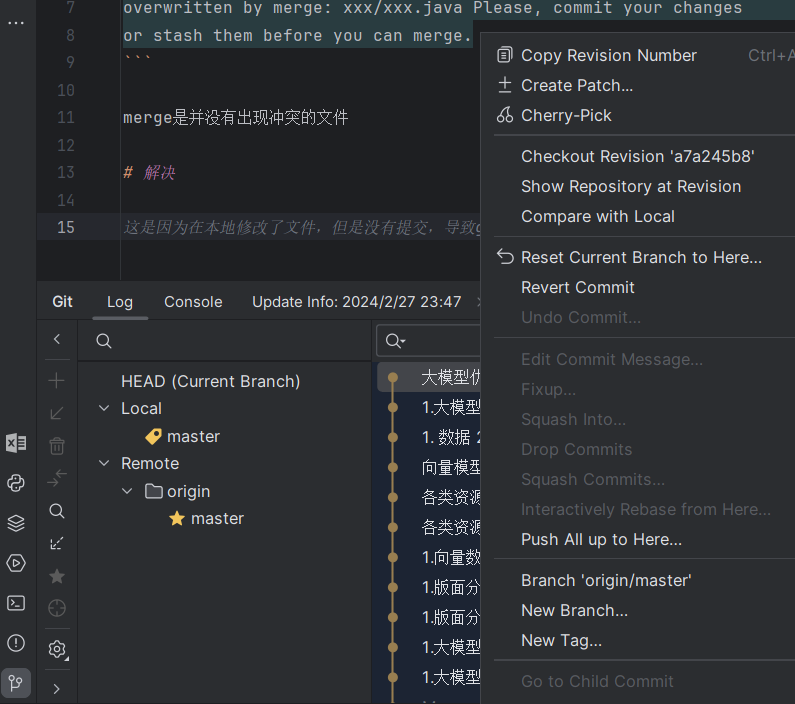

# 问题

在使用git pull命令更新代码时遇到了如下报错：

```text
error: Your local changes to the following files would be 
overwritten by merge: xxx/xxx.java Please, commit your changes 
or stash them before you can merge.
```

merge是并没有出现冲突的文件

# 解决



在pycharm的git可视化里undo commit，然后pull，再redo commit

# 参考

[1] git使用学习七、解决报错error: Your local changes to the following files would be overwritten by merge，
    https://blog.csdn.net/qq_41035283/article/details/124066316
