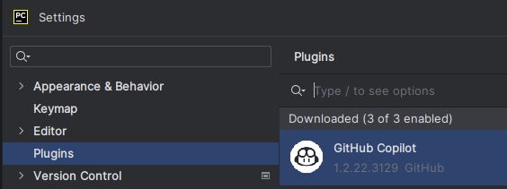

1. Install from plugin
   
    
    再pycham右下角有一个copilot头像，点击登录，然后一步一步确认，即可授权使用，前半年免费

2. Usage
    - 选中一段代码，按下快捷键 `Ctrl + .`，即可调用AI Copilot
    - 按下`Tab`键，即可选择AI Copilot给出的建议
    - 按下`Alt+[`或`Alt+]`，即可切换到上一个或下一个建议