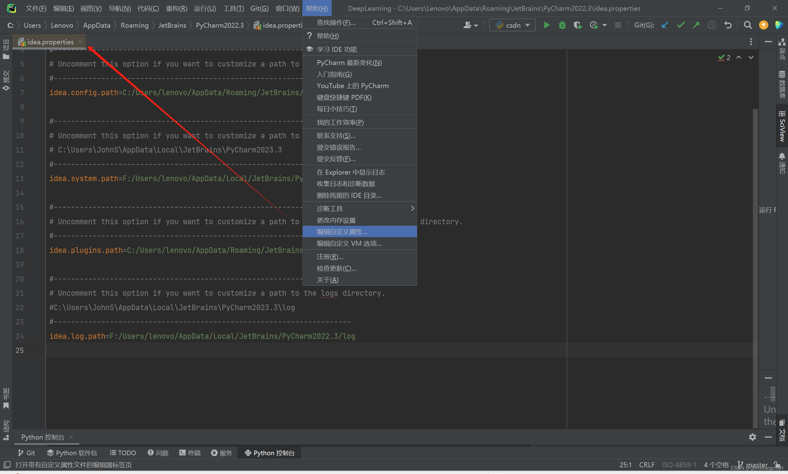
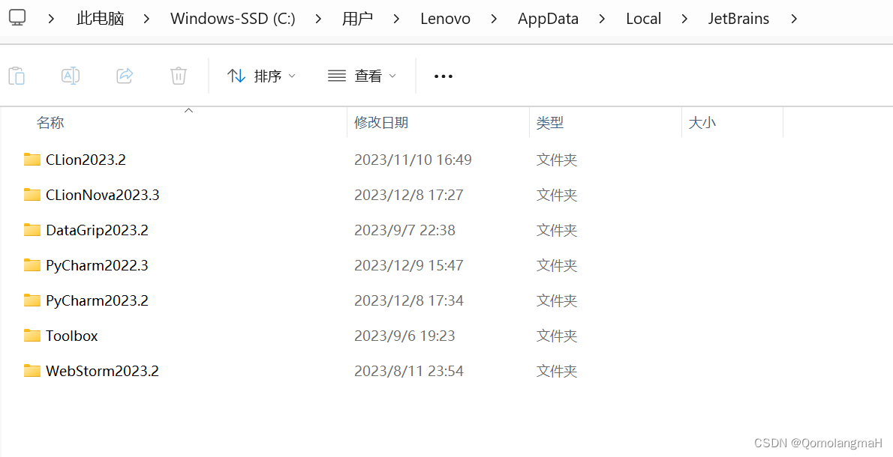

# 1. 问题

默认情况下，PyCharm 将每个 IDE 实例的用户特定文件（配置、缓存、插件、日志等）存储在用户的主目录中。
随着用的越来越多，你会发现C的空间占用越来越多。
如有必要，您可以更改存储这些文件的位置。

# 2. 解决方法
## 2.1 修改文件路径

转到“帮助”|“编辑自定义属性”



未设置过是空白的，这里是设置之后的

```markdown
| 属性              | 目录类型 | 示例路径                                                      |
|-------------------|----------|---------------------------------------------------------------|
| idea.system.path  | 配置目录 | C:\Users\JohnS\AppData\Roaming\JetBrains\PyCharm2023.3         |
| idea.system.path  | 系统目录 | C:\Users\JohnS\AppData\Local\JetBrains\PyCharm2023.3           |
| idea.plugins.path | 插件目录 | C:\Users\JohnS\AppData\Roaming\JetBrains\PyCharm2023.3\plugins |
| idea.log.path     | 日志目录 | C:\Users\JohnS\AppData\Local\JetBrains\PyCharm2023.3\log        |
```



用的久了，暂用可能超6G

修改idea.properties

```text
# custom PyCharm properties (expand/override 'bin\idea.properties')


#---------------------------------------------------------------------
# Uncomment this option if you want to customize a path to the settings directory.
#---------------------------------------------------------------------
idea.config.path=C:/Users/lenovo/AppData/Roaming/JetBrains/PyCharm2022.3

#---------------------------------------------------------------------
# Uncomment this option if you want to customize a path to the caches directory.
# C:\Users\JohnS\AppData\Local\JetBrains\PyCharm2023.3
#---------------------------------------------------------------------
idea.system.path=F:/Users/lenovo/AppData/Local/JetBrains/PyCharm2022.3

#---------------------------------------------------------------------
# Uncomment this option if you want to customize a path to the user-installed plugins directory.
#---------------------------------------------------------------------
idea.plugins.path=C:/Users/lenovo/AppData/Roaming/JetBrains/PyCharm2022.3/plugins

#---------------------------------------------------------------------
# Uncomment this option if you want to customize a path to the logs directory.
#C:\Users\JohnS\AppData\Local\JetBrains\PyCharm2023.3\log
#---------------------------------------------------------------------
idea.log.path=F:/Users/lenovo/AppData/Local/JetBrains/PyCharm2022.3/log

```

重启 PyCharm 后，将使用上述设置的相应目录的新位置。

## 2.2 清理旧的 IDE 目录

每次安装 PyCharm 的新主要版本时，它都会使用一组新的 IDE 目录，并自动删除过去 180 天内未更新的旧版本 IDE 的缓存和日志目录。配置和插件目录将永远保留，除非您手动删除它们。

- 转到“帮助”|”删除剩余的 IDE 目录。
- 在 “Delete Leftover IDE Storage Directories”（删除剩余的 IDE 存储目录）对话框中，选择不打算使用的 IDE 版本，然后单击 “Delete”（删除）。

# 参考

[1] C盘清理】Jetbrains全家桶（PyCharm、Clion……）更改 IDE 特定文件（配置、缓存、插件、日志等）存储位置, https://blog.csdn.net/m0_63834988/article/details/134896284