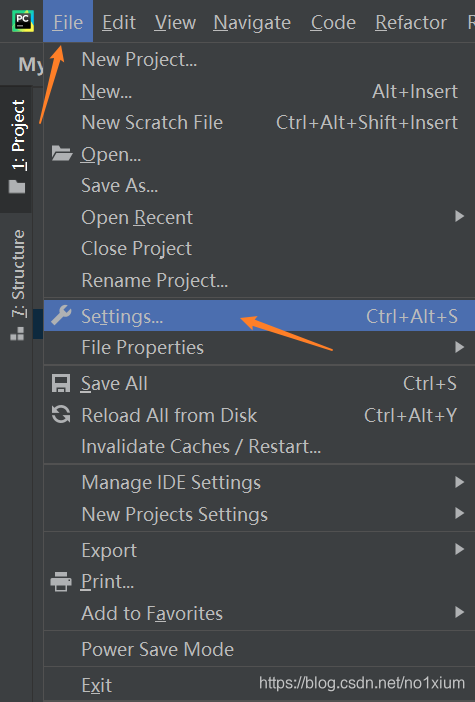
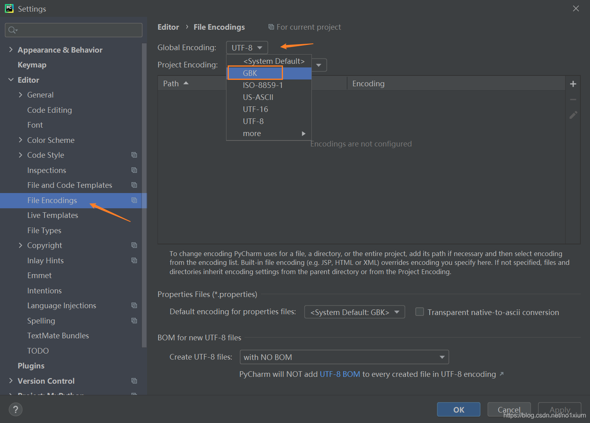

引言
在使用PyCharm进行Python开发时，中文乱码问题是一个常见且令人头疼的问题。无论是代码中的中文注释、字符串内容，还是控制台输出，一旦出现乱码，不仅影响阅读，还可能导致程序运行错误。本文将全面解析PyCharm中文乱码问题的成因，并提供详细的解决方案和配置技巧，帮助开发者彻底解决中文显示问题，提升开发效率。

中文乱码问题的成因
在深入解决方案之前，我们首先需要了解中文乱码问题产生的根本原因。

编码基础知识
计算机中所有字符都以二进制形式存储，而编码则是字符与二进制之间的映射规则。常见的编码方式有：

ASCII：美国信息交换标准代码，仅包含英文字母、数字和一些符号，无法表示中文
GBK/GB2312：中国的国家标准字符集，主要用于简体中文
UTF-8：Unicode的一种实现方式，可以表示世界上几乎所有字符，是国际通用的编码标准
ISO-8859-1：西欧字符集，不支持中文
PyCharm中文乱码的主要原因
文件编码不一致：源代码文件保存的编码与PyCharm读取时使用的编码不匹配
控制台编码不匹配：程序运行时，控制台使用的编码与程序输出编码不一致
系统环境变量问题：操作系统默认编码设置不正确
Python解释器设置问题：Python解释器默认编码设置不当
项目配置缺失：PyCharm项目级别或文件级别的编码配置不正确
PyCharm编码配置详解
全局编码设置
PyCharm提供了全局编码设置，影响所有项目和文件的默认编码。

打开PyCharm，点击菜单栏的 File → Settings（Windows/Linux）或 PyCharm → Preferences（macOS）
在设置对话框中，导航到 Editor → File Encodings
配置以下选项：
Global Encoding：设置为 UTF-8
Project Encoding：设置为 UTF-8
Default encoding for properties files：设置为 UTF-8
勾选 Transparent native-to-ASCII conversion 选项
建议配置：
- Global Encoding: UTF-8
- Project Encoding: UTF-8
- Default encoding for properties files: UTF-8
- ✓ Transparent native-to-ASCII conversion
项目级别编码设置
每个项目可以单独设置编码，优先级高于全局设置。

在项目视图中，右键点击项目根目录
选择 Open Module Settings 或按 F4
在打开的对话框中，导航到 Modules → 你的项目
在右侧的 Sources 标签页中，找到 Encoding 选项
选择 UTF-8 作为项目编码
文件级别编码设置
对于特定文件，可以单独设置编码格式。

在编辑器中打开文件
右键点击编辑器右下角显示的当前编码（如 UTF-8）
从弹出菜单中选择 File Encoding
选择正确的编码格式，或选择 UTF-8
控制台输出编码设置
PyCharm中的控制台输出乱码是常见问题，主要需要配置以下两个方面：

Python控制台编码设置
打开设置对话框，导航到 Build, Execution, Deployment → Console → Python Console
在 Environment variables 字段中添加：PYTHONIOENCODING=utf-8
或者在 Starting script 中添加以下代码：
import sys
import io
sys.stdout = io.TextIOWrapper(sys.stdout.buffer, encoding='utf-8')
sys.stderr = io.TextIOWrapper(sys.stderr.buffer, encoding='utf-8')
运行/调试配置编码设置
点击工具栏的运行/调试配置下拉菜单
选择 Edit Configurations...
在配置对话框中，找到你的运行配置
在 Environment variables 字段中添加：PYTHONIOENCODING=utf-8
或者在 Interpreter options 字段中添加：-X utf8
操作系统相关配置
Windows系统配置
Windows系统默认使用GBK编码，需要额外配置：

设置系统环境变量：

右键点击”此电脑” → “属性” → “高级系统设置” → “环境变量”
在系统变量中添加：
变量名：PYTHONIOENCODING
变量值：utf-8
或者在PyCharm的运行配置中设置环境变量：

Name: PYTHONIOENCODING
Value: utf-8
macOS系统配置
macOS系统通常默认使用UTF-8编码，但仍需检查：

打开终端，运行以下命令查看当前locale设置：

locale
如果不是UTF-8，可以设置环境变量：

export LANG=en_US.UTF-8
export LC_ALL=en_US.UTF-8
在PyCharm中，可以通过 Help → Edit Custom VM Options 添加：

-Dfile.encoding=UTF-8
Linux系统配置
Linux系统通常默认使用UTF-8，但不同发行版可能有所不同：

检查当前locale设置：

locale
如果需要修改，可以编辑 /etc/environment 文件：

LANG="en_US.UTF-8"
LC_ALL="en_US.UTF-8"
重新启动系统或运行：

source /etc/environment
Python代码中的编码处理
除了PyCharm的配置，我们还可以在Python代码中处理编码问题。

文件读写编码处理
在读写文件时，明确指定编码格式：

# 读取文件
with open('example.txt', 'r', encoding='utf-8') as f:
    content = f.read()
    print(content)

# 写入文件
with open('output.txt', 'w', encoding='utf-8') as f:
    f.write('这是一些中文内容')
字符串编码转换
当需要在不同编码之间转换时：

# 字符串编码为字节
text = "这是一些中文"
utf8_bytes = text.encode('utf-8')
gbk_bytes = text.encode('gbk')

# 字节解码为字符串
utf8_text = utf8_bytes.decode('utf-8')
gbk_text = gbk_bytes.decode('gbk')

print(f"UTF-8编码: {utf8_bytes}")
print(f"GBK编码: {gbk_bytes}")
处理命令行输出
确保命令行输出使用正确的编码：

import sys

# 检查标准输出编码
print(f"标准输出编码: {sys.stdout.encoding}")

# 如果编码不是UTF-8，可以尝试设置
if sys.stdout.encoding != 'utf-8':
    try:
        # 重新配置标准输出
        sys.stdout = open(sys.stdout.fileno(), mode='w', encoding='utf-8', buffering=1)
        print("已将标准输出设置为UTF-8编码")
    except Exception as e:
        print(f"设置标准输出编码失败: {e}")

# 输出中文测试
print("这是一些中文测试内容")
处理外部数据编码
当处理来自外部源（如数据库、API）的数据时：

import requests
import json

# 从API获取数据
response = requests.get('https://api.example.com/data')
response.encoding = 'utf-8'  # 明确指定编码

# 解析JSON数据
data = response.json()

# 处理包含中文的数据
if 'chinese_field' in data:
    chinese_text = data['chinese_field']
    print(f"获取到的中文内容: {chinese_text}")
常见编码问题及解决方案
问题1：代码中的中文注释显示乱码
现象：编辑器中的中文注释显示为乱码。

原因：文件保存的编码与PyCharm读取时使用的编码不匹配。

解决方案：

右键点击编辑器右下角的编码显示
选择正确的编码（通常是UTF-8或GBK）
如果文件确实使用了GBK编码，可以选择”Convert”将其转换为UTF-8
问题2：控制台输出中文乱码
现象：程序运行时，控制台输出的中文显示为乱码。

原因：控制台使用的编码与程序输出编码不一致。

解决方案：

在运行配置中设置环境变量 PYTHONIOENCODING=utf-8
或者在代码中添加以下内容：
import sys
import io

# 重新配置标准输出和错误输出
sys.stdout = io.TextIOWrapper(sys.stdout.buffer, encoding='utf-8')
sys.stderr = io.TextIOWrapper(sys.stderr.buffer, encoding='utf-8')
问题3：读取外部文件中文乱码
现象：读取外部文件时，中文内容显示为乱码。

原因：文件的编码与读取时指定的编码不匹配。

解决方案：

确定文件的实际编码（可以使用文本编辑器查看）
使用正确的编码读取文件：
# 尝试不同编码读取文件
def read_file_with_encoding(file_path, encodings=['utf-8', 'gbk', 'gb2312']):
    for encoding in encodings:
        try:
            with open(file_path, 'r', encoding=encoding) as f:
                return f.read()
        except UnicodeDecodeError:
            continue
    raise ValueError(f"无法使用提供的编码 {encodings} 读取文件")

# 使用示例
content = read_file_with_encoding('example.txt')
print(content)
问题4：数据库中文数据显示乱码
现象：从数据库读取的中文数据显示为乱码。

原因：数据库连接、表或字段的编码设置不正确。

解决方案：

确保数据库、表和字段使用UTF-8编码
在数据库连接字符串中指定编码：
# MySQL连接示例
import pymysql

connection = pymysql.connect(
    host='localhost',
    user='user',
    password='password',
    db='database',
    charset='utf8mb4',  # 指定字符集
    cursorclass=pymysql.cursors.DictCursor
)

# 查询数据
try:
    with connection.cursor() as cursor:
        sql = "SELECT * FROM examples"
        cursor.execute(sql)
        results = cursor.fetchall()
        for row in results:
            print(row['chinese_column'])
finally:
    connection.close()
问题5：Web应用中文响应乱码
现象：Web应用返回的中文内容在浏览器中显示为乱码。

原因：HTTP响应头中未正确指定字符编码。

解决方案：

在HTTP响应头中指定Content-Type为UTF-8：
# Flask示例
from flask import Flask, Response

app = Flask(__name__)

@app.route('/')
def index():
    content = "这是一些中文内容"
    return Response(
        content,
        mimetype='text/html',
        headers={'Content-Type': 'text/html; charset=utf-8'}
    )

if __name__ == '__main__':
    app.run(debug=True)
或者在HTML模板中指定字符集：
<!DOCTYPE html>
<html>
<head>
    <meta charset="UTF-8">
    <title>中文页面</title>
</head>
<body>
    <h1>这是一些中文内容</h1>
</body>
</html>
实际案例演示
案例1：处理中文文本文件
假设我们有一个包含中文的文本文件，需要正确读取和处理：

# 创建一个包含中文的文本文件
with open('chinese_text.txt', 'w', encoding='utf-8') as f:
    f.write("这是一个测试文件。\n")
    f.write("包含多行中文内容。\n")
    f.write("我们需要确保这些内容能够正确显示。\n")

# 读取并处理文件
def process_chinese_file(file_path):
    # 尝试使用UTF-8编码读取
    try:
        with open(file_path, 'r', encoding='utf-8') as f:
            lines = f.readlines()
            print("使用UTF-8编码成功读取文件：")
            for i, line in enumerate(lines, 1):
                print(f"第{i}行: {line.strip()}")
    except UnicodeDecodeError:
        # 如果UTF-8失败，尝试GBK编码
        try:
            with open(file_path, 'r', encoding='gbk') as f:
                lines = f.readlines()
                print("使用GBK编码成功读取文件：")
                for i, line in enumerate(lines, 1):
                    print(f"第{i}行: {line.strip()}")
        except UnicodeDecodeError as e:
            print(f"无法解码文件: {e}")
            return None
    
    # 处理文本内容
    word_count = sum(len(line.split()) for line in lines)
    char_count = sum(len(line) for line in lines)
    
    print(f"\n统计信息:")
    print(f"总行数: {len(lines)}")
    print(f"总词数: {word_count}")
    print(f"总字符数: {char_count}")
    
    return lines

# 调用函数处理文件
process_chinese_file('chinese_text.txt')
案例2：中文数据处理与分析
下面是一个处理中文数据并进行简单分析的例子：

import pandas as pd
import matplotlib.pyplot as plt
import jieba
from collections import Counter

# 确保matplotlib支持中文显示
plt.rcParams['font.sans-serif'] = ['SimHei']  # 用来正常显示中文标签
plt.rcParams['axes.unicode_minus'] = False  # 用来正常显示负号

# 创建包含中文的示例数据
data = {
    '产品': ['笔记本电脑', '智能手机', '平板电脑', '智能手表', '耳机'],
    '销量': [1200, 3500, 800, 1500, 2200],
    '评价': ['性能强劲，外观精美', '拍照效果极佳，系统流畅', '屏幕清晰，便携性好', 
             '功能丰富，续航能力强', '音质出色，佩戴舒适']
}

# 创建DataFrame
df = pd.DataFrame(data)
print("原始数据:")
print(df)

# 数据分析
print("\n数据分析:")
print(f"总销量: {df['销量'].sum()}")
print(f"平均销量: {df['销量'].mean():.2f}")
print(f"最高销量产品: {df.loc[df['销量'].idxmax(), '产品']}")

# 中文分词和词频统计
def analyze_chinese_text(text):
    # 使用jieba进行中文分词
    words = jieba.lcut(text)
    # 过滤掉单字和常见停用词
    stopwords = ['的', '和', '是', '在', '有', '我', '你', '它', '了', '与']
    filtered_words = [word for word in words if len(word) > 1 and word not in stopwords]
    return filtered_words

# 合并所有评价文本
all_comments = ' '.join(df['评价'])
# 分词
words = analyze_chinese_text(all_comments)
# 统计词频
word_counts = Counter(words)
print("\n评价中的高频词:")
for word, count in word_counts.most_common(5):
    print(f"{word}: {count}次")

# 可视化销量数据
plt.figure(figsize=(10, 6))
plt.bar(df['产品'], df['销量'], color='skyblue')
plt.title('产品销量对比')
plt.xlabel('产品名称')
plt.ylabel('销量')
plt.xticks(rotation=15)  # 旋转x轴标签，避免重叠
plt.tight_layout()  # 自动调整布局
plt.show()
案例3：多语言Web应用开发
下面是一个简单的多语言Web应用示例，展示如何处理中文和其他语言：

from flask import Flask, render_template, request

app = Flask(__name__)

# 多语言支持
LANGUAGES = {
    'en': {
        'greeting': 'Hello',
        'welcome': 'Welcome to our website!',
        'description': 'This is a multilingual website example.'
    },
    'zh': {
        'greeting': '你好',
        'welcome': '欢迎访问我们的网站！',
        'description': '这是一个多语言网站示例。'
    },
    'ja': {
        'greeting': 'こんにちは',
        'welcome': '私たちのウェブサイトへようこそ！',
        'description': 'これは多言語ウェブサイトの例です。'
    }
}

@app.route('/')
def index():
    # 获取用户语言偏好，默认为英语
    user_language = request.args.get('lang', 'en')
    
    # 如果不支持的语言，回退到英语
    if user_language not in LANGUAGES:
        user_language = 'en'
    
    # 获取对应语言的内容
    content = LANGUAGES[user_language]
    
    # 渲染模板，传递语言内容
    return render_template('index.html', 
                          greeting=content['greeting'],
                          welcome=content['welcome'],
                          description=content['description'],
                          current_lang=user_language,
                          available_langs=LANGUAGES.keys())

if __name__ == '__main__':
    app.run(debug=True)
对应的HTML模板 (templates/index.html):

<!DOCTYPE html>
<html>
<head>
    <meta charset="UTF-8">
    <title>多语言网站示例</title>
    
</head>
<body>
    

        
            <a href="/?lang={{ lang }}" class="current-lang">
                {{ lang.upper() }}
            </a>
        
    

    
    <h1>{{ greeting }}</h1>
    
    

        
{{ welcome }}

        
{{ description }}

    

</body>
</html>
最佳实践和技巧
1. 统一使用UTF-8编码
作为最佳实践，所有项目、文件和I/O操作都应该统一使用UTF-8编码：

# 在项目开始时，可以设置默认编码
import sys
import locale

# 设置标准输出编码为UTF-8
if sys.stdout.encoding != 'utf-8':
    sys.stdout = open(sys.stdout.fileno(), mode='w', encoding='utf-8', buffering=1)

# 设置文件打开默认编码为UTF-8
import functools

@functools.wraps(open)
def utf8_open(file, mode='r', **kwargs):
    if 'b' not in mode and 'encoding' not in kwargs:
        kwargs['encoding'] = 'utf-8'
    return open(file, mode, **kwargs)

# 替换内置的open函数
open = utf8_open

# 现在可以安全地打开文本文件，默认使用UTF-8编码
with open('example.txt', 'w') as f:
    f.write('这是一些中文内容')
2. 处理编码异常
编写健壮的代码，正确处理编码异常：

def safe_str_to_bytes(s, encoding='utf-8', errors='strict'):
    """安全地将字符串转换为字节"""
    if isinstance(s, str):
        return s.encode(encoding, errors=errors)
    elif isinstance(s, bytes):
        return s
    else:
        return str(s).encode(encoding, errors=errors)

def safe_bytes_to_str(b, encoding='utf-8', errors='strict'):
    """安全地将字节转换为字符串"""
    if isinstance(b, bytes):
        return b.decode(encoding, errors=errors)
    elif isinstance(b, str):
        return b
    else:
        return str(b)

# 使用示例
text = "这是一些中文内容"
bytes_data = safe_str_to_bytes(text)
back_to_text = safe_bytes_to_str(bytes_data)

print(f"原始文本: {text}")
print(f"转换为字节: {bytes_data}")
print(f"转换回文本: {back_to_text}")
3. 使用编码检测库
当不确定文件编码时，可以使用编码检测库：

# 首先安装chardet库：pip install chardet
import chardet

def detect_file_encoding(file_path):
    """检测文件编码"""
    with open(file_path, 'rb') as f:
        raw_data = f.read()
        result = chardet.detect(raw_data)
        return result['encoding']

# 使用示例
file_path = 'unknown_encoding.txt'
encoding = detect_file_encoding(file_path)
print(f"检测到的文件编码: {encoding}")

# 使用检测到的编码读取文件
try:
    with open(file_path, 'r', encoding=encoding) as f:
        content = f.read()
        print(f"文件内容: {content[:100]}...")  # 只显示前100个字符
except UnicodeDecodeError:
    print("检测到的编码仍然无法正确解码文件")
4. 创建编码工具函数
创建一个编码工具模块，方便在项目中重复使用：

# encoding_utils.py
import sys
import io
import locale
import chardet

def set_utf8_environment():
    """设置UTF-8环境"""
    # 设置标准输出和错误输出为UTF-8
    if sys.stdout.encoding != 'utf-8':
        sys.stdout = io.TextIOWrapper(sys.stdout.buffer, encoding='utf-8')
    if sys.stderr.encoding != 'utf-8':
        sys.stderr = io.TextIOWrapper(sys.stderr.buffer, encoding='utf-8')
    
    # 设置默认文件系统编码
    if locale.getpreferredencoding() != 'UTF-8':
        try:
            # 在Windows上设置环境变量
            if sys.platform == 'win32':
                import os
                os.environ['PYTHONIOENCODING'] = 'utf-8'
        except Exception as e:
            print(f"设置环境编码失败: {e}")

def read_file_with_fallback(file_path, default_encoding='utf-8'):
    """使用回退机制读取文件"""
    # 首先尝试使用默认编码
    try:
        with open(file_path, 'r', encoding=default_encoding) as f:
            return f.read()
    except UnicodeDecodeError:
        pass
    
    # 检测文件编码
    try:
        with open(file_path, 'rb') as f:
            raw_data = f.read()
            detected = chardet.detect(raw_data)
            encoding = detected['encoding']
            confidence = detected['confidence']
            
            if confidence > 0.7:  # 置信度足够高
                return raw_data.decode(encoding)
    except Exception:
        pass
    
    # 尝试常见编码
    for encoding in ['gbk', 'gb2312', 'big5', 'shift_jis']:
        try:
            with open(file_path, 'r', encoding=encoding) as f:
                return f.read()
        except UnicodeDecodeError:
            continue
    
    # 所有尝试都失败，抛出异常
    raise ValueError(f"无法解码文件: {file_path}")

def write_file_utf8(file_path, content):
    """使用UTF-8编码写入文件"""
    with open(file_path, 'w', encoding='utf-8') as f:
        f.write(content)

# 使用示例
if __name__ == '__main__':
    # 设置UTF-8环境
    set_utf8_environment()
    
    # 写入文件
    write_file_utf8('test.txt', '这是一些中文内容')
    
    # 读取文件
    content = read_file_with_fallback('test.txt')
    print(f"读取到的内容: {content}")
5. 配置PyCharm检查和自动修复编码问题
PyCharm提供了一些检查和自动修复功能，可以帮助识别和解决编码问题：

打开设置对话框，导航到 Editor → Inspections
在搜索框中输入 “encoding”
启用以下检查：
Encoding problems：检测可能的编码问题
File encoding：检查文件编码设置
点击 Apply 保存设置
启用这些检查后，PyCharm会在检测到潜在编码问题时显示警告，并提供快速修复选项。

总结
PyCharm中文乱码问题是一个常见但完全可以解决的问题。通过正确配置PyCharm的全局、项目和文件级别编码设置，以及合理处理Python代码中的编码问题，可以确保中文内容在开发环境中正确显示和处理。

本文详细介绍了PyCharm中文乱码问题的成因、各种配置方法、常见问题的解决方案以及实际案例演示。通过遵循本文提供的最佳实践和技巧，开发者可以彻底解决中文乱码问题，提升开发效率，专注于核心业务逻辑的实现。

记住，统一使用UTF-8编码是解决大多数编码问题的关键，同时编写健壮的代码来处理可能的编码异常也是非常重要的。希望本文能帮助你在PyCharm开发环境中顺利处理中文字符，避免编码错误，提升开发体验。

# 参考

[1] PyCharm中文输出乱码问题解决方法与配置技巧详解 让你的代码完美显示中文字符避免编码错误提升开发效率, https://www.oryoy.com/news/pycharm-zhong-wen-shu-chu-luan-ma-wen-ti-jie-jue-fang-fa-yu-pei-zhi-ji-qiao-xiang-jie-rang-ni-de-dai.html