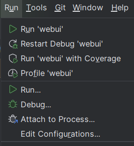

# 1. 问题

Pycharm报错：Error running ‘XXX‘: Cannot run program “XXX\python.exe“ (in directory “XXX“)CreateProcess

# 2. 解决方案

1. 方法1：重启Pycharm

2. 方法2：删除任务后重新启动

   在如下图中"Edit Configurations"中删除任务，然后重新启动任务即可

   

3. 方法3：删除文件夹下的.idea文件夹，然后重新打开项目即可（未测试）
   
   

# 参考

[1] Pycharm报错：Error running ‘XXX‘: Cannot run program “XXX\python.exe“ (in directory “XXX“)CreateProcess,
    https://blog.csdn.net/kele52he/article/details/111233185
