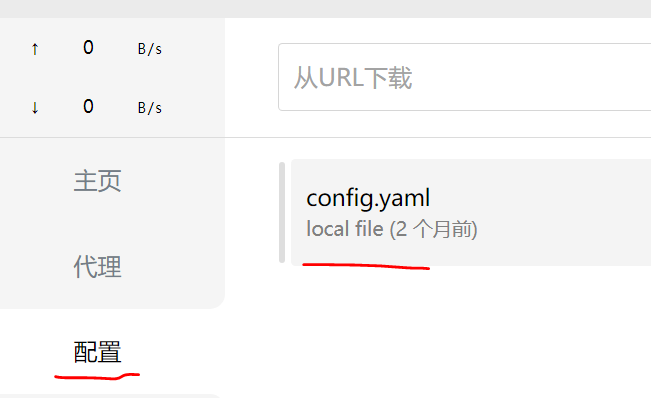
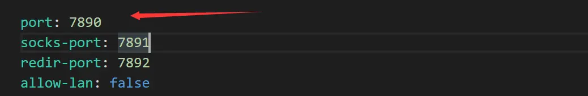
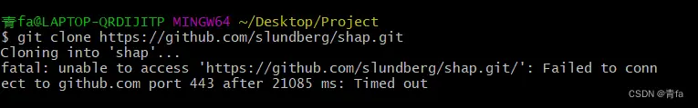

# 1. 问题
   
   pycharm从国内访问国外网站，如github，总是很慢，甚至无法访问。使用代理，如clash后，浏览器可以访问国外网站，但是pycharm依旧
   无法访问。

# 2. 解决方法
## 2.1 PyCharm代理配置

- 全局配置：单击windows最右下角clash图标，选择全局
  - 
- 更改站点
- 在clash中，配置，双击config.yaml查看配置文件
  
- 在pycharm中设置http proxy
  - 打开Pycharm 找到File -> Settings -> Appearance & Behavior -> System Settings -> HTTP Proxy 
     输入clash的Host name和代理端口(在clash的yaml文件中找)
     hostname一般默认是 127.0.0.1然后在check connection中输入URL  https://www.youtube.com/  查看是否设置成功
  - 
     
   ```yaml
    post: 7980
    hostname: 127.0.0.1
    测试URL：https://www.youtube.com/
  ``` 

## 2.2 Git全局代理配置

完成2.1的配置后，发现git还是无法正常联网，报端口 443 错误，由于git也需要设置代理。



使用Git bash工具

```shell
# 注意修改成自己的IP和端口号
git config --global http.proxy http://127.0.0.1:7890 
git config --global https.proxy http://127.0.0.1:7890
```

取消代理

```shell
# 取消代理
git config --global --unset http.proxy
git config --global --unset https.proxy

# 查看代理
git config --global --get http.proxy
git config --global --get https.proxy
```

# 参考

[1] pycharm配合clash设置http proxy, https://www.jianshu.com/p/5d440437f5fe
[2] 解决 Github port 443 : Timed out，https://zhuanlan.zhihu.com/p/636418854