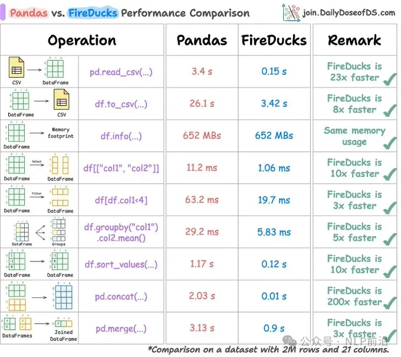

切换到FireDucks的5 个原因

只需更改一行代码：
将 "𝗶𝗺𝗽𝗼𝗿t 𝗽𝗮𝗻𝗱𝗮𝘀 𝗮𝘀 𝗽𝗱" 替换为 "𝗶𝗺𝗽𝗼𝗿t 𝗳𝗶𝗿𝗲𝗱𝘂𝗰𝗸𝘀.𝗽𝗮𝗻𝗱𝗮𝘀 𝗮𝘀 𝗽𝗱"

剩余的全部代码保持不变。

所以，如果你熟悉 Pandas，你就已经熟悉如何使用 FireDucks。

根据官方基准测试，速度极快
Modin 相比 Pandas 平均加速了 0.9 倍。

Polars 相比 Pandas 平均加速了 39 倍。

但是 FireDucks 的速度比 Pandas 快了 50 倍。

Pandas 是单核；FireDucks 是多核。

Pandas 遵循Eager Execution；FireDucks 基于Lazy Execution。

前者意味着它在你调用函数时就会立刻执行计算，立即返回结果。这种方式比较直观，但对于复杂的操作，可能会导致不必要的中间计算和效率问题。

后者意味着它在你请求结果时不会立即执行计算，而是先构建一个 逻辑执行计划（即操作的执行顺序和结构），并在必要时应用可能的优化，比如合并多个操作、减少计算的开销等，直到你真正需要最终结果时才会执行。

在复杂的数据处理场景中，FireDucks 的模式会比较快！

即使在Eager Execution，FireDucks 也比 Pandas 快得多，如下图：

# 参考

[1] Pandas要退休了，速度狂飙50倍！https://mp.weixin.qq.com/s/ziaiP2s7rab0DMM3kzTnuQ