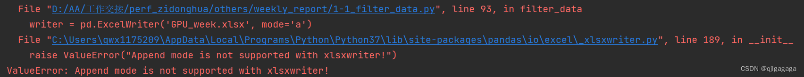

# 问题

对excel追加写入时报错

运行报错：ValueError: Append mode is not supported with xlsxwriter!



# 解决方案

原因：

ExcelWriter中，当mode为a时，需要将引擎指定为openpyxl，增加参数engine=‘openpyxl’

```python
writer = pd.ExcelWriter('GPU_week.xlsx', mode='a', engine='openpyxl')
df_filtered = df_excel[~df_excel['简要描述'].str.contains('【Daily】|【LLVM-15】|【Weekly】|【版本预验证')]
df_filtered.to_excel(writer, index=False, sheet_name='【非daily】')
```

当mode为w时，引擎可不加

# 总结

openpyxl是一个支持 追加 模式的Excel操作库，而不需要指定引擎是因为pandas自带的ExcelWriter已经实现了 覆盖 模式的功能

# 参考

[1] ValueError: Append mode is not supported with xlsxwriter!，https://blog.csdn.net/qjlgagaga/article/details/134012731
