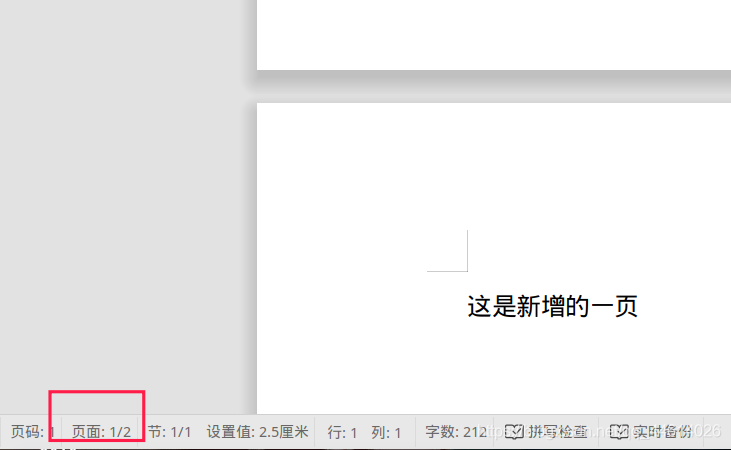
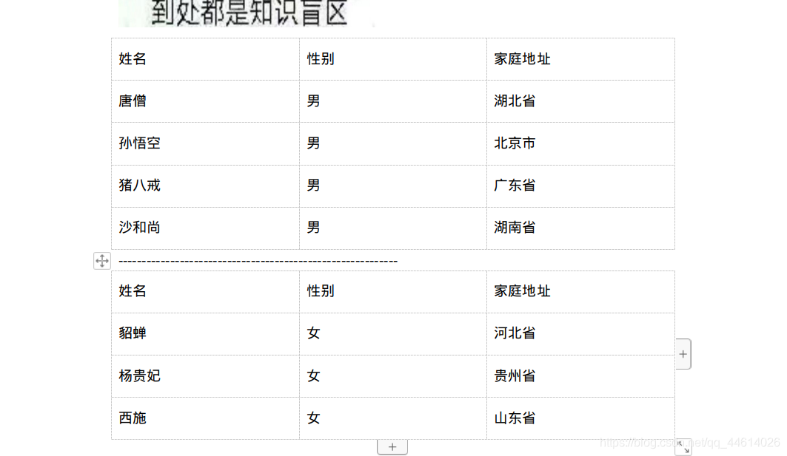

# python 使用 python-docx 读取和写入 word
# 1. 安装

```bash
pip install python-docx

若安装超时或速度较慢，可更换安装源
pip3 install -i https://pypi.tuna.tsinghua.edu.cn/simple python-docx
```

# 2. 读取 word 文档


python-docx 提取文字和文字块


```python
from docx import Document

path = '/media/bobo/自动化办公/wordOperation/wordDemo/test2.docx'

doc = Document(path)
print(doc.paragraphs)

# 输出的是列表，列表中一共有4份内容
# [<docx.text.paragraph.Paragraph object at 0x7fca95f0aba8>,
# <docx.text.paragraph.Paragraph object at 0x7fca95f0abe0>,
# <docx.text.paragraph.Paragraph object at 0x7fca95f0ab70>, 
#<docx.text.paragraph.Paragraph object at 0x7fca95f0ac50>,]

for paragraph in doc.paragraphs:
	print(paragraph.text)

# 输出文件中的所有文字

# 摘要
#
# 二十一世纪，科技的不断发展，移动互联网行业的技术迭代不断深入。
# 电子商务已成为一项较为先进的商业模式在我国快速兴起与发展，网络购物这一行业发展日益成熟，网上购物已成当前购物订单评价方式的主流。
```

python-docx 提取文字块

```python
from docx import Document

path = '/media/bobo/自动化办公/wordOperation/wordDemo/test2.docx'

doc = Document(path)
# print(doc.paragraphs)

# 输出的是列表，列表中一共有4份内容
# [<docx.text.paragraph.Paragraph object at 0x7fca95f0aba8>, 
#<docx.text.paragraph.Paragraph object at 0x7fca95f0abe0>,
# <docx.text.paragraph.Paragraph object at 0x7fca95f0ab70>, 
#<docx.text.paragraph.Paragraph object at 0x7fca95f0ac50>,]


paragraph0 = doc.paragraphs[0]
runs0 = paragraph0.runs
print(runs0)

for run0 in runs0:
	print(run0.text)
	
# 	输出结果：# 输出结果：该段落被分为1个文字块，文字块内容为“摘要”

# 	[<docx.text.run.Run object at 0x7f5ea3faec18>]
#   摘要


paragraph1 = doc.paragraphs[1]
runs1 = paragraph1.runs
print(runs1)

for run1 in runs1:
	print(run1.text)


# 输出结果：该段落为空，没有文字块
# []


paragraph2 = doc.paragraphs[2]
runs2 = paragraph2.runs
print(runs2)

for run2 in runs2:
	print(run2.text)
	
# 输出结果：该段落被分为4个文字块

#[<docx.text.run.Run object at 0x7f3e6fe43c50>,
# <docx.text.run.Run object at 0x7f3e6fe43b38>,
# <docx.text.run.Run object at 0x7f3e6fe43dd8>,
# <docx.text.run.Run object at 0x7f3e6fe43cc0>]
# 二十一世纪
# ，科技的不断发展，
# 移动互联网行业的
# 技术迭代不断深入。


paragraph3 = doc.paragraphs[3]
runs3 = paragraph3.runs
print(runs3)

for run3 in runs3:
	print(run3.text)
	
	

# 输出结果：该段落被分为5个文字块

# [<docx.text.run.Run object at 0x7f182b509b38>, 
#<docx.text.run.Run object at 0x7f182b509c18>,
# <docx.text.run.Run object at 0x7f182b509b70>,
# <docx.text.run.Run object at 0x7f182b509e10>,
# <docx.text.run.Run object at 0x7f182b509cf8>]
# 电子商务
# 已成为一项较为
# 先进的商业模式在我国快速兴起
# 与发展，网络购物这一行业发展日益成熟，
# 网上购物已成当前购物订单评价方式的主流。
```

# 3. 写入 word 文档

添加段落

```python
from docx import Document

path = '/media/bobo/自动化办公/wordOperation/wordDemo/test2.docx'

doc = Document(path)

# print(doc.add_heading("一级标题", level=1)) 添加一级标题的时候出错，还没有解决！

# 添加段落的时候，赋值给一个变量，方便我们后面进行格式调整

paragraph1 = doc.add_paragraph("物联网-万物互联成为新的趋势。")
paragraph2 = doc.add_paragraph("电商企业在不断丰富产品类，水果生鲜一类的电商产品，
在网上购物商场中也占据一席之地，但目前却少有网站是单一为水果生鲜一类产品而设计。")

# 保存
doc.save(path)
# 注意，进行操作之后一定要进行保存操作，否则将对文件的修改会失效
```


添加文字块

```python
from docx import Document

path = '/media/bobo/自动化办公/wordOperation/wordDemo/test2.docx'

doc = Document(path)


# 这里相当于输入了一个空格，后面等待着文字输入
paragraph3 = doc.add_paragraph()

paragraph3.add_run("这句是被加粗了文字块").bold = True
paragraph3.add_run("，这句是普通文字块，")
paragraph3.add_run("这句是斜体文字块").italic = True

doc.save(path)
```


添加一个分页

```python
from docx import Document

path = '/media/bobo/自动化办公/wordOperation/wordDemo/test2.docx'

doc = Document(path)

# 添加一个分页
doc.add_page_break()

# 在新分页中添加一句话
paragraph1 = doc.add_paragraph("这是新增的一页")

doc.save(path)

```



添加图片

```python
'''
Cm 模块，用于设定图片尺寸大小
只给定一个宽度或高度，另一个会自动计算
'''

from docx import Document
from docx.shared import Cm

path = '/media/bobo/自动化办公/wordOperation/wordDemo/test2.docx'
picPath = '/media/bobo/自动化办公/wordOperation/openAndRead/pic.jpeg'

doc = Document(path)

doc.add_picture(picPath,width=Cm(7),height=Cm(5))

doc.save(path)
```


添加表格

```python
from docx import Document

path = '/media/bobo/自动化办公/wordOperation/wordDemo/test2.docx'

doc = Document(path)

list1 = [
["姓名","性别","家庭地址"],
["唐僧","男","湖北省"],
["孙悟空","男","北京市"],
["猪八戒","男","广东省"],
["沙和尚","男","湖南省"]
]
list2 = [
["姓名","性别","家庭地址"],
["貂蝉","女","河北省"],
["杨贵妃","女","贵州省"],
["西施","女","山东省"]
]


table1 = doc.add_table(rows=5,cols=3)

for row in range(5):
	cells = table1.rows[row].cells
	for col in range(3):
		cells[col].text = str(list1[row][col])
doc.add_paragraph("---------------------------------------------------------")

table2 = doc.add_table(rows=4,cols=3)

for row in range(4):
	cells = table2.rows[row].cells
	for col in range(3):
		cells[col].text = str(list2[row][col])
		
		
doc.save(path)
```



# 4. 高级操作

提取 word 表格，并保存在 excel 中

```python
from docx import Document
from openpyxl import Workbook

docPath = '/media/bobo/自动化办公/wordOperation/wordDemo/test2.docx'

doc = Document(docPath)

t0 = doc.tables[1]

workbook = Workbook()
sheet = workbook.active

for i in range(len(t0.rows)):
	list1 = []
	for j in range(len(t0.columns)):
		list1.append(t0.cell(i,j).text)
	sheet.append(list1)


workbook.save(filename="/media/bobo/自动化办公/wordOperation/wordDemo/test.xlsx")
```


# 参考

[1] python 使用 python-docx 读取和写入 word, https://blog.csdn.net/qq_44614026/article/details/108223149