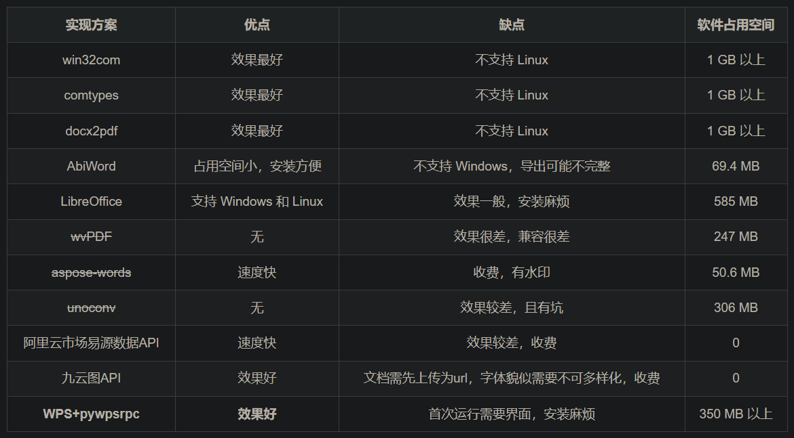

# 1. 简介

当前大部分方案均依赖office/libreOffice/WPS等组建，转换效果较好的为office和wps。其余的较好转换库均收费。



# 2. 使用

## 2.1 windows下的处理方法

```python
from win32com import client
import os
'''
代码描述：
用来实现doc与docx互转的一个软件

特色：
可穿透指定路径下的所有文件，对找到的所有word文档进行操作
并把结果输出到指定路径中

注意事项：
请确认没有同名文件，否则文件会覆盖
'''

# 转换doc为docx
def doc2docx(fn):
    word = client.Dispatch("Word.Application")  # 打开word应用程序
    doc = word.Documents.Open(fn)  # 打开word文件

    a = os.path.split(fn)  # 分离路径和文件
    b = os.path.splitext(a[-1])[0]  # 拿到文件名

    doc.SaveAs("{}\\{}.docx".format(path1, b), 12)  # 另存为后缀为".docx"的文件，其中参数12或16指docx文件
    doc.Close()  # 关闭原来word文件
    word.Quit()


# 转换docx为doc
def docx2doc(fn):
    word = client.Dispatch("Word.Application")  # 打开word应用程序
    doc = word.Documents.Open(fn)  # 打开word文件

    a = os.path.split(fn)  # 分离路径和文件
    b = os.path.splitext(a[-1])[0]  # 拿到文件名

    doc.SaveAs("{}\\{}.doc".format(path1, b), 0)  # 另存为后缀为".docx"的文件，其中参数0指doc
    doc.Close()  # 关闭原来word文件
    word.Quit()


# 获取指定路径下的所有word文件
# 可以穿透指定路径下的所有文件
def getfile(path):
    word_list = []  # 用来存储所有的word文件路径
    for current_folder, list_folders, files in os.walk(path):
        for f in files:  # 用来遍历所有的文件，只取文件名，不取路径名
            if f.endswith('doc') or f.endswith('docx'):  # 判断word文档
                word_list.append(current_folder + '\\' + f)  # 把路径添加到列表中
    return word_list  # 返回这个word文档的路径


# 用户选择的转换模式
def choice():
    num_list = ['1', '2', '3']
    a = 1
    print('请选择转换模式：')
    while a:
        print('doc与docx互转请输入：\t1')
        print('doc转docx请输入：\t2')
        print('docx转doc请输入：\t3')
        user_choice = input('我选择：')
        if user_choice in num_list:
            a = 0
            return user_choice
        else:
            print('请输入正确的选项')


if __name__ == '__main__':
    word_path = input('请给出word文档所在路径：')
    words = getfile(word_path)

    # 设置一个路径path1，保存输出结果
    print("[+] 请输入一个路径，用来存放所有的处理结果")
    print("[+] 或者按回车键，我将自动把处理之后的文件存放在你的桌面")
    path1 = input('')  # path1 用来存放所有的处理结果
    if len(path1):
        pass
    else:
        desktop_path = os.path.join(os.path.expanduser("~"), 'Desktop')  # 获取桌面路径
        path1 = os.path.join(desktop_path, '所有的处理结果')
        os.makedirs(path1)

    user_choice = choice()
    print('转换中，请稍等……')
    if user_choice == '1':
        for word in words:
            if word.endswith('doc'):
                doc2docx(word)
            else:
                docx2doc(word)
    if user_choice == '2':
        for word in words:
            if word.endswith('doc'):
                doc2docx(word)
    if user_choice == '3':
        for word in words:
            if word.endswith('docx'):
                docx2doc(word)
    print('转换完毕')

```


# 参考

[1] python实现——doc与docx互转（终极版）， https://blog.csdn.net/weixin_44288604/article/details/117109361