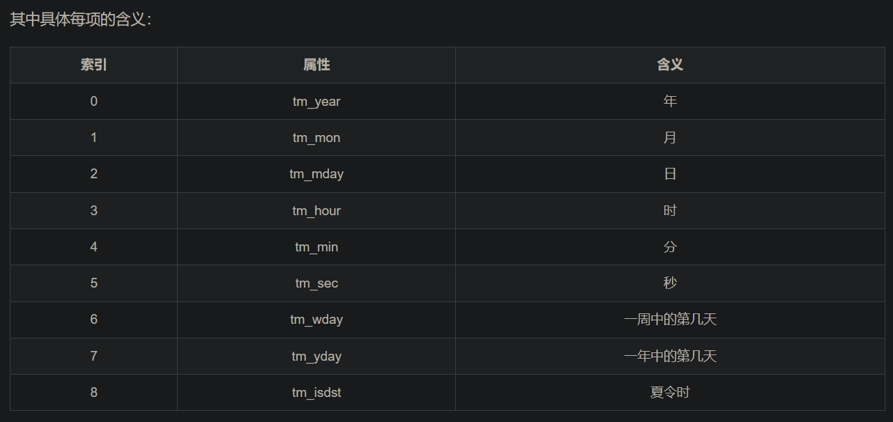

# 1. 简介

时间戳相关知识

时间戳根据位数的不同，其对应的精读也不同，具体分为：10位（秒级），13位（毫秒级），16位（微秒级），19位（纳秒级）。本文主要处理10位（秒级），13位（毫秒级）的时间戳的转换问题。

时间戳（ timestamp ）

简介：时间戳表示的是从1970年1月1日00:00:00开始按秒计算的偏移量，是一个float类型

展示形式：1597397024.765705

时间元祖（ struct_time ）

简介：共9个元素，时间戳和格式化时间转换的桥梁

展现形式：time.struct_time(tm_year=2020, tm_mon=8, tm_mday=14, tm_hour=17, tm_min=23, tm_sec=44, tm_wday=4, tm_yday=227, tm_isdst=0)



时间日期格式化符号

```text
%y 两位数的年份表示（00-99）
%Y 四位数的年份表示（000-9999）
%m 月份（01-12）
%d 月内中的一天（0-31）
%H 24小时制小时数（0-23）
%I 12小时制小时数（01-12）
%M 分钟数（00=59）
%S 秒（00-59）
%a 本地简化星期名称
%A 本地完整星期名称
%b 本地简化的月份名称
%B 本地完整的月份名称
%c 本地相应的日期表示和时间表示
%j 年内的一天（001-366）
%p 本地A.M.或P.M.的等价符
%U 一年中的星期数（00-53）星期天为星期的开始
%w 星期（0-6），星期天为星期的开始
%W 一年中的星期数（00-53）星期一为星期的开始
%x 本地相应的日期表示
%X 本地相e应的时间表示
%Z 当前时区的名称
%% %号本身
```

```python
import re
import time
import pymysql

# 输入毫秒级的时间，转出正常格式的时间
def timeStamp(timeNum):
    timeStamp = float(timeNum/1000)
    timeArray = time.localtime(timeStamp)
    otherStyleTime = time.strftime("%Y-%m-%d %H:%M:%S", timeArray)
    print (otherStyleTime)
    return otherStyleTime
```

# 参考

[1] Python进行时间戳转换为标准时间, https://blog.csdn.net/ncut_wxj/article/details/108011326