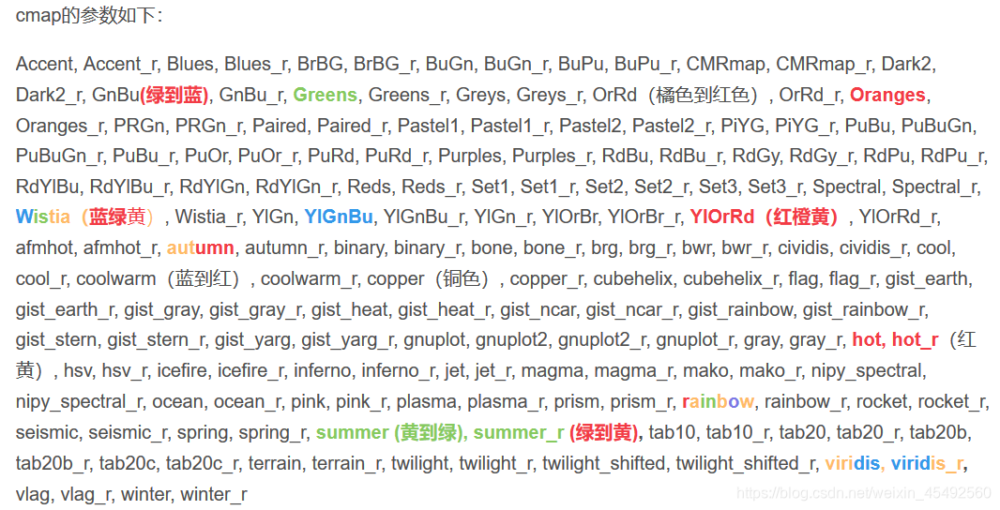
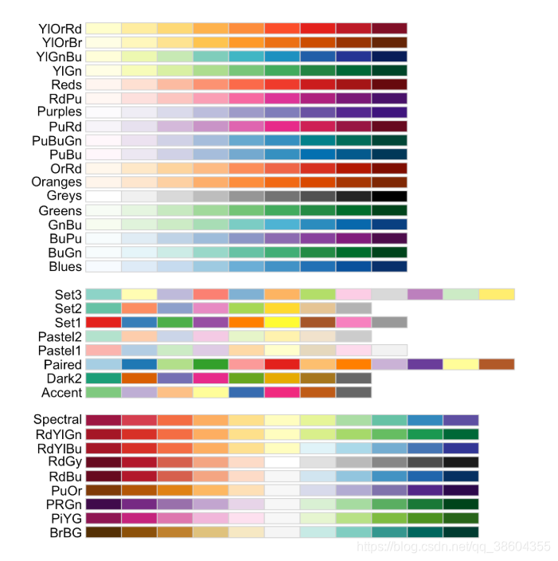

seaborn.heatmap(data, vmin=None, vmax=None, cmap=None, center=None, 
robust=False, annot=None, fmt=’.2g’, annotkws=None, linewidths=0, linecolor=‘white’, 
cbar=True, cbarkws=None, cbar_ax=None, square=False, ax=None, xticklabels=True, 
yticklabels=True, mask=None, **kwargs)

```text

vmin,vmax：用于指定图例中最小值与最大值的显示值

cmap：指定一个colormap对象，用于热力图的填充色

center：指定颜色中心值，通过该参数可以调整热力图的颜色深浅

annot：指定一个bool类型的值或与data参数形状一样的数组，如果为True，就在热力图的每个单元上显示数值

fmt：指定单元格中数据的显示格式

annot_kws：有关单元格中数值标签的其他属性描述，如颜色、大小等

linewidths ：指定每个单元格的边框宽度

linecolor：指定每个单元格的边框颜色

cbar：bool类型参数，是否用颜色条作为图例，默认为True

square：bool类型参数，是否使热力图的每个单元格为正方形，默认为False

cbar_kws：有关颜色条的其他属性描述

xticklabels,yticklabels：指定热力图x轴和y轴的刻度标签，如果为True，则分别以数据框的变量名和行名称作为刻度标签

mask：用于突出显示某些数据

ax：用于指定子图的位置

```

cmap自定义颜色：

```python
import seaborn as sns
import matplotlib.pyplot as plt
import matplotlib.colors as colors

cmap = colors.ListedColormap(['red', 'green', 'blue'])
sns.heatmap(data, cmap=cmap)
plt.show()
```

cmap参数如下：






# 参考

[1] 如何对seaborn.heatmap进行调色？cmap色彩配置大全，https://blog.csdn.net/qq_38604355/article/details/105705070