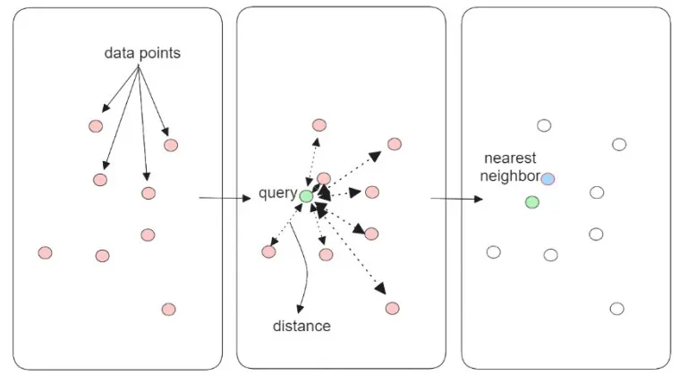
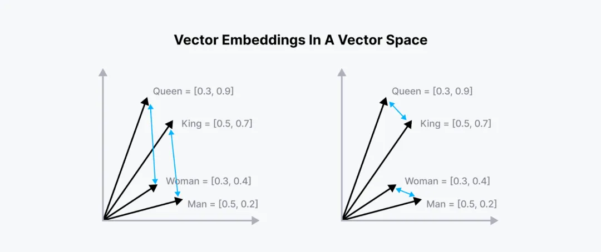
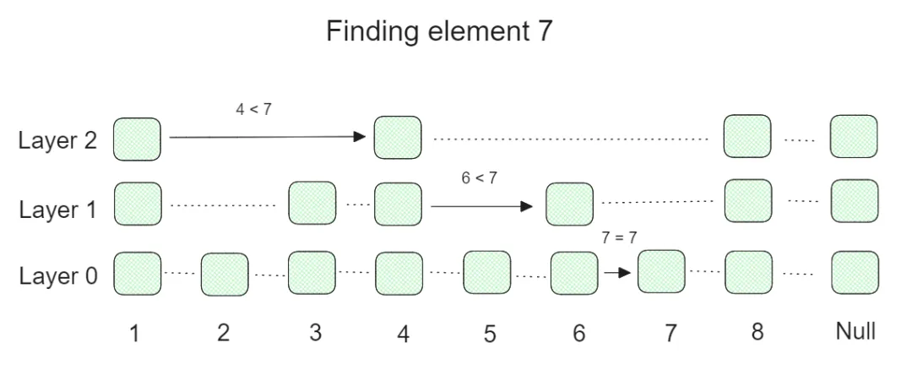
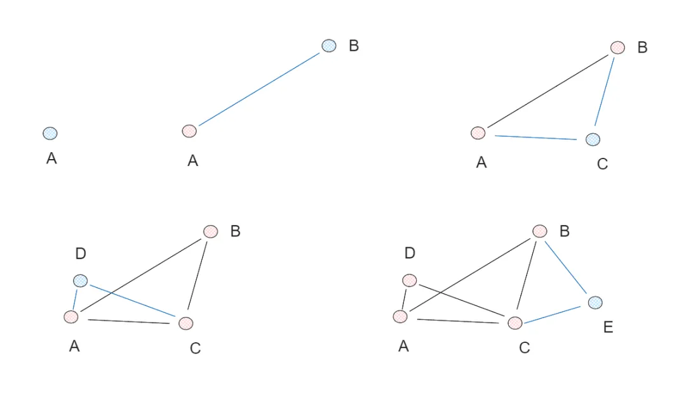
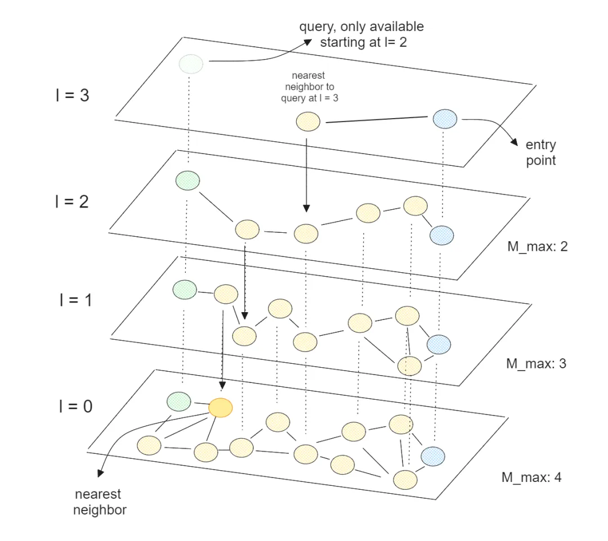
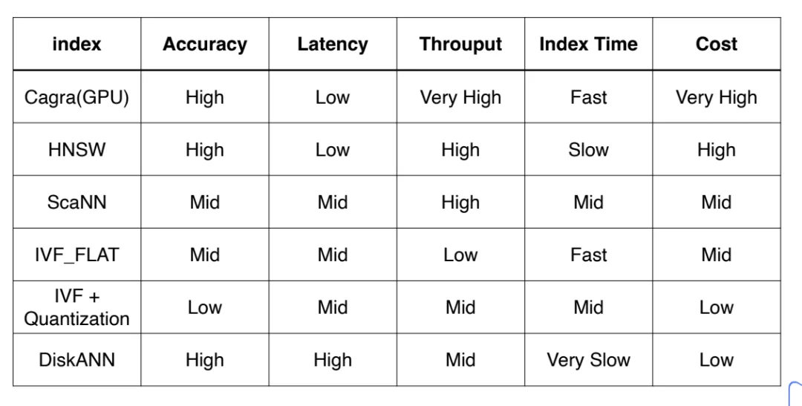
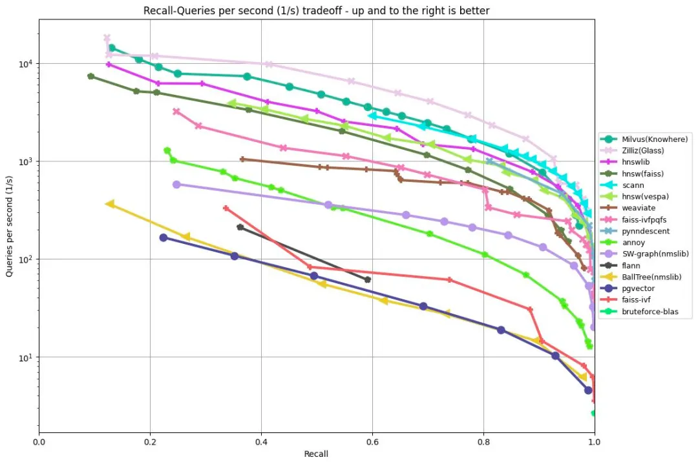

# 0. 简介

过去，向量搜索通常是用暴力扫描的方式来找到和查询向量最近的K个邻居（kNN）。它的核心思想是比对查询向量和库内所有向量的距离，简单直观但计算量大。也就是说，如果内存中有100个文档，kNN算法将计算查询向量与100个文档向量的相似度或距离。因此kNN的优势在于可以获得精确的搜索结果，但缺陷则是在检索时间与数据规模成正比。因此在处理数百万级以上数据规模时，成本、效率、速度都会遇到极大瓶颈。



图：kNN算法工作流程

在本文，我们将介绍一个基于Hierarchical Navigable Small World（HNSW）算法实现的HNSWlib的向量检索库。

# 1. 什么是向量检索

解读HNSWlib之前，我们需要对什么是向量检索先有一个基本的概念。

向量检索是信息检索中的一种常用方法，用于从大量非结构化数据集（图像、文档、音频等）中找到与给定查询最相似的信息。顾名思义，文档和查询都被表示为高维向量空间中具有特定维度的向量。向量的维度取决于用于转换文档和查询的Embedding模型。例如，如果我们使用“all-MiniLM-L6-v2”作为Embedding模型，每个查询或文档将获得384个维度的向量。

在查询时，Embedding模型会将查询内容，转化为文档中已有的语义维度，然后进行计算，相似含义的内容在向量空间中的位置更加靠近，然后返回其中最高相似性得分（或最短距离）的内容，这就是向量检索背后的逻辑。



图：2D向量空间中相似单词的向量嵌入

# 2. 什么是HNSW

近些年，为了优化kNN的检索性能，业内已经开发了各种索引算法，HNSW就是最有效的算法之一。

HNSW是一种基于图的高效向量检索算法。它依赖于两个关键概念：跳表（Skip List）和可导航小世界（NSW）图。

其中，跳表是一种概率数据结构，由多层链表组成，层次越高，链表中跳过的元素就越多。正如下面的可视化图，最低层包含了链表中的所有元素。随着我们向更高层移动，链表逐渐跳过越来越多的元素，所剩下的元素就越来越少。



图：跳表工作流程

假设我们需要从有3层和8个元素的原始链表中查找元素7。首先，我们从最高层开始，检查第一个元素是否低于7。如果是，那么我们检查第二个元素。如果第二个元素高于7，那么我们将第一个元素用作较低层的起点。接下来，我们在较低层做完全相同的事情，并逐渐下降到最低层以找到所需的元素。在许多元素上的跳过过程使得跳表在执行搜索操作时非常快。

理解了跳表的基本概念之后，我们再来看看NSW图。

NSW图中，每个节点（或称为顶点）都会与相似的节点相连，组成一张完整的NSW图。其检索的底层逻辑是贪婪路由搜索，从任意节点开始，检索起相邻节点中与其更加相似的节点，然后转移到该节点，过程循环往复，直到找到局部最小值，即当前节点比之前访问的任何节点都更接近查询向量，此时停止搜索。



图：NSW 图创建过程

HNSW算法，结合了跳表和NSW图的优势于一体。HNSW不仅仅是一个简单的二维图，而是由几层图所组成的多图层结构。与跳表概念类似，图的最低层包含所有元素，层越高，跳过的元素就越多。

在图创建过程中，HNSW首先为每个元素分配一个从0到 I 的随机数，其中 I 是一个元素在多层图中能存在的最大层。如果一个元素的 I 等于2，并且总层数为4，那么这个元素将从第0层一直存在到第2层，但不存在于第3层。



图：使用HNSW算法的向量检索

在向量检索过程中，HNSW算法首先选择最高层的任意节点，然后通过NSW图检索到局部最小值，紧接着，相同的流程在下一层重复，逐步逼近目标节点，直到找到最接近查询向量的节点。

通过这一方法，HNSW算法不必检索那些离查询点较远的相关度较低的元素，进而增加了检索的效率。这也导致了HNSW并不适用于精确匹配，因为HNSW在搜索过程中跳过了一些元素，当然，其他的近似最近邻（ANN）方法，如FAISS或ScaNN也是一样。

那么如何在不需要精确匹配结果，但仍然希望获得相对高效的召回时，我们要怎么办？我们可以调整HNSW的超参数：

M：NSW图中每个元素的边数。较高的M值通常会对应更好的搜索精度，但代价是更慢的索引构建时间。

efConstruction：构建索引时的动态候选列表大小。一般来说，候选队列越长，索引质量越好，索引构建时间也就会越长。

efSearch：搜索阶段的动态候选列表的大小。一般来说，efSearch越高，召回率越高，但是搜索过程会比较慢。

除了速度与精度的权衡之外，我们还需要注意图创建过程中的内存消耗。这是因为HNSW要求将整个数据集加载到RAM中，如果您的数据集太大而无法放入内存中，就会导致比较尴尬的情况发生。比如，M值越高，我们就需要分配越多存储资源用于每个元素相邻信息的存储。此外，随着元素和其相邻信息被添加到图中，内存需求会呈线性增长。因此，在图创建过程中，微调M和efConstruction至关重要，特别是在大规模应用中。

整体来说，HNSW具有对数复杂度O（log N）和高召回率，并支持动态更新，无需重建索引即可添加新数据。然而，与其他ANN算法相比，HNSWlib也具有更高的内存消耗，索引构建时间较慢，缺乏对元素删除的原生支持。



但与其他ANN方法相比，HNSW在大型数据集上的表现依然非常具有竞争力。

参考下面的GIST1M数据集（具有960维的1M向量）上的ANN基准测试，HNSW效果整体好于FAISS，Annoy，pgector等，特别是当需要高召回率时。排名上，其表现只在Milvus的Knowhere和Zilliz Cloud的Glass算法之后，获得了前三名的成绩。



图：GIST1M数据集的ANN基准测试结果

HNSWlib 是一个基于 C++ 的开源 HNSW 算法实现。用途上，HNSWlib 非常适合为向量检索用例构建简单场景，并不适合如1亿甚至数十亿数据点这样的复杂场景检索。

因为HNSWlib是一个功能有限的轻量级ANN库，会随着数据点的增长，因为内存消耗问题，导致出现扩展性瓶颈。

因此，在大规模应用中，使用像Milvus这样的向量数据库将是更好的选择。向量数据库作为一种成熟的解决方案，能够高效地存储大量数据并执行有效的向量检索。例如，Milvus支持云原生和多租户服务，允许用户从云上的多个用户存储、索引和检索数百万甚至数十亿个数据点。

当然，HNSWlib也可以被集成到Milvus这为代表的向量数据库中，接下来我们将展示这一过程。

# 3. 如何将HNSWlib与Milvus的集成

第一步，通过pip install安装HNSWlib：

```bash
pip install hnswlib
```

接下来，让我们创建100个虚拟数据点，每个数据点的维度为128。接下来，我们构建M为8，efConstruction为25的HNSW图。最后，我们计算查询数据点的最近邻。

```python
import hnswlib
import numpy as np
import pickle

dim = 128
num_elements = 100

# Generating sample data
data = np.float32(np.random.random((num_elements, dim)))
ids = np.arange(num_elements)

# Generating query point
query = np.float32(np.random.random((1, dim)))

# Declaring index
p = hnswlib.Index(space = 'l2', dim = dim) # possible options are l2, cosine or ip

# Initializing index - the maximum number of elements should be known beforehand
p.init_index(max_elements = num_elements, ef_construction = 25, M = 8)

# Element insertion (can be called several times):
p.add_items(data, ids)

# Controlling the recall by setting ef:
p.set_ef(50) # ef should always be > k

# Query dataset, k - number of the closest elements (returns 2 numpy arrays)
labels, distances = p.knn_query(query, k = 1)
```

这就是我们实现原生HNSWlib所要做的一切。

接下来，让我们看看如何在Milvus中使用HNSW集成。

使用Milvus的最简单方法是通过Milvus Lite（Milvus的轻量级版本，可以导入到您的Python应用程序中），我们可以使用pip install安装它。

```bash
!pip install -U pymilvus
!pip install pymilvus[model]
```

现在我们可以从创建集合并定义索引方法开始。首先，我们定义一个集合模式，指定HNSW作为索引方法，Milvus将自动在幕后使用HNSW。然后，我们可以开始将数据插入到集合中进行索引构建。

```python
from pymilvus import MilvusClient, DataType
from pymilvus import model

client = MilvusClient("demo.db")

# 1. Create schema
schema = MilvusClient.create_schema(
    auto_id=False,
    enable_dynamic_field=False,
)

# 2. Add fields to schema
schema.add_field(field_name="id", datatype=DataType.INT64, is_primary=True)
schema.add_field(field_name="vector", datatype=DataType.FLOAT_VECTOR, dim=768)
schema.add_field(field_name="text", datatype=DataType.VARCHAR, max_length=200)

# 3. Prepare index parameters
index_params = client.prepare_index_params()

# 4. Add indexes
index_params.add_index(
    field_name="vector", 
    index_type="HNSW",
    metric_type="L2"
)

# Create collection
if client.has_collection(collection_name="demo_collection"):
    client.drop_collection(collection_name="demo_collection")

client.create_collection(
    collection_name="demo_collection",
    schema=schema,
    index_params=index_params
)

# Define embedding model
embedding_fn = model.DefaultEmbeddingFunction()

# Text data to search from.
docs = [
    "Artificial intelligence was founded as an academic discipline in 1956.",
    "Alan Turing was the first person to conduct substantial research in AI.",
    "Born in Maida Vale, London, Turing was raised in southern England.",
]

# Transform text data into embeddings
vectors = embedding_fn.encode_documents(docs)

data = [
    {"id": i, "vector": vectors[i], "text": docs[i]}
    for i in range(len(vectors))
]

# Insert embeddings into Milvus
res = client.insert(collection_name="demo_collection", data=data)

Finally, if we want to perform vector search, we can do the following:

SAMPLE_QUESTION = "What's Alan Turing achievement?"
query_vectors = embedding_fn.encode_queries([SAMPLE_QUESTION])

res = client.search(
    collection_name="demo_collection",  
    data=query_vectors,  
    limit=1,  
    output_fields=["text"],

)

context = res[0][0]["entity"]["text"]
```

# 4. 结论

向量检索在需要准确度和速度的现代AI应用中非常重要。虽然kNN暴力搜索通过穷举搜索提供高度准确的结果，但其线性时间复杂度使其在大规模数据集上不切实际。

HNSW算法通过使用多层次图结构，在速度和准确性之间提供了创新的解决方案。通过结合跳表和NSW图，HNSW实现了快速、近似的搜索，可以有效处理海量数据集此外，通过微调超参数（如M、efConstruction和efSearch），我们可以根据每个应用所需的搜索速度、准确性和内存消耗这三者之间进行权衡优化。实际使用中，我们可以将HNSWlib集成到Milvus向量数据库优化我们的使用体验。

# 参考

[1] 如何平衡向量检索速度和精度？深度解读HNSW算法，https://mp.weixin.qq.com/s/JECoGeO27L1IHdseDBHmow