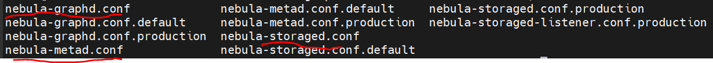
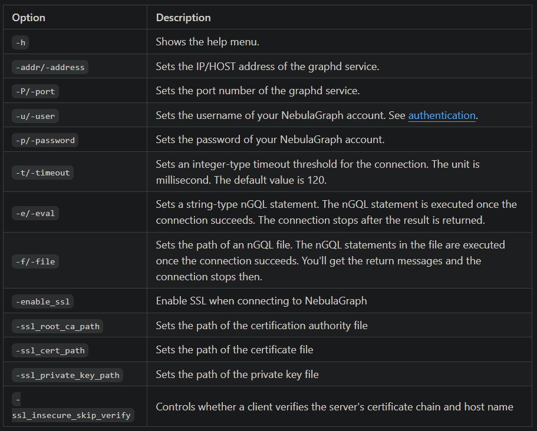

# 1. 资源

- 下载：https://www.nebula-graph.com.cn/download
- 文档：https://docs.nebula-graph.com.cn/3.8.0/4.deployment-and-installation/manage-service/

# 2. 安装

下载安装包.tar.gz：https://www.nebula-graph.com.cn/download

解压
```shell
tar -czvf xxx.tar.gz  source_file (tar -czvf 包名.tar.gz  源文件)        #以tar.gz方式打包并gz方式压缩
```

进入etc文件夹，将所有带.default后缀的都去掉后缀名另存一份，不然会包找不到文件。



退回安装目录，启动服务

```bash
./scripts/nebula.service start all
```


# 3. 参数说明



# 4. 命令行工具

下载：https://github.com/vesoft-inc/nebula-console/releases

使用说明：https://docs.nebula-graph.com.cn/3.4.3/nebula-console/

直接运行即可

```bash
$ ./nebula-console -addr <ip> -port <port> -u <username> -p <password>
    [-t 120] [-e "nGQL_statement" | -f filename.nGQL]
```


- 即使NebulaGraph与 Studio 部署在同一台机器上，用户也必须填写这台机器的本机 IP 地址，而不是 127.0.0.1 或者 localhost。
- 在新的标签页连接另一个NebulaGraph时，会覆盖旧标签页的会话。如果需要同时登录多个NebulaGraph，可以用不同的浏览器或者无痕模式。

# 参考

[1] 提升RAG性能！接入知识图谱！结合nebulagraph，生产+AI拓展两相宜！番外3，https://mp.weixin.qq.com/s/DjswLd5vqatrI3fK9ml92g
