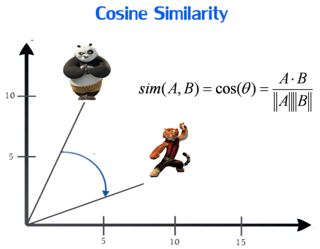
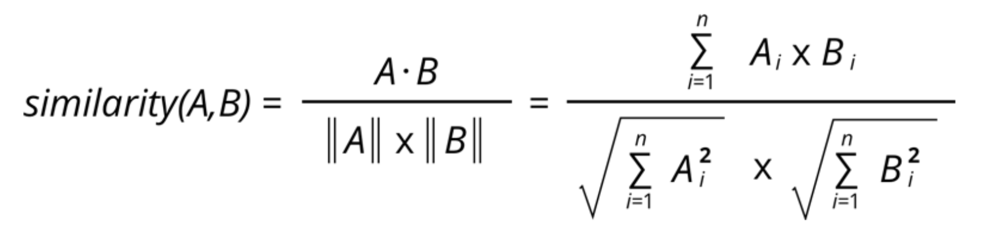

# 1. 简介





# 2. 方法汇总

## 2.1 scipy

- 实测正确
- 问题：偶然会报溢出或者分母为0的问题

```python
from scipy import spatial
vec1 = [1, 2, 3, 4]
vec2 = [5, 6, 7, 8]
cos_sim = 1 - spatial.distance.cosine(vec1, vec2)
print(cos_sim)
```

## 2.2 numpy

```python
import numpy as np
vec1 = np.array([1, 2, 3, 4])
vec2 = np.array([5, 6, 7, 8])

cos_sim = vec1.dot(vec2) / (np.linalg.norm(vec1) * np.linalg.norm(vec2))
print(cos_sim)
```

2.3 sklearn

```python
import numpy as np
vec1 = np.array([1, 2, 3, 4])
vec2 = np.array([5, 6, 7, 8])

cos_sim = vec1.dot(vec2) / (np.linalg.norm(vec1) * np.linalg.norm(vec2))
print(cos_sim)
```

2.4 Torch

```python
import torch
import torch.nn.functional as F

vec1 = torch.FloatTensor([1, 2, 3, 4])
vec2 = torch.FloatTensor([5, 6, 7, 8])

cos_sim = F.cosine_similarity(vec1, vec2, dim=0)
print(cos_sim) 
```

注意，cosine_similarity()函数只能对torch.Tensor类型的张量进行计算，
计算结果返回的仍然是一个torch.Tensor类型的数据。

# 参考

[1] Python计算余弦相似性（cosine similarity）方法汇总, https://zhuanlan.zhihu.com/p/508625294?utm_id=0