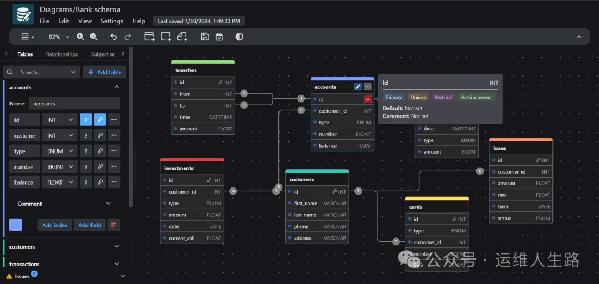

# 1. drawDB

是一款免费的在线数据库实体关系图编辑器和SQL生成器，无需注册账户，即可轻松设计、可视化并导出脚本。

其主要特点如下：

• 导出DDL脚本与图表：能够将设计好的数据库结构导出为DDL脚本，方便在数据库中执行，也可以将图表导出为JSON格式或图像文件，便于分享和存档。

• 导入DDL与JSON：如果已有数据库的DDL脚本或JSON文件，drawDB可以快速将其导入并生成对应的图表，目前主要支持MySQL，未来将支持更多数据库类型。

• 个性化UI定制：用户可以根据自己的喜好和需求，自定义界面布局，选择在工作视图中显示的组件，打造个性化的编辑环境。

• 键盘快捷键加速：通过一系列精心设计的键盘快捷键，用户可以更高效地进行操作，提升开发效率。

• 预建模板助力：提供了丰富的预建模板，无论是新手快速上手，还是寻找设计灵感，都能提供帮助。

• 样板结构保存与加载：可以将常用的数据库结构保存为模板，需要时快速加载，节省时间。

• 丰富的编辑功能：支持撤消、重做、复制、粘贴等常见操作，方便用户对表格、主题区域和注释进行编辑。

• 错误检测与修复：内置的错误检测机制能够及时发现图表中的问题，并提示用户进行修复，确保导出的SQL脚本准确无误。

• 支持多种数据库：目前支持MySQL、PostgreSQL、SQLite、MariaDB、SQL Server等五种主流关系数据库。

• 自定义类型与别名：用户可以为对象关系数据库添加自定义类型，或创建自定义JSON方案和别名类型，以满足特定需求。

• 大屏展示：在团队会议或讨论中，可以通过大屏展示数据库图表，帮助团队成员更好地理解数据库结构。

• 任务跟踪与标记：可以对数据库设计任务进行跟踪，并在任务完成后标记为已完成，便于项目管理和进度跟踪。

# 参考

[1] drawDB - 设计数据库就像画画一样简单, https://mp.weixin.qq.com/s/eYnZRuFSVdzCdCR-qEtkfg