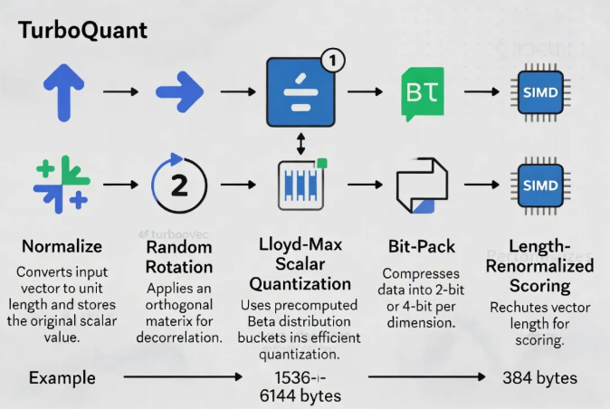

比FAISS快12-20%的TurboQuant向量索引turbovec，Rust+Python开源项目，10M向量仅需4GB内存

开源项目——RyanCodrai/turbovec基于Google Research TurboQuant算法的Rust向量索引库，提供原生Python绑定。专为隐私敏感、低内存、低延迟的RAG（Retrieval-Augmented Generation）场景设计，完全本地化、无需任何托管服务、数据永不出机或VPC。核心亮点是数据无关（data-oblivious）量化：零训练、零数据遍历、即时索引，随语料增长无需重构codebook。

能将10百万文档的float32向量（约31GB）压缩到仅4GB内存，同时在ARM（Apple M3）和x86平台上搜索速度超越或匹敌FAISS IndexPQFastScan。更重要的是，支持搜索时过滤（search-time filtering），直接在SIMD内核内处理allowlist或bitmask，实现精准rerank而无过取或召回损失。

turbovec的核心是TurboQuant算法的Rust高效实现，关键在于“数据无关”特性：

1.Normalize：向量归一化为单位向量，单独存储长度标量。

2.Random Rotation：乘以随机正交矩阵，使每个坐标服从已知Beta分布（渐近Gaussian），与输入数据分布无关。

3.Lloyd-Max Scalar Quantization：基于数学预计算的最优桶边界和质心（非数据驱动k-means），最小化均方误差，接近Shannon失真率下界。

4.Bit-Pack：将量化后的坐标紧凑打包（2-bit或4-bit/dim）。

5.Length-Renormalized Scoring：搜索时用存储的标量修正量化偏差，实现无偏估计，零额外搜索成本。

架构实现亮点：

●Rust核心：安全、高性能、无GC。使用pyo3/maturin提供Python绑定。

●SIMD内核：针对ARM NEON和x86 AVX-512BW手写汇编级优化，采用nibble-split lookup tables实现快速内积近似计算。项目明确在Apple M3上比FAISS FastScan快12-20%，x86上多数配置持平或领先。

●Block级过滤：搜索内核以32向量为block粒度检查allowlist，快速短路无关block，大幅降低选择性过滤时的实际计算量。

●内存布局：量化后bit-packed存储 + 每个向量额外1个float标量，实现极致压缩。

●持久化：简单二进制格式（.tq / .tvim），支持快速load/write。

项目在benchmarks/目录提供了完整recall结果JSON，可自行验证在1536/3072维OpenAI embedding及GloVe上的表现。