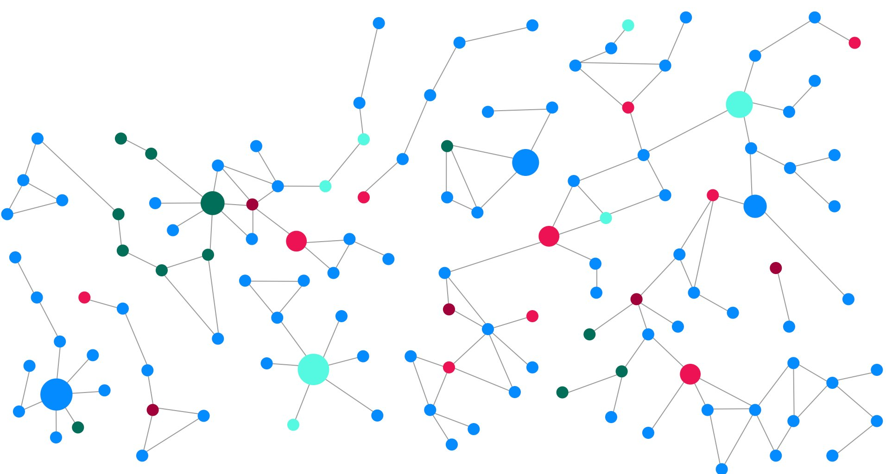
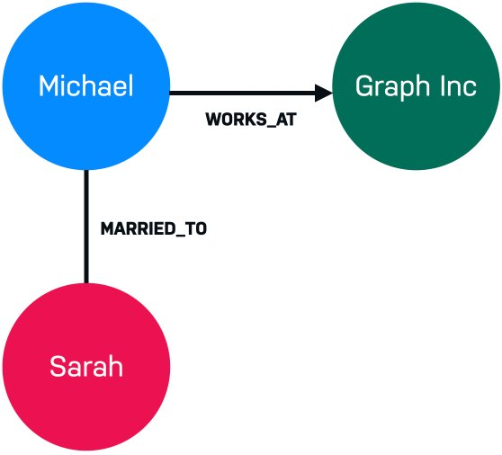
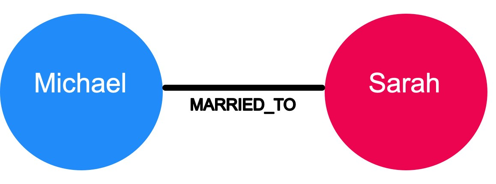
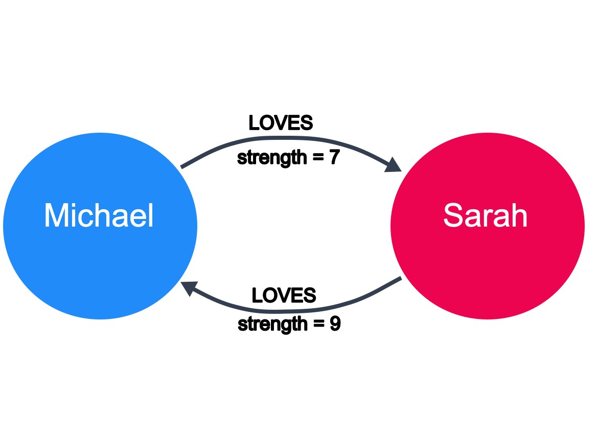
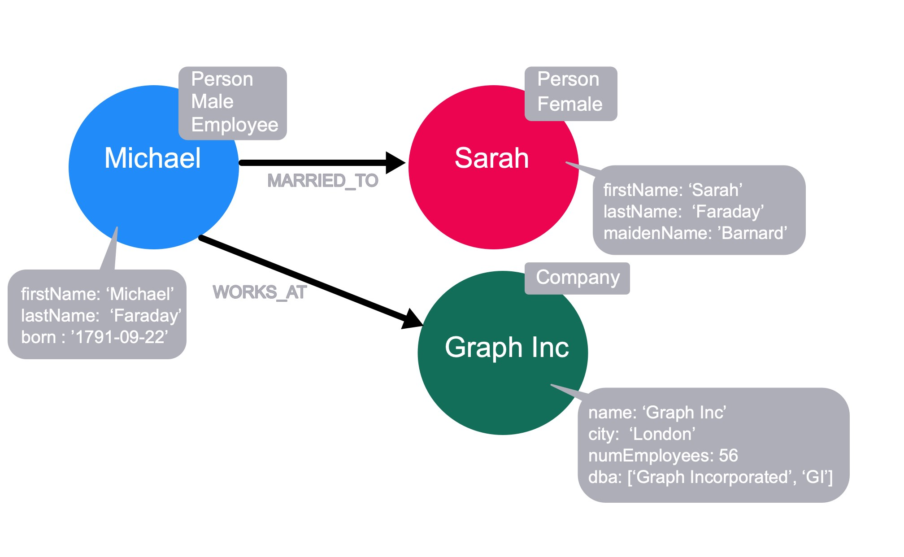
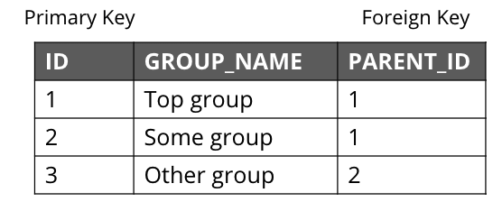
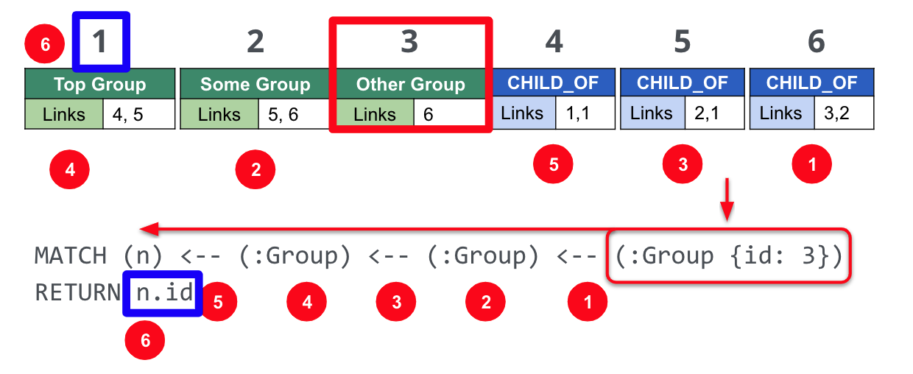
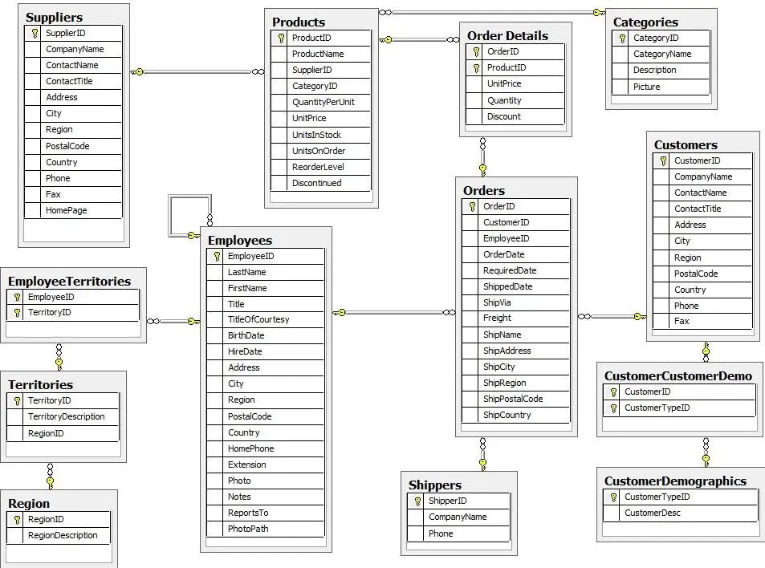
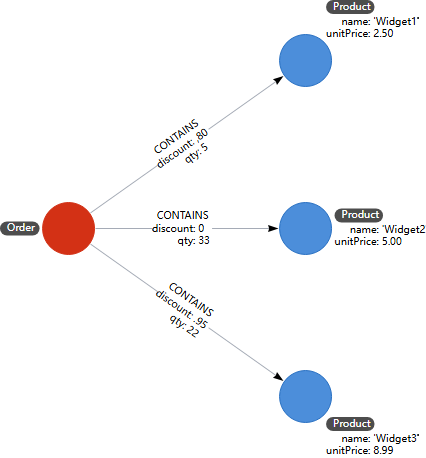

# 1. 简介

参考课程：https://graphacademy.neo4j.com/courses/neo4j-fundamentals

课程来源neo4j官方

# 2. 课程内容

## 2.1 图元素

Let’s take a closer look at the two elements that make up a graph:

- Nodes (also known as vertices)：are the circles in a graph
  - Nodes commonly represent objects, entities, or merely things.
- Relationships (also known as edges)
  - used to connect nodes. We can use relationships to describe how nodes are connected to each other. 





## 2.2 图结构

### 2.2.1 Directed vs. undirected graphs

In an undirected graph, relationships are considered to be bi-directional or symmetric.

An example of an undirected graph would include the concept of marriage. If Michael is married to Sarah, then it stands to reason that Sarah is also married to Michael.



A directed graph adds an additional dimension of information to the graph. Relationships with the same type but in opposing directions carry a different semantic meaning.

For example, if marriage is a symmetrical relationship, then the concept of love is asymmetrical. Although two people may like or love each other, the amount that they do so may vary drastically. Directional relationships can often be qualified with some sort of weighting. Here we see that the strength of the LOVES relationship describes how much one person loves another.



### 2.2.2 Weighted vs. unweighted graphs

The concept of love is also an example of a weighted graph.

In a weighted graph, the relationships between nodes carry a value that represents a variety of measures, for example cost, time, distance or priority.

A basic shortest path algorithm would calculate the shortest distance between two nodes in the graph. This could be useful for finding the fastest walking route to the local store or working out the most efficient route to travel from city to city.


### 2.2.3 Graph traversal
How one answers questions about the data in a graph is typically implemented by traversing the graph. To find the shortest path between Springfield to Centerville, the application would need to traverse all paths between the two cities to find the shortest one.

Springfield-Newtown-Centerville = 26

Springfield-Cliffside-Newtown-Centerville = 23

Springfield-Cliffside-Melrose-Certerville = 49

Traversal implies that the relationships are followed in the graph. There are different types of traversals in graph theory that can impact application performance. For example, can a relationship be traversed multiple times or can a node be visited multiple times?

Neo4j’s Cypher statement language is optimized for node traversal so that relationships are not traversed multiple times, which is a huge performance win for an application.

## 2.3 Property Graphs

Nodes, Labels and Properties

Recall that nodes are the graph elements that represent the things in our data. We can use two additional elements to provide some extra context to the data.

Let’s take a look at how we can use these additional elements to improve our social graph.

### 2.3.1 Labels

Nodes with labels

By adding a label to a node, we are signifying that the node belongs to a subset of nodes within the graph. Labels are important in Neo4j because they provide a starting point for a Cypher statement.


In Neo4j, a node can have zero, one, or many labels.

### 2.3.2 Node properties

So far we’re assuming that the nodes represent Michael, Sarah, and Graph Inc. We can make this concrete by adding properties to the node.

Properties are key, value pairs and can be added or removed from a node as necessary. Property values can be a single value or list of values that conform to the Cypher type system.


Properties do not need to exist for each node with a particular label. If a property does not exist for a node, it is treated as a null value.

### 2.3.3 Relationships

A relationship in Neo4j is a connection between two nodes.

#### 2.3.3.1 Relationship direction

Relationships with direction

In Neo4j, each relationship must have a direction in the graph. Although this direction is required, the relationship can be queried in either direction, or ignored completely at query time.

A relationship is created between a source node and a destination node, so these nodes must exist before you create the relationship.



The direction of a relationship can be important when it comes to hierarchy, although whether the relationships point up or down towards the tree is an arbitrary decision.

#### 2.3.3.2 Relationship type

Each relationship in a neo4j graph must have a type. This allows us to choose at query time which part of the graph we will traverse.

For example, we can traverse through every relationship from Michael, or we can specify the MARRIED_TO relationship to end up only at Sarah’s node.

Here are sample Cypher statement statements to support this:

```cypher
// traverse the Michael node to return the Sarah node
MATCH (p:Person {firstName: 'Michael'})-[:MARRIED_TO]-(n) RETURN n;

// traverse the Michael node to return the Graph Inc node
MATCH (p:Person {firstName: 'Michael'})-[:WORKS_AT]-(n) RETURN n;

// traverse all relationships from the Michael node
// to return the Sarah node and the Graph Inc node
MATCH (p:Person {firstName: 'Michael'})--(n) RETURN n
```

#### 2.3.3.3 Relationship properties

As with nodes, relationships can also have properties. These can refer to a cost or distance in a weighted graph or just provide additional context to a relationship.


In our graph, we can place a property on the MARRIED_TO relationship to hold the date in which Michael and Sarah were married. This WORKS_AT relationship has a roles property to signify any roles that the employee has filled at the company. If Michael also worked at another company, his WORKS_AT relationship to the other company would have a different value for the roles property.

## 2.4 Native Graph优点

Index-free adjacency (IFA) RDBMS querys



execute this SQL query to find the third-degree parents of the group with the ID of 3:

```sql
SELECT PARENT_ID
FROM GROUPS
WHERE ID = (SELECT PARENT_ID
    FROM GROUPS
    WHERE ID = (SELECT PARENT_ID
        FROM GROUPS
        WHERE ID = 3))
```

The result of this query is 1, but in order to determine this result, the SQL Server needed to:

- Locate the innermost clause.
- Build the query plan for the subclause.
- Execute the query plan for the subclause.
- Locate the next innermost clause.
- Repeat Steps 2-4.

Resulting in:
- 3 planning cycles
- 3 index lookups
- 3 DB reads

Neo4j storage

With index-free adjacency, Neo4j stores nodes and relationships as objects that are linked to each other via pointers. Conceptually, the graph looks like:


These nodes and relationships are stored as:


Neo4j Cypher statement

Suppose we had this query in Cypher:

```cypher
MATCH (n) <-- (:Group) <-- (:Group) <-- (:Group {id: 3})
RETURN n.id
```

Using IFA, the Neo4j graph engine starts with the anchor of the query which is the Group node with the id of 3. Then it uses the links stored in the relationship and node objects to traverse the graph pattern.



To perform this query, the Neo4j graph engine needed to:

1. Plan the query based upon the anchor specified.
2. Use an index to retrieve the anchor node.
3. Follow pointers to retrieve the desired result node.
4. The benefits of IFA compared to relational DBMS access are:

Fewer index lookups.

1. No table scans.
2. Reduced duplication of data.

## 2.5 从通用数据库转为图数据库

Let’s look at the Northwind RDBMS data model.



In this example, an order can contain one or more products and a product can appear in one or more orders. In a relational database, the Order Details table is required to handle the many-to-many relationships. The more orders added, and subsequently the larger the Order Details table grows, the slower order queries will become.



In a graph, we can simply model a CONTAINS relationship from the Order node to each Product node. The Product node has a unit price property and the CONTAINS relationship which has properties to represent the quantity and discount.

