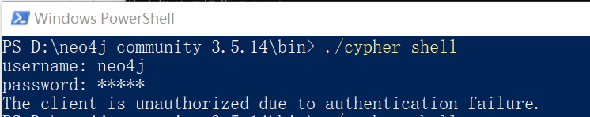
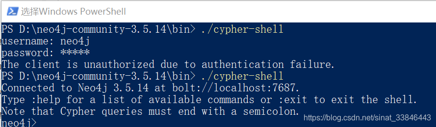

# 问题

启动后查看日志

```bash
vim ./conf/neo4j.conf
```

报错
```text
WARN  Failed authentication attempt for 'neo4j' from 127.0.0.1
```

进入neo4j安装目录， 并进入bin目录；

运行./cypher-shell命令， 输入用户名，密码（初始默认用户名和密码为neo4j）



# 解决

1. 停止neo4j服务，并且删除data/dbms/auth

2. 修改D:\neo4j-community-3.5.14\conf下的neo4j.conf配置文件，取消验证机制，修改如下：
    ```text
    dbms.security.auth_enabled=false
    ```
3. cmd重启：
    ```bash
    ./neo4j.bat start
    ```

4. 测试
    

# 参考

[1] Neo4j问题及解决，https://blog.csdn.net/sinat_33846443/article/details/109023259