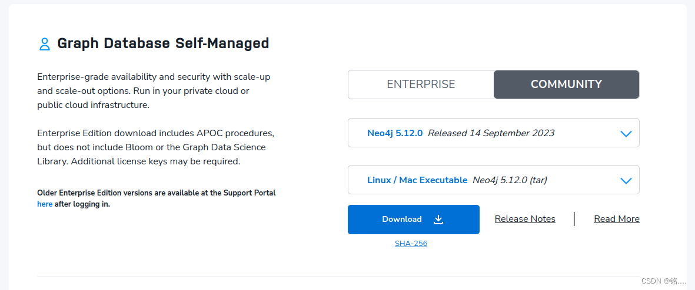
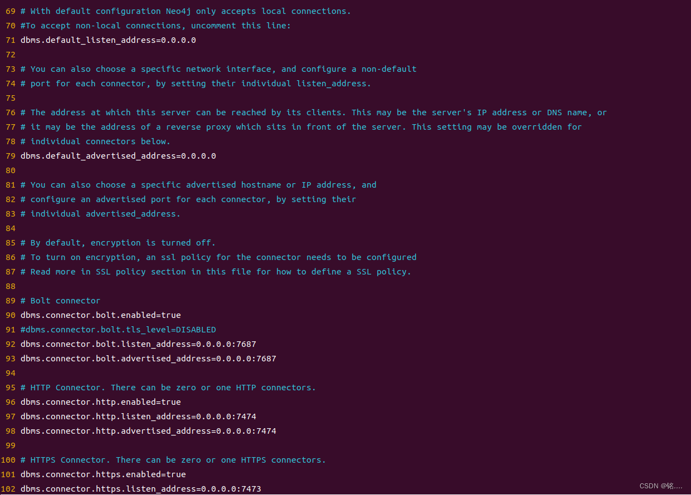
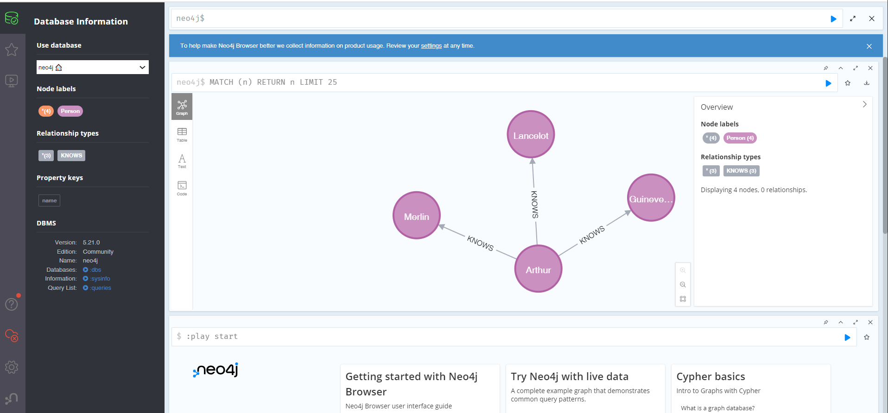

# 1. 依赖安装

检查系统上已安装的Java版本:

```bash
java -version
```

需要java 17的版本

如果您已经安装了Java 11.0.20.1，请卸载它。您可以使用以下命令卸载Java 11：

```bash
sudo apt remove openjdk-11-*
```

安装支持的Java版本（Oracle Java 17或OpenJDK 17）。对于Ubuntu 22.04，建议使用OpenJDK 17。执行以下命令进行安装：

```bash
sudo apt update
sudo apt install openjdk-17-jdk
```

配置系统以使用新安装的Java版本。使用以下命令设置默认的Java版本：

```bash
sudo update-alternatives --config java
```

验证Java版本是否正确安装：

```bash
java -version
```

# 2. Neo4j安装

输入初始账号：neo4j

输入初始密码：neo4j

下载安装包

进入网站 https://neo4j.com/deployment-center/#community



建议使用tar包，比较容易安装 （注：如果频繁无法下载，选择老一点的版本就可以了）

放在任意路径解压

```bash
tar -xf neo4j-community-5.21.0-unix.tar.gz
```

确认授权(实测，不需要这一步)

```bash
<NEO4J_HOME>/bin/neo4j-admin server license --accept-evaluation
```

# 3. Neo4j启动及常见命令

启动neo4j console

```bash
<NEO4J_HOME>/bin/neo4j console
```

启动neo4j

```bash
<NEO4J_HOME>/bin/neo4j start
```

查看neo4j状态

```bash
<NEO4J_HOME>/bin/neo4j status
```

停止neo4j
    
```bash
<NEO4J_HOME>/bin/neo4j stop
```

在浏览器访问http://localhost:7474/

# 4. 配置

远程配置文件修改

进入相应目录，打开conf文件

（这里直接给出我的conf文件链接，仅供参考: https://pan.baidu.com/s/1g4W_o8B7brWnls9DbRT60Q?pwd=u572 提取码: u572）

```bash
vim ./conf/neo4j.conf
```

搜索network关键词

```bash
/network
```

可以看到，通过去掉注释的方法，这里启用了相应的连接方式



保存并退出

停止并重新运行neo4j

```bash
./bin/neo4j stop	#停止运行neo4j
./bin/neo4j start	#开始运行neo4j
```

这里显示正常运行

打开log文件

```bash
vim ./logs/neo4j.log
```

如果日志中没有error，则恭喜以上设置均顺利进行

# 5. python访问

请注意配套python版本，这个是严格配套使用的

安装neo4j包，这里使用的是5.21.0版本neo4j

```bash
pip install neo4j==5.21.0
```

(下面内容还未尝试，先写)

使用脚本如下所示：

```python
from neo4j import GraphDatabase, RoutingControl


URI = "neo4j://localhost:7687"
AUTH = ("neo4j", "password")


def add_friend(driver, name, friend_name):
    driver.execute_query(
        "MERGE (a:Person {name: $name}) "
        "MERGE (friend:Person {name: $friend_name}) "
        "MERGE (a)-[:KNOWS]->(friend)",
        name=name, friend_name=friend_name, database_="neo4j",
    )


def print_friends(driver, name):
    records, _, _ = driver.execute_query(
        "MATCH (a:Person)-[:KNOWS]->(friend) WHERE a.name = $name "
        "RETURN friend.name ORDER BY friend.name",
        name=name, database_="neo4j", routing_=RoutingControl.READ,
    )
    for record in records:
        print(record["friend.name"])


with GraphDatabase.driver(URI, auth=AUTH) as driver:
    add_friend(driver, "Arthur", "Guinevere")
    add_friend(driver, "Arthur", "Lancelot")
    add_friend(driver, "Arthur", "Merlin")
    print_friends(driver, "Arthur")
```

这里的python脚本简单创建两个节点，和这两个节点的关系，创建成功如下所示：
在这里插入图片描述



# 参考

[1] 知识图谱01——ubuntu22.04 neo4j安装配置, https://blog.csdn.net/weixin_46538207/article/details/133310565