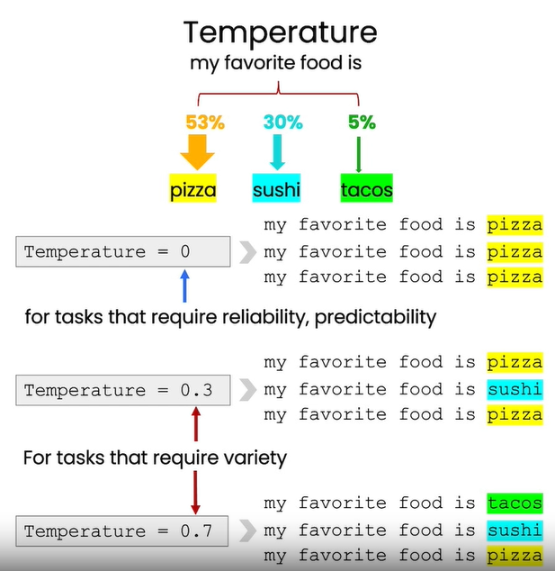

1. Temperature

    模型倾向于把高概率给到一个输出（概率分布呈现尖峰），使得多样性减少。
    通过认为调整temperature值，平滑概率输出（概率分布尽可能平坦），就有机会
    选择到不同的输出结果，是的结果更加多样性。
    
    但是，如果想要结果更加真实可靠，temperature设0，让它不起作用；如果想要
    增加多样性，更有创造性，则可以调高这个值。

    
    
    （图片来源，参考[1]吴恩达Prompt课程）
    
# 参考

[1] 吴恩达课程，Prompt Engineering, https://learn.deeplearning.ai/chatgpt-prompt-eng/lesson/1/lesson_1