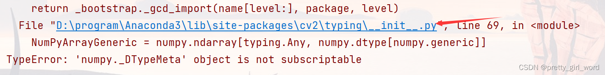

问题：

jupyter/pyharm导入cv2 报错“‘numpy._DTypeMeta‘ object is not subscriptable”

解决方法：

numpy和opencv-python的版本不匹配， 可以吧numpy版本调到1.17.3（我这样可以解决）

# 参考

[1] jupyter/pyharm导入cv2 报错“‘numpy._DTypeMeta‘ object is not subscriptable”, 
     https://blog.csdn.net/pretty_girl_word/article/details/132545355