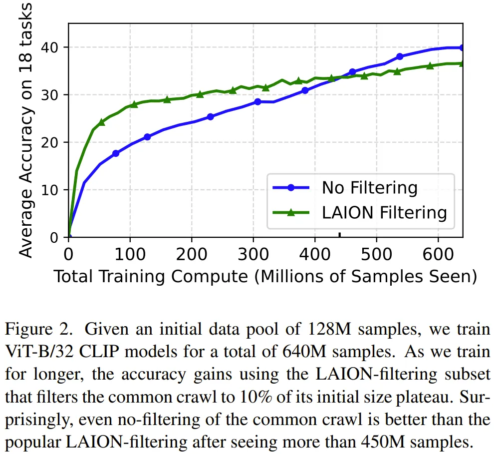

# 1. 资源

- 论文标题：Scaling Laws for Data Filtering—Data Curation cannot be Compute Agnostic
- 论文地址：https://arxiv.org/pdf/2404.07177.pdf
- 代码地址：https://github.com/locuslab/scaling_laws_data_filtering

# 2. 问题

当训练多个 epoch 时，高质量数据的效用（utility）就不大了（因为模型已经完成了学习）。

此时，使用更低质量的数据（一开始的效用更小）往往比重复使用高质量数据更有助益。

在数量 - 质量权衡（QQT）之下，我们该如何确定训练使用怎样的数据搭配更好？

# 3. 方法和结论

他们首先研究了用于获得 LAION 数据集的 LAION 过滤策略，结果见图 2。他们观察到了以下结果：

1. 在计算预算低时，使用高质量数据更好。
2. 当计算预算高时，数据过滤会造成妨害。

原因为何？

LAION 过滤会保留数据中大约 10% 的数据，因此计算预算大约为 450M，来自已过滤 LAION 池的每个样本会被使用大约 32 次。这里的关键见解是：对于同一个样本，如果其在训练过程中被多次看见，那么每一次所带来的效用就会下降。

# 参考

[1] 数据更多更好还是质量更高更好？这项研究能帮你做出选择，https://mp.weixin.qq.com/s/EvPCCw7OAB-1wdSTmykJLQ