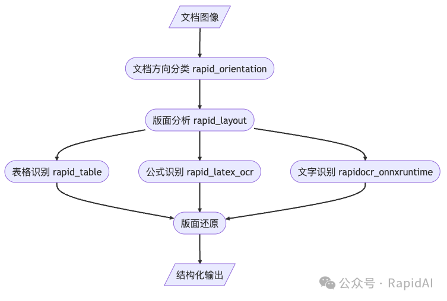

1. 读光-文档理解-文档理解多模态预训练模型
    - 模型下载：https://modelscope.cn/models/iic/multi-modal_convnext-roberta-base_vldoc-embedding/summary
    - 简介：该模型仅给出了分别提取文档文本和对应图片的特征embedding，
    - 缺点：其它功能，包括文档信息抽取、文档版面分析、文档分类与文档VQA等功能未给出
   
    模型结构：    
    模型采用双塔结构(如下图)，主要包括三个主要部分，Image backbone用于提取文档的图像信息，
    Text-layout backbone用于对文档的文本、版式信息进行建模，最后进行多模态特征融合，连接相关的预训练任务进行优化

    预训练任务
    - 采用Masked Vision Language Modeling (MVLM)预训练任务
    - 采用Bi-VLDoc的Text Image Position Awareness(TIPA)预训练任务
    - 采用geometric pre-training tasks (from the GeoLayoutLM)
   
    

    模型输入：
    - 文本和版式信息：坐标位置和文本
    - 图像信息：文档图片

    论文：
    - Bi-VLDoc: Bidirectional Vision-Language Modeling for Visually-Rich Document Understanding （2022）
    - GeoLayoutLM: Geometric Pre-training for Visual Information Extraction （2023）

    测试：   
    在如下4个集子（FUNSD.SER	FUNSD.RE	XFUND.zh.SER	XFUND.zh.RE），大幅领先LayoutLMv3-base

2. pptstructure
   - 百度开源，基于PaddlePaddle的文档版面分析工具
   - 包括版面分析、表格分析、版面还原，实体关系提取、文档方向分类
   - https://github.com/PaddlePaddle/PaddleOCR/blob/release/2.7/ppstructure/layout/README_ch.md

3. layout parser
   - Github(4.3k Stars): https://github.com/Layout-Parser/layout-parser
   - Gitee (0 Stars): https://gitee.com/germey/layout-parser
   - 模型800M，擅长论文类的版面
   - 文档：https://layout-parser.readthedocs.io/en/latest/
   - 模型：https://layout-parser.readthedocs.io/en/latest/notes/modelzoo.html
   - 缺点：已2年没有更新了
   
4. RapidStructure
   - 起初是对标百度的PP-Structure系列。经过一段时间的发展，逐步变得完善起来。
   - 在线demo: https://swhl-rapidstructuredemo.hf.space/
   - Github （87 stars）: https://github.com/RapidAI/RapidStructure
   - Gitee: https://gitee.com/RapidAI/RapidStructure
   - 

# 参考

[1] RapidStructure: 智能文档处理工具，https://mp.weixin.qq.com/s/6IErDNyyS1mn7yH9D3YlhQ