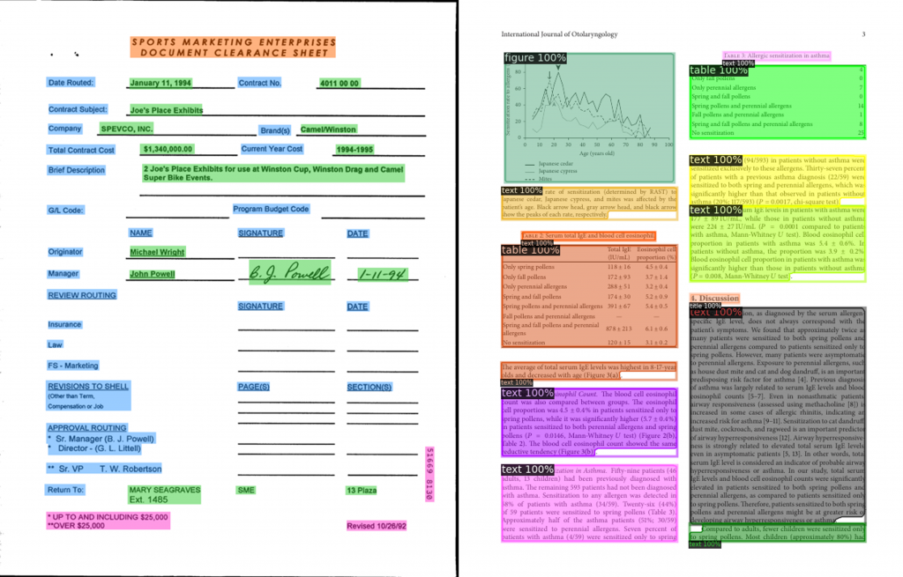

# 1. 简介

文档智能多模态预训练模型LayoutLMv3

- 模型下载：https://huggingface.co/microsoft/layoutlmv3-base-chinese
- 论文：https://arxiv.org/pdf/2204.08387.pdf
- 代码：https://github.com/microsoft/unilm/tree/master/layoutlmv3

- 模型下载：https://huggingface.co/HYPJUDY/layoutlmv3-base-finetuned-publaynet
- 基于microsoft/layoutlmv3-base作为base model，使用PubLayNet数据集进行finetune
- layoutlmv3论文：https://arxiv.org/pdf/2204.08387.pdf
- base模型代码：https://github.com/microsoft/unilm/tree/master/layoutlmv3
- 使用代码：https://github.com/microsoft/unilm/blob/master/dit/object_detection/README.md
- 使用代码：https://github.com/microsoft/unilm/blob/master/dit/object_detection/README.md
- 文档：https://detectron2.readthedocs.io/en/latest/tutorials/getting_started.html
- DiT文档图像Transformer所有相关模型和介绍：https://github.com/microsoft/unilm/tree/master/dit
- Huggingface Demo：https://huggingface.co/spaces/nielsr/dit-document-layout-analysis

图1：文档智能任务示例：表单理解、文档布局分析

文档不仅有大量的文本信息，同时也包含丰富的布局和视觉信息，并且这三种模态在文档中有天然的对齐特性。

- LayoutLM——通过将文本和布局进行联合预训练，在多种文档理解任务上取得了显著提升。
- LayoutLMv2——通过将视觉特征信息融入到预训练过程中，大大提高了模型的图像理解能力。
- LayoutXLM——基于 LayoutLMv2 的模型结构，通过使用53种语言进行预训练，拓展了 LayoutLM 的多语言支持。

# 2. 方法

## 2.1 模型架构

以统一的文本和图像掩码建模目标来预训练多模态模型，即 LayoutLMv3 学习重建语言模态的遮盖词 ID，
并对称地重建图像模态的遮盖图像块 ID。

图2：关于图像表示方式和预训练目标的比较

对于文档来说，每个文本词都对应着一个图像块。为了学习这种跨模态的对齐关系，
研究员们还提出了一个词块对齐预训练目标，通过预测一个文本词的对应图像块是否被遮盖，来学习这种语言——图像细粒度对齐关系。

在模型架构设计上，LayoutLMv3 不依赖复杂的 CNN 或 Faster R-CNN 网络来表征图像，而是直接利用文档图像的图像块，
从而大大节省了参数并避免了复杂的文档预处理（如人工标注目标区域框和文档目标检测）。简单的统一架构和训练目标使 
LayoutLMv3 成为通用的预训练模型，可适用于以文本为中心和以图像为中心的文档 AI 任务。

图3：LayoutLMv3 的架构和预训练目标

微软亚洲研究院在五个数据集中评估了预训练的 LayoutLMv3 模型，包括以文本为中心的数据集：表单理解 FUNSD 数据集，
票据理解 CORD 数据集，文档视觉问答 DocVQA 数据集；以及以图像为中心的数据集：文档图像分类 RVL-CDIP 数据集，
文档布局分析 PubLayNet 数据集。实验结果表明，LayoutLMv3 在这些数据集上以更少的参数达到了更优的性能。

LayoutLMv3 还应用了文本——图像多模态 Transformer 架构来学习跨模态表征。文本向量由词向量、词的一维位置向量和二维位置向量
相加得到。文档图像的文本和其相应的二维位置信息（布局信息）则利用光学字符识别（OCR）工具抽取。因为文本的邻接词通常表达了相似的语义，
LayoutLMv3 共享了邻接词的二维位置向量，而 LayoutLM 和 LayoutLMv2 的每个词则用了不同的二维位置向量。

图像向量的表示通常依赖于 CNN 抽取特征图网格特征或 Faster R-CNN 提取区域特征，这些方式增加了计算开销或依赖于区域标注。
因此，研究员们将图像块经过线性映射获得图像特征，这种图像表示方式最早在 ViT 中被提出，计算开销极小且不依赖于区域标注，
有效解决了以上问题。具体来说，首先将图像缩放为统一的大小（例如224x224），然后将图像切分成固定大小的块（例如16x16），
并通过线性映射获得图像特征序列，再加上可学习的一维位置向量后得到图像向量。

## 2.2 损失函数

通过三个预训练目标以自监督的方式学习多模态表示

掩码语言建模（Masked Language Modeling, MLM）。为了利于模型学习布局信息与文本和图像之间的对应关系，
该任务随机遮盖30%的文本词向量，但保留对应的二维位置（布局）信息。类似 BERT 和 LayoutLM，模型目标是根据未
被遮盖的图文和布局信息还原文本中被遮盖的词。

掩码图像建模（Masked Image Modeling, MIM）。为了鼓励模型从文本和图像的上下文信息推测图像信息，该任务随机遮盖了
约40%的图像块。类似 BEiT，模型目标是根据未被遮盖的文本和图像的信息还原被遮盖的图像块经过离散化的 ID。

词块对齐（Word-Patch Alignment, WPA）。对于文档来说，每个文本词都对应着一个图像块。由于前两个任务随机遮盖了
部分文本词和图像块，模型无法显式地学习这种文本词和图像块之间的细粒度对齐关系。该目标通过显式地预测一个文本词的对应图像
块是否被掩盖来学习语言和视觉模态之间的细粒度对齐关系。

# 3. 实验

为了学习各种文档任务的通用表示，LayoutLMv3 的预训练数据集是 IIT-CDIP，包含大约1100万张扫描文档图像。
微软亚洲研究院训练了 BASE、LARGE 两种规模的模型，参数量分别是133M、368M。

## 3.1 微调多模态任务：远超 SOTA

研究员们在四个多模态任务上对 LayoutLMv3 进行了微调：

- 表单理解任务对表单的文本内容进行序列标注。FUNSD 是一个文档扫描表单理解数据集，包含199个文档，
  有9,707个语义实体的标注。FUNSD 数据集的语义实体标签任务旨在为每个语义实体分类为“问题”、“答案”、“标题”或“其他”中的一个。
- 票据理解任务需要提取票据信息，对每个词进行语义标签分类。该任务的数据集是 CORD，它包含1,000张收据，在4个类别下定义了30个语义标签。
- 文档图像分类任务的目的是预测文档图像的类别。该任务在 RVL-CDIP 数据集上进行。RVL-CDIP 数据集包含400,000张文档图像，标有16个类别。
- 文档视觉问答任务需要模型将文档图像和问题作为输入，并输出一个答案。该任务在DocVQA数据集上进行。DocVQA 的训练集包含约一万张图片和四万个问题。

在这些任务上，LayoutLMv3 取得了比以前的工作更好或相当的结果。例如，对于LARGE模型规模，
LayoutLMv3 在 FUNSD 数据集上取得了92.08的 F1 分数，大大超过了此前 LARGE 规模的 SOTA 结果（85.14）。

表1：LayoutLMv3 和已有工作在 CORD、FUNSD、RVL-CDIP、DocVQA 数据集上的实验结果对比

## 3.2 微调视觉任务：所有指标优于其他模型

为了证明多模态预训练模型 LayoutLMv3 在视觉领域应用的通用性，研究员们将 LayoutLMv3 应用于了文档布局分析任务。
文档布局分析任务旨在为文档的不同布局元素检测二维位置和类别。这项任务有助于将文档解析成机器可读的格式，供下游应用程序使用。
研究员们将这项任务建模为目标检测问题，以 LayoutLMv3 为特征提取网络，将不同层提取的特征整合到目标检测器中。研究员们在 
PubLayNet 数据集上进行了实验。该数据集包含三十多万张研究论文图像，每张图像都有布局边界框的位置和类别标注，类别涵盖文本、
标题、列表、图和表。与卷积神经网络模型和同期的视觉 Transformer 预训练模型相比，LayoutLMv3 在所有指标上都优于其他模型。

表2：LayoutLMv3 和已有工作在 PubLayNet 数据集关于文档布局分析任务的实验结果对比

## 3.3 消融实验：有力证明了 LayoutLMv3 适合以图像为中心的文档分析任务

为了研究 LayoutLMv3 的图像表示方法和预训练目标的效果，研究员们在四个典型的数据集上进行了消融实验。基础模型只使用文本和布局信息，
用 MLM 目标进行预训练。接着，研究员们依次为基础模型增加图像表示，MIM 和 WPA 预训练目标。

通过表格中的结果，可观察到，基础模型没有图像表示，不能进行以图像为中心的文档分析任务。LayoutLMv3 
采用图像块的线性映射作为图像表示，设计简单，只引入了0.6M的参数。这种图像表示通过与 MIM 预训练目标结合，
不仅能支持以图像为中心的任务，还能提升以文本为中心的任务的表现。结合 WPA 预训练目标又进一步提升了所有下游任务的性能，
证实了 WPA 在跨模态表示学习和图像表示学习中的有效性，强调了视觉和语言跨模态对齐学习的重要性。此外，研究员们还发现 MIM 
可以帮助规范化训练，对于 PubLayNet 上的文档布局分析等视觉任务的模型收敛至关重要。

## 3.4 LayoutLMv3 用于中文文档理解也有出色表现

以上描述的 LayoutLMv3 模型的预训练数据均为英语，可在英语的下游任务数据集上微调。为了满足广大中文用户的需求，
研究员们还训练了中文的 LayoutLMv3 模型，可用于中文任务。

研究员们通过大规模数据抓取获得了海量的数字文档，并用自动化语言检测工具筛选出了5000万张中文文档图像用于预训练。
研究员们在一个中文视觉信息抽取任务上验证了模型的效果。由表4可见，LayoutLMv3 在所有类别平均分数上取得了99.21的高分，
显著超过了其他模型，验证了 LayoutLMv3 中文模型的有效性。

表4：LayoutLMv3 和已有工作在 EPHOIE 中文数据集关于视觉信息抽取任务的实验结果对比

大量的实验结果都证明了 LayoutLMv3 的通用性和优越性，它不仅适用于以文本为中心和以图像为中心的文档智能任务，
还可以以更少的参数获得更好或相当的性能。未来，微软亚洲研究院将探索扩大预训练模型的规模，
使模型能够利用更多的训练数据来进一步推动结果；同时扩展模型的少样本学习能力，从而促进模型在文档智能行业中更多业务场景下的应用。

LayoutLMv3 论文链接：https://arxiv.org/pdf/2204.08387.pdf

LayoutLMv3 代码链接：https://aka.ms/layoutlmv3

# 参考

[1] 文档智能多模态预训练模型LayoutLMv3：兼具通用性与优越性，https://www.msra.cn/zh-cn/news/features/layoutlmv3