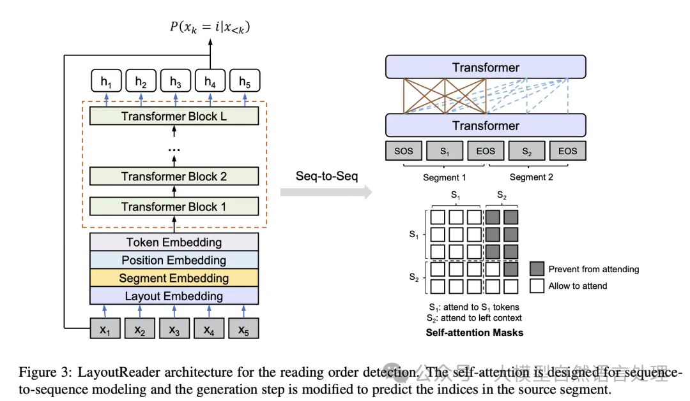
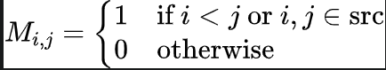
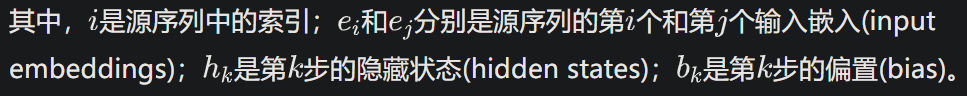
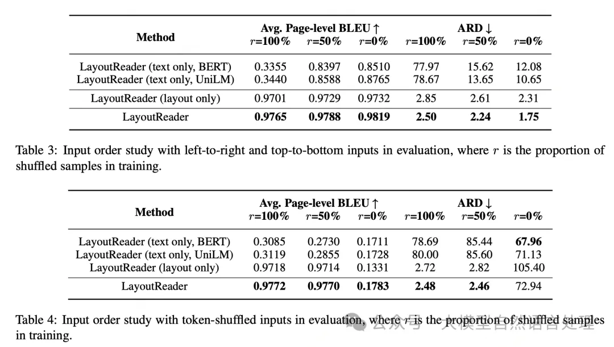
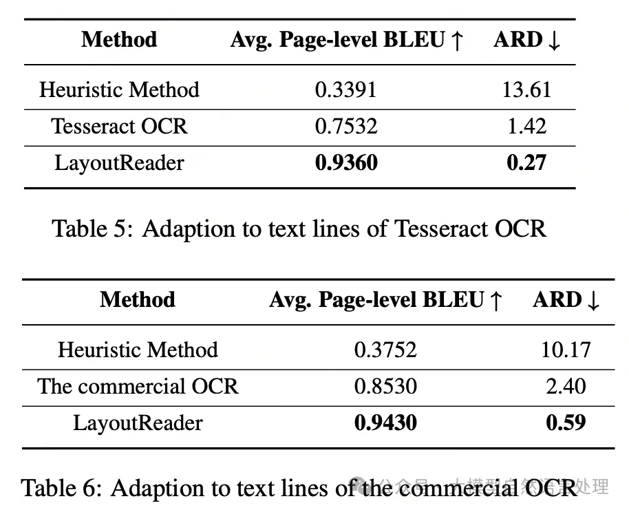
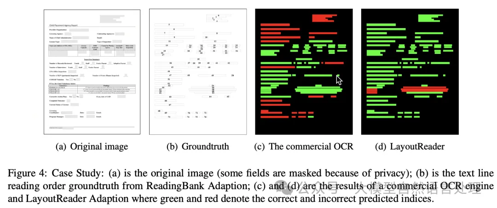
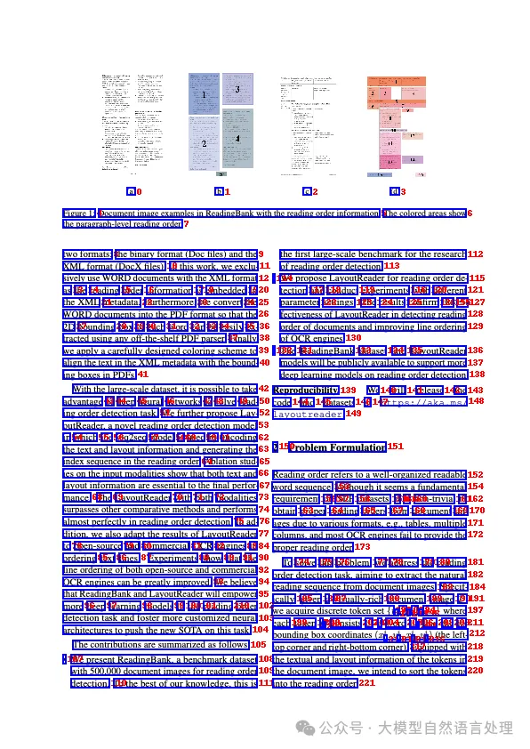

# 1. 资源

paper：LayoutReader: Pre-training of Text and Layout for Reading Order Detection，https://arxiv.org/pdf/2108.11591
Official code：https://github.com/microsoft/unilm/tree/master/layoutreader

非官方权重：
- huggingface：https://huggingface.co/yujunhuinlp/LayoutReader-only-layout-large
- github code（only layout）：https://github.com/yujunhuics/LayoutReader

# 2. 简介

阅读顺序检测旨在捕获人类读者能够自然理解的单词序列。现有的OCR引擎通常按照从上到下、从左到右的方式排列识别到的文本行，但这并不适用于某些文档类型，如多栏模板、表格等。

LayoutReader模型使用seq2seq模型捕获文本和布局信息，用于阅读顺序预测，在实验中表现出色，并显著提高了开源和商业OCR引擎在文本行排序方面的表现。

# 3. 原理



## 3.1 编码器(Encoder)

LayoutReader使用LayoutLM的布局模型作为编码器。在编码阶段，LayoutReader将源序列和目标序列打包成一个连续的输入序列，并设计了自注意力掩码来控制token之间的可见性。具体来说，LayoutReader允许源序列中的标记相互关注，同时阻止目标序列中的标记关注右侧上下文。

自注意力掩码M的设计：



其中，i和j是打包输入序列中的索引，可能来自源或目标序列；i,j表示两个标记都来自源序列。

## 3.2 解码器(Decoder)

在解码阶段，由于源序列和目标序列是重新排序的序列，预测候选可以被限制在源序列内。因此，模型被要求预测源序列中的索引。概率计算如下：




# 4. 实验

进行了三个实验来评估LayoutReader在ReadingBank上的表现，包括阅读顺序检测、输入顺序研究和对OCR引擎的适应性







实验结果表明，LayoutReader在阅读顺序检测任务上超越了其他基线方法，并且可以显著提高OCR引擎的文本行排序。

# 5. 代码

bbox排序

```python
import torch
from model import LayoutLMv3ForBboxClassification
from collections import defaultdict

CLS_TOKEN_ID = 0
UNK_TOKEN_ID = 3
EOS_TOKEN_ID = 2


def BboxesMasks(boxes):
    bbox = [[0, 0, 0, 0]] + boxes + [[0, 0, 0, 0]]
    input_ids = [CLS_TOKEN_ID] + [UNK_TOKEN_ID] * len(boxes) + [EOS_TOKEN_ID]
    attention_mask = [1] + [1] * len(boxes) + [1]
    return {
        "bbox": torch.tensor([bbox]),
        "attention_mask": torch.tensor([attention_mask]),
        "input_ids": torch.tensor([input_ids]),
    }


def decode(logits, length):
    logits = logits[1: length + 1, :length]
    orders = logits.argsort(descending=False).tolist()
    ret = [o.pop() for o in orders]
    while True:
        order_to_idxes = defaultdict(list)
        for idx, order in enumerate(ret):
            order_to_idxes[order].append(idx)
        order_to_idxes = {k: v for k, v in order_to_idxes.items() if len(v) > 1}
        if not order_to_idxes:
            break
        for order, idxes in order_to_idxes.items():
            idxes_to_logit = {}
            for idx in idxes:
                idxes_to_logit[idx] = logits[idx, order]
            idxes_to_logit = sorted(
                idxes_to_logit.items(), key=lambda x: x[1], reverse=True
            )
            for idx, _ in idxes_to_logit[1:]:
                ret[idx] = orders[idx].pop()
    return ret


def layoutreader(bboxes):
    inputs = BboxesMasks(bboxes)
    logits = model(**inputs).logits.cpu().squeeze(0)
    orders = decode(logits, len(bboxes))
    return orders


if __name__ == '__main__':
    bboxes = [[584, 0, 595, 1], [35, 120, 89, 133],
              [35, 140, 75, 152]]
    model_path = ""
    model = LayoutLMv3ForBboxClassification.from_pretrained()

    print(layoutreader(bboxes))
# [1, 2, 0]
```

效果样例



# 参考

[1] 文档智能前沿进展：符合人类阅读顺序的文档模型-LayoutReader及非官方权重开源, https://mp.weixin.qq.com/s/W4Rs9tKA5Qi1MRuLGiVL0Q