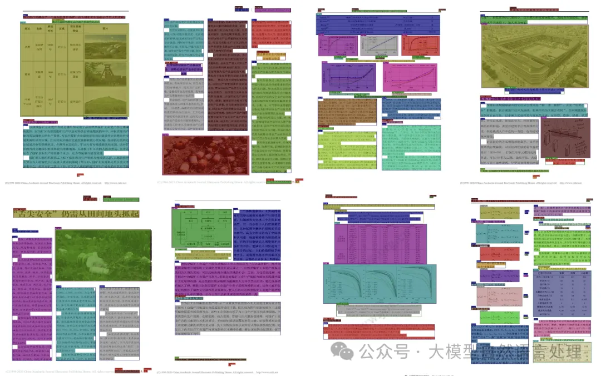

# 1. 数据集



本文以开源的CDLA数据集做为实验，CDLA是一个中文文档版面分析数据集，面向中文文献类（论文）场景。包含以下10个label：


数据集下载地址：https://github.com/buptlihang/CDLA

数据集是labelme格式的文件，需要自行转化成yolo训练所需要的格式，最后文件放置形式如下：


注意：这个数据集有个问题就是缺乏段落标注，含相关段落标注的开源模型可以查看上篇

# 2. 训练配置

```bash
pip install ultralytics
```

配置yaml文件

```yaml
#path: ./datasets/  # dataset root dir
train: cdla/images/train
val: cdla/images/dev
test:  # test images (optional)

nc: 10   # 数据集类别数量
names: [ # 数据集标签
  'Text',
  'Title',
  'Figure',
  'Figure caption',
  'Table',
  'Table caption',
  'Header',
  'Footer',
  'Reference',
  'Equation',
]
```

训练代码

```python
from ultralytics import YOLO

# model = YOLO('yolov8n.yaml')    # 重新训练模型
model = YOLO('yolov8n.pt')        # 加载预训练模型

# Train the model
results = model.train(data='cdla.yaml', epochs=100, imgsz=640, device=0)
```

预测代码

```python
from ultralytics import YOLO

image_path = ''  # 待预测图片路径
model_path = ''  # 权重路径
model = YOLO(model_path)

result = model(image_path, save=True, conf=0.5, save_crop=False, line_width=2)
print(result)

print(result[0].names)         # 输出id2label map
print(result[0].boxes)         # 输出所有的检测到的bounding box
print(result[0].boxes.xyxy)    # 输出所有的检测到的bounding box的左上和右下坐标
print(result[0].boxes.cls)     # 输出所有的检测到的bounding box类别对应的id
print(result[0].boxes.conf)    # 输出所有的检测到的bounding box的置信度
```

# 参考

[1] 【文档智能】实践：基于Yolo三行代码极简的训练一个版式分析模型，https://mp.weixin.qq.com/s/5ntWTmf8ys8wLYpJPZ-f9A