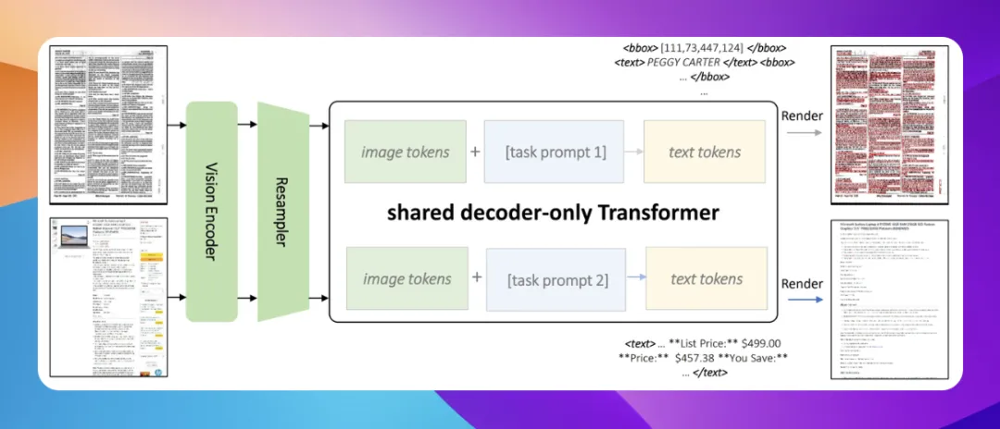

Kosmos-2.5是微软开源的多模态模型，专门用于机器阅读文本密集型图片。它通过共享的解码器仅自回归Transformer架构、任务特定提示和灵活的文本表示来实现统一的多模态能力。Kosmos-2.5在端到端的文档级文本识别和图像到Markdown文本生成方面表现出色，并且可以通过有监督的微调轻松适应任何文本密集型图像理解任务，使其成为处理文本丰富图像的实用工具。

☆一键收藏：

https://sota.jiqizhixin.com/project/kosmos-2-5

# 参考

[1] 今日开源（2024-06-24）：微软Kosmos-2.5，文档图片到Markdown的精准转换，https://mp.weixin.qq.com/s/ScEt7X-2bLG1JRI6KNj5nQ