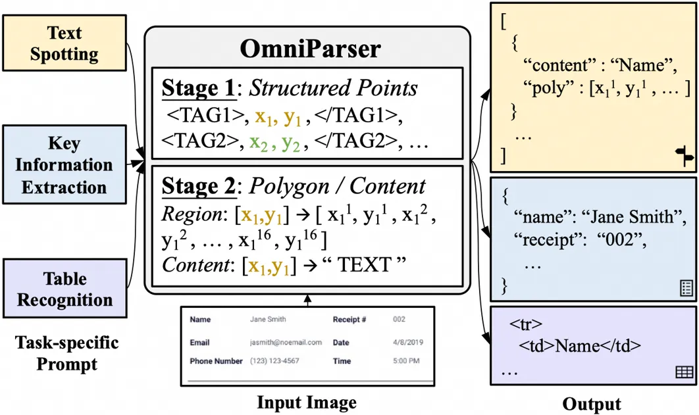
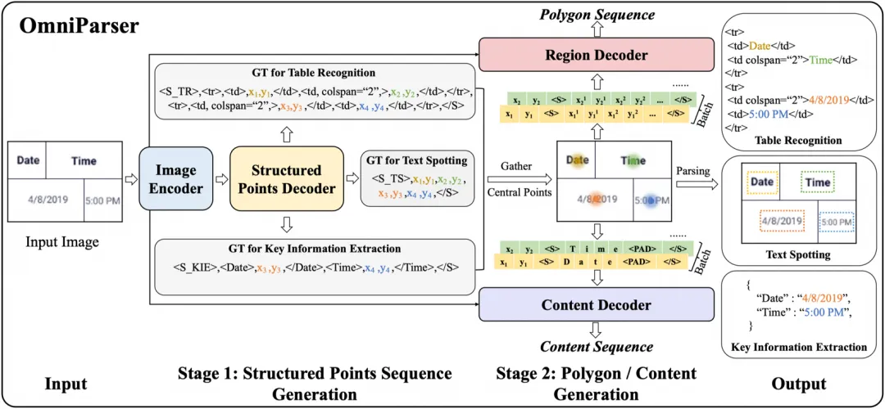
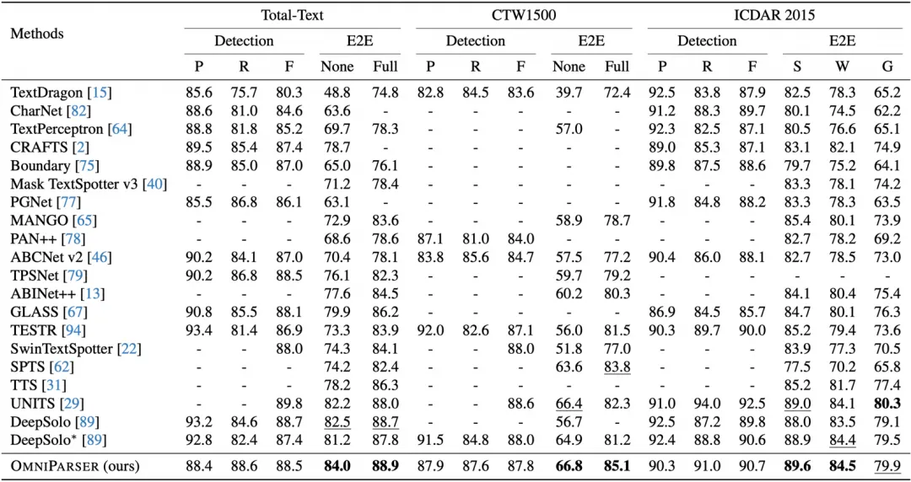
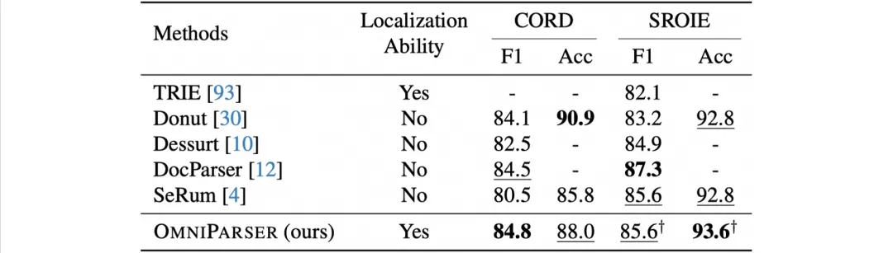
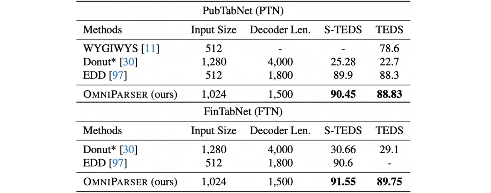

# 1. 资源

论文链接：https://arxiv.org/abs/2403.19128
代码：https://github.com/AlibabaResearch/AdvancedLiterateMachinery

[CVPR 2024] OmniParser: 统一图文解析模型：文字检测识别、视觉信息抽取和表格识别

本文简要介绍CVPR 2024录用论文“OmniParser: A Unified Framework for Text Spotting, Key Information Extraction and Table Recognition”的主要工作。这篇文章提出了一个新的统一框架，将文字领域的核心任务（文字检测识别，关键信息抽取和表格识别）巧妙融合在一起，无需额外的任务相关的定制化模块设计。

# 2. 方法原理

图1 OmniParser多任务输入输出结构形式

OmniParser整体框架如图2所示，模型主要包含图像编码器，结构化中心点序列解码器，检测框解码器以及文本内容解码器。首先，文字图像经过图像编码器得到预处理图像特征；其次，图像特征和任务提示符（用于区分不同任务，如<S_TR>、<S_KIE>、<S_TS>分别表示表格识别、关键信息抽取、文本识别。）一起输入结构化中心点序列解码器，得到任务相关的结构化序列，该结构化序列包含丰富的信息，如表格中的行列结构以及信息抽取中的实体类别；接着，将上一步得到的结构化中心点序列中的中心点和图像特征一起输入到检测框解码器和文本内容解码器，得到中心点对应的文本包围框以及文字识别内容；最后，根据解码后的文字包围框、文本内容以及结构化中心点序列得到最终的图像解析结果。文字包围框以及内容解码可以多个中心点并行处理，同时三个编码器的设计也进一步大幅降低了模型推理时间。

图2 OmniParser整体框架图

# 3. 实验结果

作者主要在三个OCR核心任务上验证了OmniParser的先进性，在文字检测识别任务上，OmniParser不仅在常规文字数据集上达到了领先的效果，在曲形文字数据集以及文字行数据集上也超越了之前的方法。

表1 文字检测识别任务上方法效果对比

在关键信息抽取任务上，OmniParser可以同时得到实体的类别信息以及精确的位置信息，在CORD以及SROIE数据集上也取得了比之前方法更好的表现，值得注意的是多数端到端抽取方法无法提供精确的文本定位能力，这削弱了方法的可解释性，部分情况下会出现较为严重的幻觉问题。表3展示了OmniParser在表格识别任务上的性能对比，其不仅可以获得准确的表格结构，同时可以得到单元格的具体位置以及文本内容，通过一次前向处理端到端的得到最终的表格解析结果。

表2 关键信息抽取任务上方法效果对比

表3 表格识别任务上方法效果对比

作者进一步探究了OmniParser在层次化文字检测任务[9]上的表现，如图3所示，从左至右分别为单词、文字行和段落级别的检测粒度，可以看到OmniParser可以准确的区分出不同层次的文字粒度信息，这仅需要针对该任务将结构化中心点序列进行相应的改造适配，模型其他部分并不需要过多改动，即可实现对新任务的高效迁移。

图3 OmniParser在层次化文字检测任务上的部分可视化结果

# 参考

[1] [CVPR 2024] OmniParser: 统一图文解析模型：文字检测识别、视觉信息抽取和表格识别，https://mp.weixin.qq.com/s/OQ6aV1v8nnGPVNfKOhBfpg