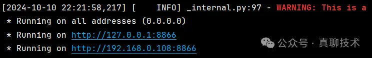

# 1. 介绍

PaddleOCR通过PaddleHub Serving发布串联的文本、表格、版面识别模型，利用structure_system模块实现文档解析的整体流程。具体过程如下：

模型串联：PaddleOCR的structure_system将文本检测、方向分类、表格识别和版面分析等模型串联为一个完整的文档解析系统。首先，文本检测模型识别出文档中的文字区域，接着方向分类模型校正这些区域的方向，随后识别模型对文字进行识别。对于表格和版面，特定的模型会识别表格的结构与布局。
工作原理：

文本检测模型：识别图像中的文字块位置，输出对应的检测框。

方向分类模型：矫正文字检测框的方向，确保字符的正确方向排列。

文本识别模型：从矫正后的框中提取文字，并输出识别结果。

表格识别：对于表格内容，模型会分析表格的结构和单元格，提取出相应的文本和位置关系。

版面识别：在版面识别中，模型不仅能识别文字，还能理解文档的版面结构，如标题、段落、图片区域等。

版面识别预测的标签包括：

```text
text
title
figure
figure_caption
table
table_caption
header
footer
reference
equation
```

# 2. 服务部署
## 2.1 简介

基于PaddleHub Serving的服务部署

PaddleHub Serving 是 PaddleOCR 提供的一种部署服务方式，用于快速构建和发布 OCR 服务。在 PaddleHub Serving 部署中，您可以通过其模块化、易用的 API 结构，快速将 PaddleOCR 模型部署为在线服务。

hubserving服务部署目录下包括文本检测、文本方向分类，文本识别、文本检测+文本方向分类+文本识别3阶段串联，版面分析、表格识别和PP-Structure七种服务包，请根据需求选择相应的服务包进行安装和启动。目录结构如下：

```text
deploy/hubserving/
  └─  ocr_cls     文本方向分类模块服务包
  └─  ocr_det     文本检测模块服务包
  └─  ocr_rec     文本识别模块服务包
  └─  ocr_system  文本检测+文本方向分类+文本识别串联服务包
  └─  structure_layout  版面分析服务包
  └─  structure_table  表格识别服务包
  └─  structure_system  PP-Structure服务包
  └─  kie_ser  关键信息抽取-SER服务包
  └─  kie_ser_re  关键信息抽取-SER+RE服务包
```

每个服务包下包含3个文件。以PP-Structure服务包为例，目录如下：

```text

deploy/hubserving/structure_system/
  └─  __init__.py    空文件，必选
  └─  config.json    配置文件，可选，使用配置启动服务时作为参数传入
  └─  module.py      主模块，必选，包含服务的完整逻辑
  └─  params.py      参数文件，必选，包含模型路径、前后处理参数等参数
```

安装服务模块前，需要准备推理模型并放到正确路径。默认模型路径为：

| 模型           | 路径                                     |
|----------------|------------------------------------------|
| 检测模型       | `./inference/ch_PP-OCRv4_det_infer/`    |
| 识别模型       | `./inference/ch_PP-OCRv4_rec_infer/`    |
| 方向分类器     | `./inference/ch_ppocr_mobile_v2.0_cls_infer/` |
| 表格识别模型   | `./inference/ch_ppstructure_mobile_v2.0_SLANet_infer/` |
| 版面分析模型   | `./inference/picodet_lcnet_x1_0_fgd_layout_cdla_infer/` |

模型路径可在params.py中查看和修改，可以替换成自己训练转换好的模型。

## 2.2 安装服务模块

```bash
# 执行全服务模型安装命令
hub install deploy/hubserving/structure_system

# 执行后可以看到以下输出，说名全服务串联模型安装成功
[2024-10-10 21:56:43,853] [    INFO] - Successfully uninstalled structure_system
[2024-10-10 21:56:44,570] [    INFO] - Successfully installed structure_system-1.0.0
```

## 2.3 启动服务

启动全服务模型串联structure_system服务，端口默认8866，并发任务数，默认为2*cpu_count-1。

命令行命令启动（仅支持CPU）

```bash
hub serving start --modules Module1==Version1, Module2==Version2, ... \
                  --port 8866 \
                  --use_multiprocess \
                  --workers \
```

参数说明：

| 参数                  | 说明                                                             |
|-----------------------|------------------------------------------------------------------|
| `--modules/-m`        | PaddleHub Serving预安装模型，以多个 `Module==Version` 键值对形式列出。当不指定Version时，默认选择最新版本。 |
| `--port/-p`           | 服务端口，默认为8866。                                           |
| `--use_multiprocess`  | 是否启用并发方式，默认为单进程方式，推荐在多核CPU机器上使用此方式。Windows操作系统只支持单进程方式。 |
| `--workers`           | 在并发方式下指定的并发任务数，默认为 `2*cpu_count-1`，其中 `cpu_count` 为CPU核数。 |

启动全服务串联：

```bash
# 执行后会出现以下图片输出，说明服务已经启动
hub serving start -m structure_system
```



## 2.4 请求服务

进入E:\paddle_ocr\PaddleOCR源码路径下，在praddle_env的Python的环境下，执行以下命令，验证已启动服务是否可用。

```bash
python ./tools\test_hubserving.py --server_url=http://127.0.0.1:8866/predict/structure_system --image_dir=./doc\imgs/train_1430.jpg --visualize=true
```

结果说明：

返回结果为列表（list），列表中的每一项为词典（dict），词典一共可能包含3种字段，以下是全模型串联返回字段信息：

| 字段名称        | 数据类型 | 意义                                                             |
|-----------------|----------|------------------------------------------------------------------|
| `text`          | str      | 文本内容                                                         |
| `confidence`    | float    | 文本识别置信度或角度分类置信度                                   |
| `text_region`   | list     | 文本位置坐标                                                     |
| `html`          | str      | 表格的HTML字符                                                  |
| `regions`       | list     | 版面分析、表格识别和OCR的结果，每一项为一个list，包含表示区域坐标的 `bbox`、区域类型的 `type` 和区域结果的 `res` 三个字段。 |

说明： 如果需要增加、删除、修改返回字段，可在相应模块的module.py文件中进行修改。

# 参考

[1] 打造自己的RAG解析大模型：(可商用)OCR全服务部署，文本+表格+版面！，https://mp.weixin.qq.com/s/1ByxsInDuRZEQDJx1TUH6g