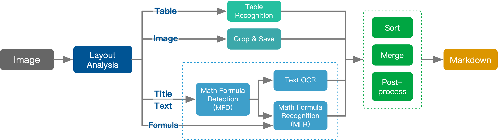
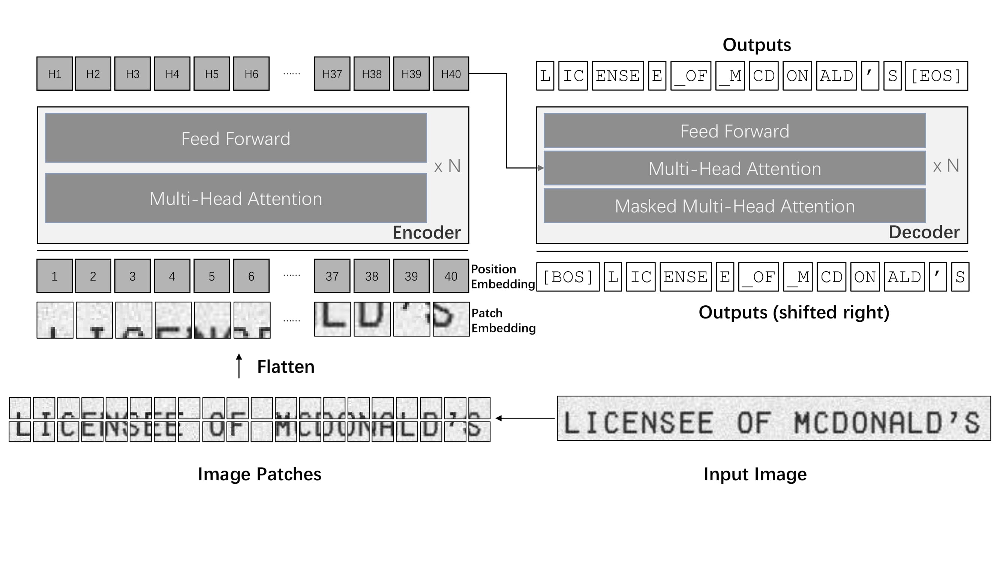

# 1. 资源

- Github (1.4k stars): https://github.com/breezedeus/pix2text
- 在线demo：
  - 官网：https://p2t.breezedeus.com/
  - HuggingFace: https://huggingface.co/spaces/breezedeus/Pix2Text-Demo
- 使用文档：
  - https://pix2text.readthedocs.io/zh/latest/usage/



个人评测：开源免费版相比在线版本差距较大

# 2. 安装

```bash
pip install pix2text
pip install onnxruntime-gpu
```

If the installation is slow, you can specify an installation source, such as using the Aliyun source:

```bash
pip install pix2text -i https://mirrors.aliyun.com/pypi/simple
```

安装步骤：
1. 模型下载
   - 参考使用文档： https://pix2text.readthedocs.io/zh/latest/models/ 分别下载各个模型，并存放在对应目录
   - 使用hf-mirror.com下载模型的步骤
     - 安装依赖：首先，我们需要安装 huggingface-cli 命令行工具，可以使用以下命令进行安装： pip install -U huggingface_hub 。
     - 设置镜像endpoint：在下载模型之前，我们需要设置镜像endpoint，可以使用以下命令进行设置： export HF_ENDPOINT=https://hf-mirror.com 。
     - 下载模型：使用huggingface-cli的download命令可以下载模型，例如： huggingface-cli download --resume-download --local-dir-use-symlinks False bigscience/bloom-560m --local-dir bloom-560m


# 3. 原理

基于TrOCR



# 4. 使用

- 参考：https://pix2text.readthedocs.io/zh/latest/usage/
- 样例：https://pix2text.readthedocs.io/zh/latest/examples/

