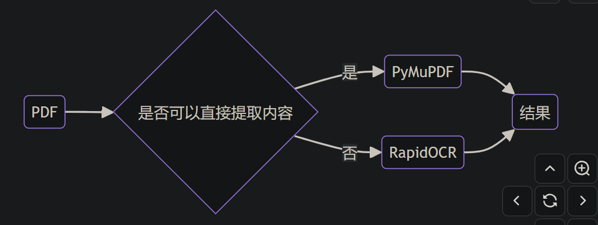

# 1. RapidOCR

RapidOCR (Github 2.3k): https://github.com/RapidAI/RapidOCR

Awesome OCR multiple programing languages toolkits based on ONNXRuntime, OpenVION and PaddlePaddle.

# 2. RapidOCRPDF

Github 110 stars: https://github.com/RapidAI/RapidOCRPDF

