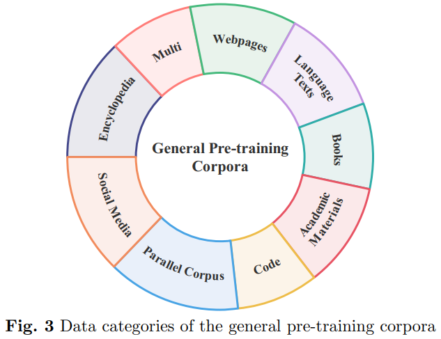
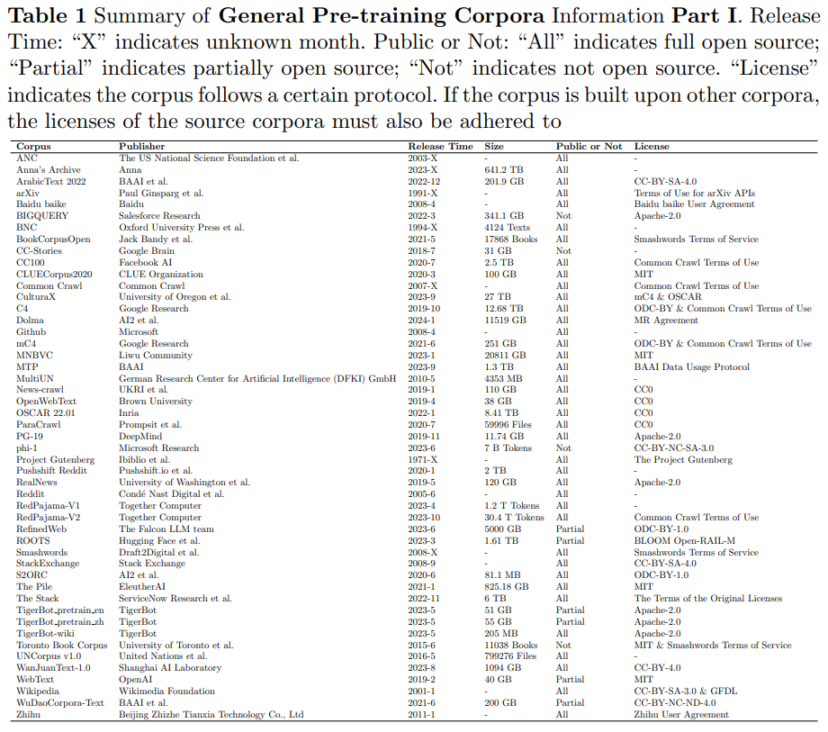

# 1. 简介

- Github (174 stars): https://github.com/lmmlzn/Awesome-LLMs-Datasets
- 论文
  - Datasets for Large Language Models: A Comprehensive Survey
  - https://arxiv.org/pdf/2402.18041.pdf

为了解决目前缺乏对LLM数据集全面概述和深入分析的问题，并洞察它们的现状和未来趋势，从五个角度整合和分类了LLM数据集的基本方面：

（1）预训练语料库；

（2）指令微调数据集；

（3）偏好数据集；

（4）评估数据集；

（5）特定任务：传统的自然语言处理（NLP）数据集。

本篇综述的整体架构

# 2. 详细介绍

论文还提供了现有可用数据集资源的全面回顾，包括来自444个数据集的统计数据，涵盖8种语言类别，
跨越32个领域。从20个维度的信息被纳入数据集统计。调查的总数据量超过774.5 TB的预训练语料库和7亿实例的其他数据集。
旨在呈现LLM文本数据集的整体景观，为该领域的研究人员提供全面的参考，并为未来的研究做出贡献。

一些代表性的大型语言模型（LLM）数据集的时间线。橙色代表预训练语料库，黄色代表指令微调数据集，绿色代表偏好数据集，
粉色代表评估数据集

## 2.1 预训练语料库

预训练语料库是在大型语言模型（LLM）预训练过程中使用的大量文本数据集合。在所有类型的数据集中，
预训练语料库的规模通常是最大的。在预训练阶段，LLM从大量未标记的文本数据中学习广泛的知识，这些知识随后被存储在其模型参数中。
这使得LLM具备了一定程度的语言理解和生成能力。预训练语料库可以包含各种类型的文本数据，如网页、学术材料、书籍，
同时也包括来自不同领域的相关文本，例如法律文件、年度财务报告、医学教科书以及其他特定领域的数据。

根据预训练语料库涉及的领域，它们可以分为两种类型：
- 第一种是通用预训练语料库，它包括来自不同领域和主题的大规模文本数据混合。数据通常包括来自互联网的文本内容，
  如新闻、社交媒体、百科全书等。其目标是为自然语言处理（NLP）任务提供通用的语言知识和数据资源。
  通用预训练语料库分类：网页、语言文本、书籍、学术材料、代码、平行语料库、社交媒体和百科全书。
- 

通用预训练语料库信息部分总结。发布时间：“X”表示未知月份。公开与否：“All”表示完全开源；“Partial”表示部分开源；
“Not”表示不开源。“许可证”表示该语料库遵循某种协议。如果该语料库是基于其他语料库构建的，那么源语料库的许可证也必须遵守。

第二种是特定领域的预训练语料库，它专门包含特定领域或主题的相关数据。其目的是为LLM提供专业知识。
特定领域预训练语料库分类：金融、医疗、法律、交通、数学。

# 参考

[1] 大模型数据集全面综述：770+TB大小涵盖预训练、微调、偏好对齐、评估、特定任务！,
    https://mp.weixin.qq.com/s/Pk1D4qQJhyD63wuG3BgpqQ