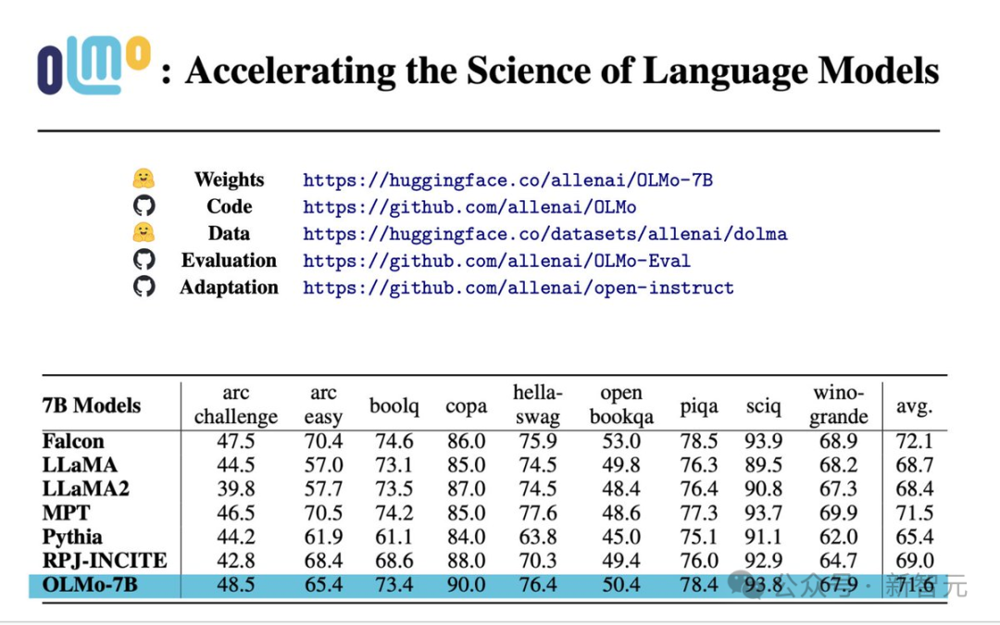

# 1. 简介

艾伦人工智能研究所等5机构最近公布了史上最全的开源模型「OLMo」，公开了模型的模型权重、
完整训练代码、数据集和训练过程，为以后开源社区的工作设立了新的标杆。

- 论文：https://allenai.org/olmo/olmo-paper.pdf
- 权重：https://huggingface.co/allenai/OLMo-7B
- 代码：https://github.com/allenai/OLMo
- 数据：https://huggingface.co/datasets/allenai/dolma
- 评估：https://github.com/allenai/OLMo-Eval
- 适配：https://github.com/allenai/open-instruct

# 2. 原理

## 2.1 预训练语料

# 参考

[1] 史上首个100%开源大模型重磅登场！破纪录公开代码/权重/数据集/训练全过程，AMD都能训，
    https://mp.weixin.qq.com/s/v-xCzo6j7sfVK5SF9iLg_A