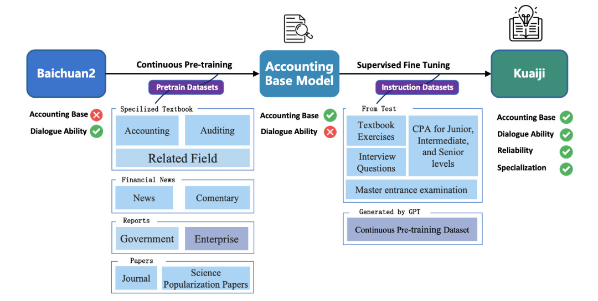

# 1. 简介

中文会计大模型Kuaiji
- the First Chinese Accounting Large Language Model
- 基于Baichuan框架微调
- 发布CAtAcctQA数据集，包含大量真实的会计师-客户对话
- 论文：
  - Kuaiji: the First Chinese Accounting Large Language Model
  - https://arxiv.org/pdf/2402.13866.pdf

# 2. 原理

模型实现流程

训练流程：
- CPT和SFT训练过程均采用QLora训练
- 训练数据抽取10%做验证集

# 参考

[1] 也谈长文本取代RAG的局限观点：兼看20240224大模型进展早报及Self-DC RAG问答框架，
    https://mp.weixin.qq.com/s/I-pu2bK8Ajw-e9qeLx2hbw
[2] Kuaiji: the First Chinese Accounting Large Language Model,
    https://arxiv.org/pdf/2402.13866.pdf