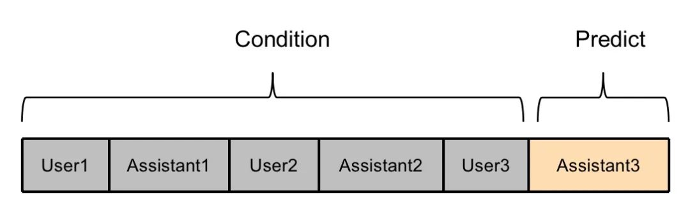

# 1. loss计算优化

```markdown
User1：你好
Assistant1：你好，有什么能帮你吗？
User2：今天天气怎么样
Assistant2：北京今天天气晴，气温25度，紫外线较强，注意防护。
User3：谢谢你
Assistant3：不客气
```

在指令微调阶段，一般只有Assistant回答部分的loss会用于梯度回传，更新权重；而User部分的loss则不会用于更新权重

基本逻辑如下：

- prompt和answer之间一定要有一个开始符隔开，然后answer后需要一个结束符。
- 计算loss的时候，对prompt部分的loss进行mask，只计算answer部分的loss即可。

优势如下：

- 推理时候，模型不会出现“自问自答”和“不停止”的情况。
- 训练时，多轮对话中的每个回复都被充分利用。
- 计算高效，不需要将一条多轮对话数据拆分成多条数据。


***

现有方法缺陷

1. 方法一

    User1、Assistant1、User2、Assistant2、User3的文本都视为模型的输入部分，
    将Assistant3的文本视为模型的预测部分，只有Assistant3部分的loss参与权重更新

    

    这种方法的弊端在于，没有充分利用多轮对话的训练数据，Assistant1和Assistant2的内
    容没有参与模型训练，这部分数据在训练时被浪费了。并且对于很多多轮对话数据而言，
    中间的Assitant回复部分的信息量更丰富详细，最后一个Assitant回复部分往往是”谢谢“、
    ”不客气“等诸如此类的较为简短的文本。如果只使用这部分文本训练模型，会严重影响模型的训练效果。

2. 方法二

    将一条多轮对话数据，拆分成多条数据。例如将以上示例拆分成如下三条数据。

    

    相比方法一，方法二能够更加充分利用多轮对话中每一个Assistant的回复内容。
    但是弊端在于，需要将一个包含n轮对话的数据，拆分成n条数据，训练效率降低了n倍，训练方法不高效。

***

改进方案细节如下：

```text
Below is a conversation between a user and an assistant.

User: input1
Assistant: target1</s>
User: input2
Assistant: target2</s>
...
```

一个需要注意的点，训练的时候，需要在每个Assistant的回复后面都添加</s>，作为此轮对话生成结束的标识符。
否则推理的时候，模型很难采样到</s>，从而无法结束生成。

在生成input_ids的时候，我们还会生成一个target_mask，取值为0或1，用来标记每个token是否属于target部分，
即是否需要模型进行预测。其中“target</s>”部分的target_mask均为1，其他部分均为0。


我们会并行计算每个位置的loss，但只有target_mask=1的部分位置的loss，才会参与权重更新。
这种方式充分利用了模型并行计算的优势，更加高效，并且多轮对话中的每个target部分都参与了训练，更加充分利用了数据。

loss计算如下：

```python
class TargetLMLoss(Loss):

    def __init__(self, ignore_index):
        super().__init__()
        self.ignore_index = ignore_index
        self.loss_fn = nn.CrossEntropyLoss(ignore_index=ignore_index)

    def __call__(self, model, inputs, training_args, return_outputs=False):
        input_ids = inputs['input_ids']
        attention_mask = inputs['attention_mask']
        target_mask = inputs['target_mask']
        # 模型前馈预测
        outputs = model(input_ids=input_ids, attention_mask=attention_mask, return_dict=True)
        logits = outputs["logits"] if isinstance(outputs, dict) else outputs[0]

        # 将labels中不属于target的部分，设为ignore_index，只计算target部分的loss
        labels = torch.where(target_mask == 1, input_ids, self.ignore_index)
        shift_logits = logits[..., :-1, :].contiguous()
        shift_labels = labels[..., 1:].contiguous()
        # Flatten the tokens
        loss = self.loss_fn(shift_logits.view(-1, shift_logits.size(-1)), shift_labels.view(-1))
        return (loss, outputs) if return_outputs else loss
```

# 2. Lora微调

该经验来源Firefly

- lora_rank：qlora矩阵的秩。一般设置为8、16、32、64等，在qlora论文中作者设为64。越大则参与训练的参数量越大，一般来说效果会更好，但需要更多显存，。
- lora_alpha: qlora中的缩放参数。一般设为16、32即可。
- lora_dropout: lora权重的dropout rate。
- learning_rate：qlora中的学习率设置更大一些，一般为1e-4、2e-4


# 参考

[1] 一文看懂：如何充分高效训练多轮对话大模型, https://zhuanlan.zhihu.com/p/645517143
[2] Firefly中文对话大模型，https://github.com/yangjianxin1/Firefly
