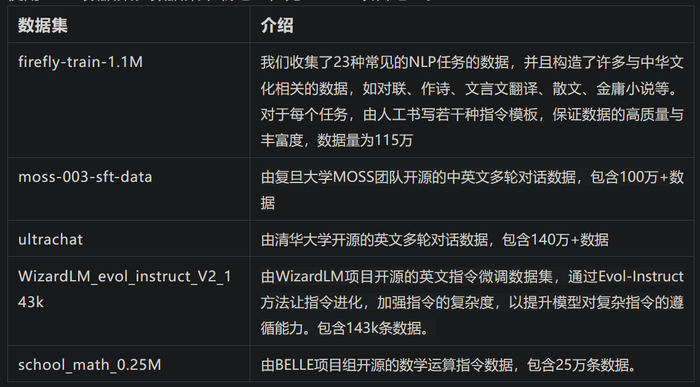

# 1. Firefly-baichuan-13B



本项目中的所有训练参数配置，均存储在train_args目录下，方便统一管理。我们以微调Baichuan-13B为例子，其训练参数的配置文件路径为train_args/qlora/baichuan-13b-sft-qlora.json，读者可以根据自身的硬件条件，对文件中的训练参数进行修改。

训练参数的详细说明如下：

- output_dir：训练输出目录，存储checkpoint、tokenizer、tensorboard等
- model_name_or_path：预训练模型的本地目录，或者在huggingface上的模型名称。
- train_file：训练数据集路径。可以使用data/dummy_data.jsonl进行debug，或者指定为本地的训练文件。
- num_train_epochs：训练的轮次。如果数据量足够大，一般建议只训一个epoch。
- per_device_train_batch_size：每张显卡的batch size。
- gradient_accumulation_steps：梯度累计步数。global batch=num_gpus * 
  per_device_train_batch_size * gradient_accumulation_steps。
- gradient_checkpointing：如果显存捉襟见肘，可以开启。以时间换空间，模型不缓存激活状态，
  会进行两次forward计算，以节省显存，我们默认开启。
- learning_rate：学习率。全量参数微调的时候，建议小一些，1e-5或5e-6。qlora训练时，根据模型大小的不同，建议设置为2e-4或1e-4。
- max_seq_length：训练时的最大长度。按照自己的设备进行设置，越长需要占用越多显存。
- logging_steps：每隔多少步打印一次train loss，结果会打印到日志中，也会保存在tensorboard中。
- save_steps：每隔多少步保存一次模型。
- save_total_limit：output_dir目录中最多保存多少个checkpoint，超出则会将最旧的删除。
- lr_scheduler_type：学习率变化策略。
- warmup_steps：warm up步数。学习率经过多少步，增长到指定的数值。
- optim：优化器。如果是全量参数微调，建议使用adamw_hf。如果是qlora微调，建议使用paged_adamw_32bit。
- seed：随机种子，用于复现实验结果。
- fp16：使用使用fp16混合精度。V100建议开启。
- bf16：使用使用fp16混合精度。A100建议开启。
- lora_rank：qlora矩阵的秩。一般设置为8、16、32、64等，在qlora论文中作者设为64。越大则参与训练的参数量越大，一般来说效果会更好，但需要更多显存，。
- lora_alpha: qlora中的缩放参数。一般设为16、32即可。
- lora_dropout: lora权重的dropout rate。

```json
{
    "output_dir": "output/firefly-baichuan-13b",
    "model_name_or_path": "baichuan-inc/Baichuan-13B-Base",
    "train_file": "./data/moss-003-sft-data.jsonl",
    "num_train_epochs": 1,
    "per_device_train_batch_size": 6,
    "gradient_accumulation_steps": 2,
    "learning_rate": 1e-4,
    "max_seq_length": 900,
    "logging_steps": 300,
    "save_steps": 500,
    "save_total_limit": 1,
    "lr_scheduler_type": "constant_with_warmup",
    "warmup_steps": 3000,
    "lora_rank": 64,
    "lora_alpha": 16,
    "lora_dropout": 0.05,

    "gradient_checkpointing": true,
    "disable_tqdm": false,
    "optim": "paged_adamw_32bit",
    "seed": 42,
    "fp16": true,
    "report_to": "tensorboard",
    "dataloader_num_workers": 5,
    "save_strategy": "steps",
    "weight_decay": 0,
    "max_grad_norm": 0.3,
    "remove_unused_columns": false
}
```