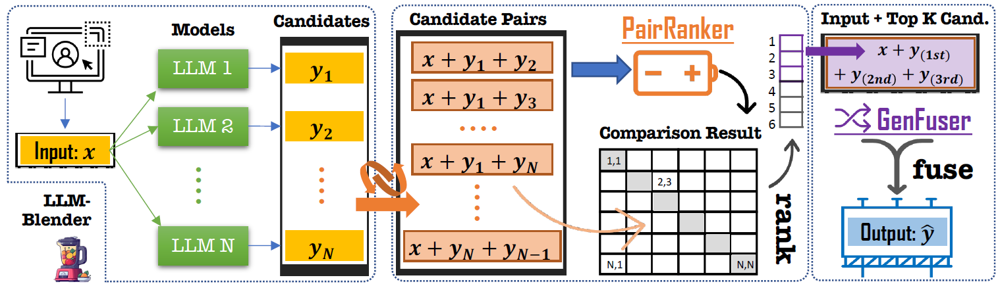
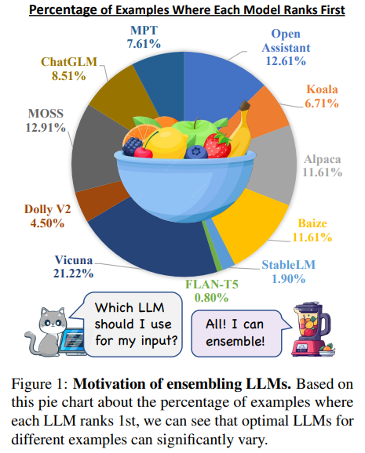

# 1. 简介

- Github: https://github.com/yuchenlin/LLM-Blender
- 论文：https://arxiv.org/pdf/2306.02561.pdf
- 数据（100w SFT，1.54G 英文）：https://huggingface.co/datasets/llm-blender/mix-instruct
  - 由如下数据集构造：Alpaca-GPT4, Dolly-15k, GPT4All-LAION and ShareGPT
- 680 Stars

动机：大型语言模型(LLM)在多种任务中表现出了令人印象深刻的性能，但是，由于数据、
架构和超参数的变化，开源LLM表现出了各种各样的优点和缺点，使得它们彼此之间具有互补性。
因此，动态地将这些LLM集成起来以生成一致性更好的响应对于每个输入来说都是重要的。

然而，现有的方法在候选输出之间的差异微妙时可能效果不佳，因为它们都是由非常复杂的模型产生的，
一个可能只比另一个稍好一点。因此，本文提出了一个专门的成对比较方法，PAIRRANKER，
以有效地区分候选输出之间的微妙差异并提高排名性能。

# 2. 原理

方法：LLM-BLENDER框架由两个模块组成：PAIRRANKER和GENFUSER。

首先，PAIRRANKER比较来自N个LLM的输出，然后GENFUSER将这些输出融合以生成最终的输出。
PAIRRANKER采用一种专门的成对比较方法，通过联合编码输入文本和一对候选项，使用交叉注意力编码器来确定哪一个更优。

然后，GENFUSER旨在合并排名最高的候选项，通过利用他们的优点并减轻他们的弱点来生成改进的输出。

优势：LLM-BLENDER框架通过集成LLM显著提高了整体性能。

PAIRRANKER的选择超过了任意固定的个体LLM模型，如通过在参考基准和GPT-Rank中的优越性能所示。
通过利用PAIRRANKER的顶级选择，GENFUSER通过有效的融合进一步提高了响应质量。LLM-BLENDER在传统指标(即BERTScore，BARTScore，
BLUERT)和基于ChatGPT的排名方面都取得了最高分。

提出一种新的大型语言模型集成框架LLM-BLENDER，通过使用专门的成对比较方法PAIRRANKER和生成融合方法GENFUSER，
有效地利用了不同模型的优点，提高了模型的整体性能。

pair ranker训练方法

GenFuser用seq2seq融合多个候选输入

# 参考

[1] LLM-Blender: 用成对排序和生成融合集成大型语言模型，
    https://blog.csdn.net/elinkenshujuxian/article/details/131363600
